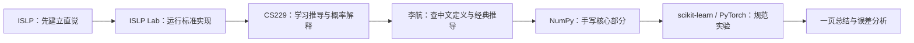
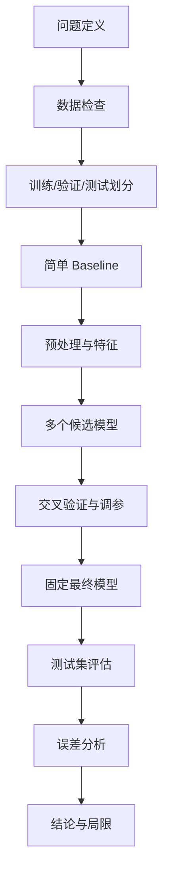

# 机器学习学习路线：ISLP × Stanford CS229 ×《统计学习方法》

> 适用基础：已经学习过高等数学、线性代数、概率论和数理统计，希望系统建立机器学习知识体系，并为后续 PyTorch、深度学习、推荐系统和科研复现打基础。  
> 建议周期：14 周；每周约 8～10 小时。时间紧张时可压缩到 10～12 周，时间充足时可扩展到 16～18 周。

---

## 1. 路线定位

这条路线不采用“依次学完三本材料”的方式，而采用一条统一主线：

$$
\text{ISLP 建立直觉与实验框架}
\rightarrow
\text{CS229 补充数学推导与算法实现}
\rightarrow
\text{李航补充中文定义与经典理论}
$$

三套材料的分工如下。

| 材料 | 主要定位 | 建议时间占比 | 使用方式 |
|---|---|---:|---|
| **ISLP** | 主教材；负责学习顺序、统计直觉、模型比较和 Python 实验 | 50% | 按章节顺序学习，完成核心 Lab |
| **Stanford CS229** | 理论与工程强化；负责概率解释、优化推导、经典作业和代码骨架 | 35% | 只学与主线对应的 Notes、视频和精选 Problem Sets |
| **李航《统计学习方法》** | 中文补充；负责严格定义、经典算法表述和保研笔试常见推导 | 15% | 不单独开一条路线，只在关键算法处查阅 |

第一轮的目标不是“覆盖所有章节”，而是形成下面的完整能力闭环：

1. 能说明机器学习问题的输入、输出和假设；
2. 能写出核心模型、损失函数和优化目标；
3. 能解释训练、验证、测试和泛化的关系；
4. 能用 NumPy 手写少数关键算法；
5. 能用 scikit-learn 完成规范的训练、调参和评估；
6. 能阅读 CS229 风格的代码骨架；
7. 能从经典机器学习平滑过渡到 PyTorch、推荐系统和科研实验。

---

## 2. 最终能力目标

### 2.1 理论层

学完后应当能够围绕任意一个经典算法回答：

- 它解决的是回归、分类还是无监督问题？
- 模型假设是什么？
- 预测函数是什么？
- 损失函数或似然函数是什么？
- 参数通过什么算法求解？
- 正则化如何加入？
- 模型复杂度如何影响偏差与方差？
- 什么情况下该模型可能失效？

### 2.2 工程层

应当能够独立完成：

- 读取与检查数据；
- 划分训练集、验证集和测试集；
- 构建预处理与模型 `Pipeline`；
- 手写 `fit`、`predict` 和评价函数；
- 进行超参数搜索；
- 保存预测、模型参数和图表；
- 记录随机种子、环境和 Git commit；
- 检查数据泄漏、数值溢出和维度错误；
- 撰写一份可复现的实验报告。

### 2.3 后续衔接

这条路线完成后，可以继续进入：

$$
\text{PyTorch}
\rightarrow
\text{深度学习基础}
\rightarrow
\text{推荐系统}
$$

其中最关键的桥梁知识是：

- 逻辑回归与交叉熵；
- Softmax；
- 梯度下降与小批量训练；
- 正则化；
- Embedding 前所需的向量表示直觉；
- 训练、验证、测试的规范；
- 概率输出、排序分数和评价指标；
- 误差分析与可复现实验。

---

## 3. 总体学习流程

每个主题都按同一套顺序学习，避免在三套资料之间来回跳跃。



推荐的单主题学习闭环：

1. **先问问题**：模型要解决什么现实任务？
2. **读 ISLP**：理解模型直觉、适用场景和经验表现；
3. **跑 ISLP Lab**：先看到模型真正运行；
4. **读 CS229**：理解似然、梯度、Hessian、对偶或隐变量；
5. **查李航**：补中文定义和严谨表述；
6. **手写核心算法**：只实现最能帮助理解的部分；
7. **调用成熟库**：完成数据划分、调参、评估和对比；
8. **总结**：记录公式、假设、优缺点、代码接口和实验结论。

---

## 4. 学习材料入口

### 4.1 ISLP

- 官方网站：[An Introduction to Statistical Learning](https://www.statlearning.com/)
- 官方 Python 包：[intro-stat-learning/ISLP](https://github.com/intro-stat-learning/ISLP)
- 官方 Labs：[intro-stat-learning/ISLP_labs](https://github.com/intro-stat-learning/ISLP_labs)
- 社区应用题参考：[pzuehlke/ISLP](https://github.com/pzuehlke/ISLP)

建议使用 Python 版 ISLP。社区题解只在自己做完后核对，不直接照抄。

### 4.2 CS229

- 课程主页：[Stanford CS229](https://cs229.stanford.edu/)
- 2018 课程资料社区整理仓库：[maxim5/cs229-2018-autumn](https://github.com/maxim5/cs229-2018-autumn)
- 课程 Notes：[notes](https://github.com/maxim5/cs229-2018-autumn/tree/main/notes)
- Problem Sets：[problem-sets](https://github.com/maxim5/cs229-2018-autumn/tree/main/problem-sets)
- Problem Set Solutions：[problem-sets-solutions](https://github.com/maxim5/cs229-2018-autumn/tree/main/problem-sets-solutions)
- 课程 Section：[section](https://github.com/maxim5/cs229-2018-autumn/tree/main/section)

使用顺序：

1. 先读题目和代码骨架；
2. 自己完成关键函数；
3. 运行实验并解释结果；
4. 最后再看 Solutions；
5. 不要求完成 PS0～PS4 的所有题。

### 4.3 李航《统计学习方法》

- 社区笔记与实现：[SmirkCao/Lihang](https://github.com/SmirkCao/Lihang)

重点查阅章节：

- 第 1 章：统计学习方法概论；
- 第 2 章：感知机；
- 第 3 章：K 近邻；
- 第 4 章：朴素贝叶斯；
- 第 5 章：决策树；
- 第 6 章：逻辑回归与最大熵；
- 第 7 章：支持向量机；
- 第 8 章：提升方法；
- 第 9 章：EM；
- 第 12 章：监督学习方法总结；
- 第 14～16 章：聚类、SVD、PCA。

---

## 5. 学习环境与工程目录

### 5.1 推荐目录

```text
machine-learning-roadmap/
├─ README.md
├─ environment/
│  ├─ requirements.txt
│  └─ environment.yml
├─ notes/
│  ├─ 01-framework.md
│  ├─ 02-linear-regression.md
│  └─ ...
├─ labs/
│  ├─ islp/
│  └─ sklearn/
├─ from_scratch/
│  ├─ linear_regression.py
│  ├─ logistic_regression.py
│  ├─ pca.py
│  └─ kmeans.py
├─ cs229_ps/
│  ├─ ps1/
│  ├─ ps2/
│  └─ ps3/
├─ projects/
│  └─ final_project/
├─ reports/
└─ figures/
```

### 5.2 建议安装

```bash
python -m venv .venv
```

Windows PowerShell：

```powershell
.venv\Scripts\Activate.ps1
```

安装常用包：

```bash
pip install numpy pandas scipy matplotlib scikit-learn statsmodels jupyterlab ISLP torch
```

克隆 CS229 资料：

```bash
git clone https://github.com/maxim5/cs229-2018-autumn.git
```

> 仓库保留了较早期课程代码。部分代码可能使用旧版 Python 写法，例如 `xrange`。实践时应当在理解原逻辑后迁移到 Python 3，而不是为了运行旧代码去破坏自己的主环境。

### 5.3 每个实验必须固定的信息

```python
RANDOM_STATE = 42
```

实验记录至少包含：

- Python 与主要库版本；
- 数据集版本或文件哈希；
- 随机种子；
- 训练、验证、测试划分；
- 特征预处理；
- 超参数；
- 指标定义；
- 运行命令；
- Git commit。

---

## 6. 14 周路线总览

| 周次 | 核心主题 | ISLP 主线 | CS229 强化 | 李航补充 | 主要产出 |
|---:|---|---|---|---|---|
| 0 | 环境与数学语言转换 | Python Lab 环境 | PS0、数学复习材料 | 不单独学习 | 环境、目录、数学速查表 |
| 1 | 统计学习统一框架 | Ch2 | Introduction、Supervised Learning Setup | Ch1、Ch12选读 | 第一个标准 ML Pipeline |
| 2～3 | 线性回归与优化 | Ch3 | Linear Regression、Gradient Descent、Normal Equation | 按需查阅 | NumPy 线性回归；LWR 实验 |
| 4～5 | 分类模型体系 | Ch4 | Logistic Regression、GDA、Naive Bayes、GLM | Ch2、Ch3、Ch4、Ch6 | Logistic/GDA 对比；正例缺失实验 |
| 6 | 评估、重采样与调参 | Ch5 | Bias–Variance、Evaluation、Calibration | Ch1相关内容 | 无泄漏的调参与评估模板 |
| 7 | 正则化与非线性 | Ch6、Ch7 | Regularization、Model Selection | Ch6选读 | Ridge/Lasso 路径与验证曲线 |
| 8 | 决策树与集成学习 | Ch8 | Decision Trees、Ensembles | Ch5、Ch8 | 树、随机森林、Boosting 对比 |
| 9 | SVM 与核方法 | Ch9 | SVM、Kernel Methods | Ch2、Ch7 | 核感知机；垃圾短信分类 |
| 10 | 神经网络基础 | Ch10 | Neural Networks、Backpropagation | 暂不作为主材料 | NumPy 反向传播；PyTorch MLP |
| 11 | PCA、SVD 与降维 | Ch12相关部分 | PCA、Factor Analysis、ICA选读 | Ch15、Ch16 | NumPy PCA 与重构实验 |
| 12 | 聚类、GMM 与 EM | Ch12 | K-means、GMM、EM | Ch9、Ch14 | K-means；无监督/半监督 GMM |
| 13 | 学习理论与系统复盘 | 回顾 Ch2、Ch5、Ch6 | Learning Theory | Ch1、Ch12 | 泛化、复杂度与学习曲线报告 |
| 14 | 综合项目 | 综合使用 | 项目规范与误差分析 | 仅查概念 | 一份可复现的完整项目 |

---

# 7. 分阶段详细路线

## 第 0 周：环境与数学语言转换

### 目标

不重新系统学习高数、线代和概率论，而是把已有数学知识转换成机器学习语言。

### 数学检查清单

- [ ] 向量、矩阵、内积和范数；
- [ ] 矩阵乘法的维度判断；
- [ ] 特征值、特征向量；
- [ ] SVD；
- [ ] 梯度、Jacobian、Hessian；
- [ ] 条件概率与贝叶斯公式；
- [ ] 极大似然估计 MLE；
- [ ] 最大后验估计 MAP；
- [ ] 多元高斯分布；
- [ ] 凸函数、梯度下降和牛顿法。

### 工程任务

- 创建独立虚拟环境；
- 创建路线目录；
- 克隆 ISLP Labs 和 CS229 仓库；
- 成功运行一个 Jupyter Notebook；
- 使用 NumPy 完成矩阵乘法、求逆、特征值分解和 SVD；
- 建立 Git 仓库并完成第一次 commit。

### 完成标准

能够根据公式快速判断：

- $X$、$y$、$\theta$ 的维度；
- 一个损失函数对参数求梯度后应得到什么形状；
- 为什么批量数据常写成 $(m,n)$；
- 为什么深度学习源码经常出现矩阵转置和广播。

---

## 第 1 周：机器学习的统一框架

### 主要材料

- ISLP Chapter 2：Statistical Learning；
- CS229 Introduction、Supervised Learning Setup；
- 李航第 1 章；第 12 章只看总结性内容。

### 核心问题

- 监督学习与无监督学习有什么区别？
- 回归与分类有什么区别？
- 训练误差为什么不能代表测试误差？
- 参数模型与非参数模型有什么区别？
- 模型灵活性为什么既可能提高效果，也可能造成过拟合？
- 偏差与方差为什么存在权衡？

### 统一表达

大多数监督学习流程都可以写成：

$$
\text{数据}
\rightarrow
\text{模型}
\rightarrow
\text{损失函数}
\rightarrow
\text{优化算法}
\rightarrow
\text{预测}
\rightarrow
\text{评估}
$$

### 工程实践

完成一个最小分类 Pipeline：

```python
from sklearn.model_selection import train_test_split
from sklearn.preprocessing import StandardScaler
from sklearn.pipeline import Pipeline
from sklearn.linear_model import LogisticRegression
from sklearn.metrics import accuracy_score

x_train, x_test, y_train, y_test = train_test_split(
    x, y, test_size=0.2, random_state=42, stratify=y
)

model = Pipeline([
    ("scaler", StandardScaler()),
    ("classifier", LogisticRegression(max_iter=1000))
])

model.fit(x_train, y_train)
pred = model.predict(x_test)
print(accuracy_score(y_test, pred))
```

这一周不追求复杂模型，重点是看懂完整的数据流。

### 产出

- `notes/01-framework.md`
- `labs/sklearn/01_first_pipeline.ipynb`
- 一张“模型—损失—优化—评估”概念图

---

## 第 2～3 周：线性回归与优化基础

### 主要材料

- ISLP Chapter 3；
- CS229 Linear Regression、Normal Equation、Gradient Descent、Probabilistic Interpretation；
- 李航不作为主材料。

### 核心模型

$$
\hat y = \beta_0+\beta_1x_1+\cdots+\beta_px_p
$$

平方损失：

$$
J(\beta)=\frac{1}{2m}\sum_{i=1}^{m}(y_i-x_i^\top\beta)^2
$$

需要理解三种视角：

1. **函数拟合视角**：寻找最接近真实数据的线性函数；
2. **几何视角**：将 $y$ 投影到 $X$ 的列空间；
3. **概率视角**：在高斯噪声假设下进行极大似然估计。

### 必须掌握

- 一元与多元线性回归；
- 哑变量、交互项和多项式特征；
- 残差分析；
- 共线性；
- 正规方程；
- Batch Gradient Descent；
- Stochastic Gradient Descent 的基本思想；
- 牛顿法与 Hessian 的直觉；
- 参数估计、置信区间和显著性检验的区别。

### 手写任务

- [ ] 正规方程；
- [ ] Batch Gradient Descent；
- [ ] 损失曲线；
- [ ] 学习率过大、过小的对比；
- [ ] 与 `sklearn.linear_model.LinearRegression` 的结果核对。

### CS229 实践：局部加权线性回归

仓库任务：

- [PS1-5 Locally weighted linear regression Notebook](https://github.com/maxim5/cs229-2018-autumn/blob/main/problem-sets/PS1/PS1-5%20Locally%20weighted%20linear%20regression.ipynb)
- [p05b_lwr.py](https://github.com/maxim5/cs229-2018-autumn/blob/main/problem-sets/PS1/src/p05b_lwr.py)
- [p05c_tau.py](https://github.com/maxim5/cs229-2018-autumn/blob/main/problem-sets/PS1/src/p05c_tau.py)

建议完成：

1. 在 `fit` 中保存训练集；
2. 在 `predict` 中针对每个查询点计算局部权重；
3. 在验证集上计算 MSE；
4. 搜索不同带宽 $\tau$；
5. 选出验证误差最低的 $\tau$；
6. 最后只在测试集上评估一次；
7. 绘制不同 $\tau$ 下的拟合曲线。

该任务特别适合理解：

- 参数模型与非参数模型；
- 超参数和模型参数的区别；
- 训练集、验证集和测试集的分工；
- 欠平滑与过平滑；
- 为什么某些模型几乎没有显式“训练过程”，但预测代价很高。

### 产出

- `from_scratch/linear_regression.py`
- `cs229_ps/ps1/lwr.py`
- 一张 $\tau$ 与验证 MSE 的曲线
- 一份线性回归、KNN 回归、LWR 的比较笔记

---

## 第 4～5 周：分类模型体系

分类部分按“判别式模型 → 生成式模型 → 非参数模型”的顺序学习。

### 4.1 逻辑回归、感知机与 GLM

#### 主要材料

- ISLP Chapter 4；
- CS229 Logistic Regression、Perceptron、Exponential Family、GLM；
- 李航第 2 章、第 6 章。

逻辑回归：

$$
P(Y=1\mid X=x)=\sigma(\theta^\top x)
$$

其中：

$$
\sigma(z)=\frac{1}{1+e^{-z}}
$$

二元交叉熵：

$$
J(\theta)
=
-\frac{1}{m}
\sum_{i=1}^{m}
\left[
y_i\log \hat p_i+
(1-y_i)\log(1-\hat p_i)
\right]
$$

需要串起：

$$
\text{伯努利分布}
\rightarrow
\text{极大似然}
\rightarrow
\text{负对数似然}
\rightarrow
\text{交叉熵}
\rightarrow
\text{逻辑回归}
$$

### 4.2 GDA、LDA、QDA、朴素贝叶斯与 KNN

重点理解：

#### 判别式模型

直接学习：

$$
P(Y\mid X)
$$

例如逻辑回归。

#### 生成式模型

先学习：

$$
P(X\mid Y),\qquad P(Y)
$$

再通过贝叶斯公式求：

$$
P(Y\mid X)
=
\frac{P(X\mid Y)P(Y)}{P(X)}
$$

### CS229 实践一：逻辑回归与 GDA

仓库任务：

- [PS1-1 Linear Classifiers Notebook](https://github.com/maxim5/cs229-2018-autumn/blob/main/problem-sets/PS1/PS1-1%20Linear%20Classifiers%20%28logistic%20regression%20and%20GDA%29.ipynb)
- [LinearModel 基类](https://github.com/maxim5/cs229-2018-autumn/blob/main/problem-sets/PS1/src/linear_model.py)
- [p01b_logreg.py](https://github.com/maxim5/cs229-2018-autumn/blob/main/problem-sets/PS1/src/p01b_logreg.py)
- [p01e_gda.py](https://github.com/maxim5/cs229-2018-autumn/blob/main/problem-sets/PS1/src/p01e_gda.py)

重点不只是补公式，还要学习工程接口：

```python
model = LogisticRegression(...)
model.fit(x_train, y_train)
prob = model.predict(x_eval)
```

实践要求：

1. 继承 `LinearModel`；
2. 用牛顿法求解逻辑回归；
3. 明确梯度和 Hessian 的维度；
4. 处理截距项；
5. 设置 `max_iter`、`eps` 和初始参数；
6. 保存预测概率；
7. 画出逻辑回归和 GDA 的决策边界；
8. 比较二者在数据分布假设不同时的表现。

工程重点：

- 抽象基类与统一 `fit/predict` 接口；
- 数组形状约定；
- 迭代停止条件；
- 数值稳定的 Sigmoid 与对数；
- 概率输出和类别输出的区分。

### CS229 实践二：只有部分正例被标注

仓库任务：

- [PS1-2 Incomplete, Positive-Only Labels Notebook](https://github.com/maxim5/cs229-2018-autumn/blob/main/problem-sets/PS1/PS1-2%20Incomplete,%20Positive-Only%20Labels.ipynb)
- [p02cde_posonly.py](https://github.com/maxim5/cs229-2018-autumn/blob/main/problem-sets/PS1/src/p02cde_posonly.py)

实验分三组：

1. 使用真实标签训练和测试；
2. 使用观测到的不完整正例标签训练，再对真实标签测试；
3. 使用验证集估计校正因子，对预测概率进行修正。

这个任务的价值在于，它不再是“干净标签上的标准分类”，而是开始处理：

- 标签缺失；
- 选择偏差；
- 观测标签与真实标签的差异；
- 概率校准；
- 验证集承担的额外作用。

这与推荐系统中的曝光偏差、隐式反馈和未观测样本非常接近，应当认真完成。

### 可选实践：Poisson Regression

- [PS1-3 Poisson Regression Notebook](https://github.com/maxim5/cs229-2018-autumn/blob/main/problem-sets/PS1/PS1-3%20Poisson%20Regression.ipynb)

用于理解：

- 指数族；
- 广义线性模型；
- 计数型因变量；
- 为什么不同分布会对应不同链接函数和损失。

时间不足时只读，不必实现。

### 产出

- `from_scratch/logistic_regression.py`
- `cs229_ps/ps1/logreg_gda.py`
- `cs229_ps/ps1/positive_only.py`
- 一张生成式与判别式模型对比表
- 一张概率输出、阈值和决策边界的关系图

---

## 第 6 周：模型评估、重采样与实验规范

### 主要材料

- ISLP Chapter 5；
- CS229 Bias–Variance、Evaluation Metrics、Calibration、Practical Advice；
- 回顾李航第 1 章相关表述。

### 必须掌握

#### 数据划分

- 训练集：拟合参数；
- 验证集：选择模型与超参数；
- 测试集：只用于最终评估；
- K 折交叉验证；
- LOOCV；
- Bootstrap。

#### 回归指标

- MSE；
- RMSE；
- MAE；
- $R^2$。

#### 分类指标

- Accuracy；
- Precision；
- Recall；
- F1；
- ROC-AUC；
- PR-AUC；
- Log Loss；
- Confusion Matrix；
- Calibration Curve。

### CS229 实践：LWR 的 $\tau$ 调参

重新使用 [p05c_tau.py](https://github.com/maxim5/cs229-2018-autumn/blob/main/problem-sets/PS1/src/p05c_tau.py)，重点不再是 LWR 公式，而是实验流程：

```text
训练集拟合
→ 验证集选择 tau
→ 固定最佳 tau
→ 测试集只评估一次
→ 保存预测和图表
```

### CS229 选读：逻辑回归训练稳定性

- [PS2-1 Logistic Regression - Training Stability](https://github.com/maxim5/cs229-2018-autumn/blob/main/problem-sets/PS2/PS2-1%20Logistic%20Regression%20-%20Training%20stability.ipynb)

建议关注：

- 两个数据集上相同优化算法为何可能呈现完全不同的收敛行为；
- 仅看损失下降是否足够；
- 参数范数、梯度、迭代次数和决策边界应如何一起监控；
- 正则化为什么有时不仅改善泛化，也能改善优化行为。

### 工程任务

建立一个可复用的评估函数：

```python
def evaluate_classification(
    y_true,
    y_prob,
    threshold=0.5
):
    ...
```

至少返回：

- Accuracy；
- Precision；
- Recall；
- F1；
- ROC-AUC；
- PR-AUC；
- Log Loss；
- 混淆矩阵。

### 数据泄漏检查

- [ ] 标准化器是否只在训练集上 `fit`？
- [ ] 特征选择是否偷看测试标签？
- [ ] 缺失值填补是否使用全量数据统计量？
- [ ] 测试集是否参与了超参数选择？
- [ ] 时间序列数据是否被随机打乱？
- [ ] 同一用户的数据是否跨集合泄漏？
- [ ] 推荐系统中的未来行为是否进入了历史特征？

### 产出

- `labs/sklearn/evaluation_template.ipynb`
- `reports/model_evaluation_template.md`
- 一个包含学习曲线、验证曲线和校准曲线的小实验

---

## 第 7 周：正则化、变量选择与非线性扩展

### 主要材料

- ISLP Chapter 6；
- ISLP Chapter 7；
- CS229 Regularization、Model Selection；
- 李航第 6 章按需查阅。

### Ridge

$$
\min_\beta
\sum_{i=1}^{m}
(y_i-x_i^\top\beta)^2
+
\lambda\|\beta\|_2^2
$$

### Lasso

$$
\min_\beta
\sum_{i=1}^{m}
(y_i-x_i^\top\beta)^2
+
\lambda\|\beta\|_1
$$

### 必须理解

- 为什么特征通常需要标准化；
- $\lambda$ 控制的不是单个系数，而是整体复杂度；
- Ridge 为什么一般不产生精确零系数；
- Lasso 为什么能够进行变量选择；
- 正则化为什么通常降低方差、增加偏差；
- 正则化与 MAP 的关系；
- 多项式回归、分段函数、样条和 GAM 的作用。

### CS229 选读

- [PS2-3 Bayesian Interpretation of Regularization](https://github.com/maxim5/cs229-2018-autumn/blob/main/problem-sets/PS2/PS2-3%20Bayesian%20Interpretation%20of%20Regularization.ipynb)

目标是理解：

- 高斯先验与 $L_2$ 正则化；
- 拉普拉斯先验与 $L_1$ 正则化；
- MLE 与 MAP 的区别。

### 工程实践

在同一数据集上绘制：

1. Ridge 系数路径；
2. Lasso 系数路径；
3. 训练误差随 $\lambda$ 变化；
4. 验证误差随 $\lambda$ 变化；
5. 非零系数数量随 $\lambda$ 变化。

### 产出

- `labs/sklearn/regularization_path.ipynb`
- 一页“MLE、MAP、正则化”关系笔记
- 一张 Ridge、Lasso、Subset Selection 对比表

---

## 第 8 周：决策树与集成学习

### 主要材料

- ISLP Chapter 8；
- CS229 Decision Trees Notes；
- CS229 Ensemble Methods Notes；
- 李航第 5 章、第 8 章。

### 学习顺序

$$
\text{单棵树}
\rightarrow
\text{剪枝}
\rightarrow
\text{Bagging}
\rightarrow
\text{随机森林}
\rightarrow
\text{AdaBoost}
\rightarrow
\text{Gradient Boosting}
$$

### 必须掌握

- 回归树与分类树；
- 递归二分；
- MSE、信息增益和基尼指数；
- 树深度与过拟合；
- Bootstrap；
- Bagging 如何降低方差；
- 随机森林为何要随机选择特征；
- Boosting 为何逐步关注当前难点；
- Gradient Boosting 的负梯度或残差拟合思想。

### 工程实践

在同一表格数据集上比较：

- 逻辑回归；
- 单棵决策树；
- 随机森林；
- Gradient Boosting。

比较维度不只包括最终分数，还包括：

- 训练时间；
- 推理时间；
- 泛化误差；
- 对标准化的敏感性；
- 对异常值的敏感性；
- 特征重要性；
- 不同随机种子的稳定性。

### 实验注意

不要把树模型输出的内置 `feature_importances_` 直接解释为因果关系。可以进一步比较：

- Permutation Importance；
- SHAP；
- 不同折中的重要性稳定性。

### 产出

- `labs/sklearn/tree_ensemble_comparison.ipynb`
- 一张模型性能与工程成本对比表
- 一份树模型调参记录

---

## 第 9 周：支持向量机与核方法

### 主要材料

- ISLP Chapter 9；
- CS229 SVM、Kernel Methods；
- 李航第 2 章和第 7 章。

### 学习顺序

$$
\text{线性可分}
\rightarrow
\text{最大间隔}
\rightarrow
\text{软间隔}
\rightarrow
\text{合页损失}
\rightarrow
\text{对偶问题}
\rightarrow
\text{核技巧}
$$

软间隔 SVM 可写成：

$$
\min_{w,b}
\frac{1}{2}\|w\|^2
+
C\sum_{i=1}^{m}
\max(0,1-y_i(w^\top x_i+b))
$$

### 必须掌握

- 函数间隔与几何间隔；
- 支持向量；
- 参数 $C$；
- 合页损失；
- 原问题与对偶问题；
- KKT 条件的作用；
- 核函数；
- RBF 核；
- $\gamma$ 或核半径如何控制局部性。

### CS229 实践一：构造核与核感知机

仓库任务：

- [PS2-4 Constructing Kernels](https://github.com/maxim5/cs229-2018-autumn/blob/main/problem-sets/PS2/PS2-4%20Constructing%20kernels.ipynb)
- [PS2-5 Kernelizing the Perceptron](https://github.com/maxim5/cs229-2018-autumn/blob/main/problem-sets/PS2/PS2-5%20Kernelizing%20the%20Perceptron.ipynb)
- [p05_percept.py](https://github.com/maxim5/cs229-2018-autumn/blob/main/problem-sets/PS2/src/p05_percept.py)

代码骨架把 `kernel` 作为函数传入：

```python
predict(state, kernel, x_i)
update_state(state, kernel, learning_rate, x_i, y_i)
```

工程上要关注：

- 如何用可调用对象解耦“学习算法”和“相似度函数”；
- 核化后为什么不再显式维护普通权重向量；
- 如何保存模型状态；
- 如何画出非线性决策边界；
- 如何比较点积核与 RBF 核。

### CS229 实践二：垃圾短信分类

仓库任务：

- [PS2-6 Spam Classification Notebook](https://github.com/maxim5/cs229-2018-autumn/blob/main/problem-sets/PS2/PS2-6%20Spam%20classification.ipynb)
- [p06_spam.py](https://github.com/maxim5/cs229-2018-autumn/blob/main/problem-sets/PS2/src/p06_spam.py)

该任务形成一条完整工程链：

```text
文本规范化
→ 构建词典
→ 词频矩阵
→ 朴素贝叶斯
→ 识别代表性词汇
→ 在验证集上选择 SVM 核半径
→ 测试集评估
```

建议完成的扩展：

1. 将密集词频矩阵改为稀疏矩阵；
2. 增加 TF-IDF；
3. 比较 Multinomial Naive Bayes、Linear SVM 和 RBF SVM；
4. 增加 Precision、Recall、F1，而不仅看 Accuracy；
5. 分析错误分类的短信；
6. 检查高频词和最具判别力词是否一致。

### 产出

- `cs229_ps/ps2/kernel_perceptron.py`
- `cs229_ps/ps2/spam_pipeline.py`
- 点积核与 RBF 核决策边界图
- 一份垃圾短信误差分析

---

## 第 10 周：神经网络基础

### 主要材料

- ISLP Chapter 10；
- CS229 Neural Networks；
- CS229 Backpropagation Notes；
- 李航《统计学习方法》不作为此部分主材料。

### 核心内容

- 线性层；
- 激活函数；
- 多层感知机；
- 前向传播；
- 反向传播；
- 链式法则；
- Mini-batch；
- Epoch；
- SGD；
- Weight Decay；
- Dropout；
- Early Stopping。

两层网络可写成：

$$
z^{(1)}=W^{(1)}x+b^{(1)}
$$

$$
a^{(1)}=\sigma(z^{(1)})
$$

$$
z^{(2)}=W^{(2)}a^{(1)}+b^{(2)}
$$

$$
\hat y=\sigma(z^{(2)})
$$

### CS229 实践一：手工理解网络表达能力

- [PS3-1 A Simple Neural Network Notebook](https://github.com/maxim5/cs229-2018-autumn/blob/main/problem-sets/PS3/PS3-1%20A%20Simple%20Neural%20Network.ipynb)
- [p01_nn.py](https://github.com/maxim5/cs229-2018-autumn/blob/main/problem-sets/PS3/src/p01_nn.py)

该任务通过手动设置隐藏层和输出层权重，理解：

- 隐藏单元如何形成不同区域；
- 激活函数为什么决定网络是否真正具有非线性表达能力；
- 多层线性变换为什么仍然等价于一次线性变换。

### CS229 实践二：反向传播与梯度检查

- [notes/backprop.py](https://github.com/maxim5/cs229-2018-autumn/blob/main/notes/backprop.py)

建议不要直接运行原文件，而是迁移到 Python 3 并重写为：

```python
def forward(x, y, params):
    ...

def backward(cache):
    ...

def numerical_gradient_check(...):
    ...
```

重点完成：

1. 手写前向传播；
2. 缓存中间变量；
3. 手写反向传播；
4. 使用有限差分做梯度检查；
5. 比较解析梯度与数值梯度；
6. 解释为什么数值梯度只适合调试，而不适合真正训练。

### PyTorch 桥接实践

再用 PyTorch 完成同一网络：

```python
model = torch.nn.Sequential(
    torch.nn.Linear(input_dim, hidden_dim),
    torch.nn.ReLU(),
    torch.nn.Linear(hidden_dim, num_classes)
)
```

对照理解：

| NumPy 手写 | PyTorch |
|---|---|
| 参数字典 | `model.parameters()` |
| 前向传播 | `model(x)` |
| 手写梯度 | `loss.backward()` |
| 手写更新 | `optimizer.step()` |
| 清空梯度 | `optimizer.zero_grad()` |

### 产出

- `from_scratch/two_layer_nn.py`
- `from_scratch/gradient_check.py`
- `labs/pytorch/mlp_baseline.py`
- 一张 NumPy 与 PyTorch 训练流程对应图

---

## 第 11 周：PCA、SVD 与降维

### 主要材料

- ISLP Chapter 12 中 PCA 部分；
- CS229 PCA；
- Factor Analysis、ICA 只作拓展；
- 李航第 15 章、第 16 章。

### 核心内容

- 数据中心化；
- 协方差矩阵；
- 特征值分解；
- SVD；
- 主成分方向；
- 解释方差；
- 投影与重构；
- 标准化对 PCA 的影响；
- PCA 与线性回归的区别；
- PCA 与矩阵低秩近似的关系。

SVD：

$$
X=U\Sigma V^\top
$$

低维表示：

$$
Z=XV_k
$$

近似重构：

$$
\hat X=ZV_k^\top
$$

### 必须手写

- [ ] 中心化；
- [ ] 协方差矩阵；
- [ ] 特征值分解或 SVD；
- [ ] 主成分排序；
- [ ] 投影；
- [ ] 重构；
- [ ] 解释方差比。

### 工程实践

- 比较未标准化与标准化后的 PCA；
- 画累计解释方差曲线；
- 观察降维前后的分类效果；
- 检查 PCA 是否在交叉验证外部提前 `fit`，避免泄漏；
- 将 PCA 放入 scikit-learn `Pipeline`。

### 可选拓展

- [PS4 ICA 代码骨架](https://github.com/maxim5/cs229-2018-autumn/blob/main/problem-sets/PS4/src/p04_ica.py)

第一轮只需要知道 ICA 与 PCA 的目标不同，不要求深入推导。

### 产出

- `from_scratch/pca.py`
- `labs/sklearn/pca_pipeline.ipynb`
- 解释方差曲线与重构误差曲线

---

## 第 12 周：聚类、GMM 与 EM

### 主要材料

- ISLP Chapter 12；
- CS229 K-means、GMM、EM；
- 李航第 9 章、第 14 章。

### K-means

目标函数：

$$
\min_{\mu_1,\ldots,\mu_K}
\sum_{i=1}^{m}
\min_k
\|x_i-\mu_k\|^2
$$

需要理解：

- 分配步骤；
- 更新步骤；
- 初始化敏感性；
- 局部最优；
- 特征缩放；
- 聚类数选择；
- 类内平方和；
- 聚类标签本身没有固定语义。

### GMM 与 EM

需要理解：

- 混合分布；
- 隐变量；
- 后验责任度；
- 完整数据似然；
- 边缘似然；
- E 步；
- M 步；
- 对数似然单调不下降；
- K-means 可视为 GMM 的一种硬分配近似。

### CS229 实践：无监督与半监督 GMM

- [p03_gmm.py](https://github.com/maxim5/cs229-2018-autumn/blob/main/problem-sets/PS3/src/p03_gmm.py)

代码任务包括：

1. 随机初始化各高斯分量；
2. 初始化混合权重、均值、协方差和责任度；
3. 实现无监督 EM；
4. 每轮计算对数似然；
5. 以对数似然变化作为停止条件；
6. 运行多个随机初始化；
7. 实现半监督 EM；
8. 比较少量标签加入前后的聚类结果。

工程重点：

- 随机初始化导致的结果波动；
- 多次 trial；
- 收敛阈值 `eps`；
- 最大迭代次数；
- 协方差矩阵的数值稳定；
- 概率连乘造成的下溢；
- 对数似然应当单调不下降；
- 标签数据和无标签数据的索引切分。

建议增加：

```python
sigma_k += 1e-6 * np.eye(n_features)
```

并尽量使用对数域计算或 `logsumexp`。

### 产出

- `from_scratch/kmeans.py`
- `cs229_ps/ps3/gmm_em.py`
- 无监督与半监督 GMM 对比图
- 初始化敏感性实验报告

---

## 第 13 周：学习理论与整体复盘

### 主要材料

- CS229 Learning Theory；
- 回顾 ISLP Chapter 2、5、6；
- 回顾李航第 1 章、第 12 章。

### 第一轮需要掌握到的程度

重点理解推理链，不强求一次性完成所有严格证明：

- 经验风险最小化；
- 期望风险；
- 结构风险最小化；
- 假设空间；
- 泛化误差；
- 模型复杂度；
- Hoeffding 不等式的直觉；
- Uniform Convergence；
- VC 维；
- 正则化如何限制有效假设空间；
- Bias–Variance 分解；
- 数据量如何影响泛化。

### 实践任务：把抽象理论变成图

完成三个小实验：

1. **多项式阶数实验**  
   阶数上升时，训练误差和测试误差如何变化？

2. **训练样本量实验**  
   数据量增加时，训练误差和验证误差如何变化？

3. **正则化强度实验**  
   $\lambda$ 改变时，参数范数、训练误差和验证误差如何变化？

### 产出

- `reports/generalization_experiments.md`
- 三张学习曲线或验证曲线
- 一张“模型复杂度—数据量—正则化—泛化”关系图

---

## 第 14 周：完整机器学习项目

### 推荐项目类型

优先选择一个表格数据的分类或回归问题。第一轮不建议直接把全量 SASRec 或 FS-LTR 复现当作结课项目，因为那会把数据工程、深度学习、序列建模和推荐系统问题同时混入，反而不利于巩固经典机器学习实验范式。

可以选择：

1. 一个标准表格分类任务；
2. 一个业务数据分析任务；
3. RecFlow 的小规模子集，构建简单分类或打分 Baseline；
4. 用户—视频特征上的逻辑回归、随机森林或 GBDT 对比。

### 项目流程



### 项目最低要求

- [ ] 明确任务和目标变量；
- [ ] 写清数据划分；
- [ ] 至少一个简单 Baseline；
- [ ] 至少三类模型；
- [ ] 使用验证集或交叉验证调参；
- [ ] 测试集只在最后使用；
- [ ] 报告至少两个互补指标；
- [ ] 画学习曲线或验证曲线；
- [ ] 进行分组误差分析；
- [ ] 保存配置、结果与图表；
- [ ] 固定随机种子；
- [ ] 提交完整 README；
- [ ] 记录局限和下一步方向。

### 推荐仓库结构

```text
final_project/
├─ README.md
├─ requirements.txt
├─ data/
│  └─ README.md
├─ configs/
│  └─ baseline.yaml
├─ src/
│  ├─ data.py
│  ├─ features.py
│  ├─ models.py
│  ├─ train.py
│  └─ evaluate.py
├─ notebooks/
│  └─ exploration.ipynb
├─ outputs/
│  ├─ metrics.json
│  ├─ predictions.csv
│  └─ figures/
└─ report.md
```

---

# 8. CS229 实践的优先级

不需要把全部作业做完。建议按以下优先级选择。

## 8.1 必做

| 实践 | 对应阶段 | 为什么值得做 |
|---|---|---|
| Logistic Regression + GDA | 分类 | 同时训练判别式和生成式模型，并练习统一接口 |
| LWR + $\tau$ 调参 | 回归、评估 | 将模型、超参数、验证集和测试集串成完整流程 |
| Positive-Only Labels | 标签偏差 | 接近隐式反馈、曝光偏差和真实科研数据问题 |
| Kernelized Perceptron | 核方法 | 理解算法与核函数解耦，观察非线性决策边界 |
| Backprop + Gradient Check | 神经网络 | 建立从矩阵微分到 PyTorch 自动求导的桥梁 |
| GMM + Semi-supervised EM | 无监督学习 | 理解隐变量、概率计算、收敛监控和初始化 |

## 8.2 推荐完成

| 实践 | 作用 |
|---|---|
| Logistic Regression Training Stability | 理解可分数据、参数发散、收敛诊断和正则化 |
| Spam Classification | 完成文本预处理、特征工程、模型选择和错误分析 |
| Bayesian Interpretation of Regularization | 串联 MLE、MAP、先验和正则化 |
| Constructing Kernels | 理解哪些函数能够作为合法核函数 |

## 8.3 选读或后置

| 实践 | 处理方式 |
|---|---|
| Poisson Regression | 对计数数据或 GLM 感兴趣时完成 |
| ICA | PCA 学完后选读 |
| Reinforcement Learning / CartPole | 放到独立强化学习路线 |
| PS4 其他高级题 | 第一轮不要求 |

---

# 9. 工程实践的统一标准

## 9.1 统一模型接口

即使是手写模型，也尽量采用：

```python
model = Model(config)
model.fit(x_train, y_train)
pred = model.predict(x_test)
prob = model.predict_proba(x_test)
```

这样做的价值是：

- 训练与预测职责清晰；
- 便于替换模型；
- 便于统一评估；
- 更接近 scikit-learn 和实际项目接口；
- 更容易迁移到 PyTorch 的 `Dataset`、`DataLoader` 和 `Module`。

## 9.2 维度检查

每个核心函数都写清形状：

```python
# x: (m, n)
# y: (m,)
# theta: (n,)
# logits: (m,)
```

遇到错误时先检查：

1. 样本维在哪里；
2. 特征维在哪里；
3. 是否遗漏截距；
4. 是否发生意外广播；
5. `(m,)` 与 `(m,1)` 是否混用；
6. 矩阵乘法顺序是否正确。

## 9.3 数值稳定

常见问题：

- `np.exp` 溢出；
- `np.log(0)`；
- 概率连乘下溢；
- 协方差矩阵不可逆；
- Hessian 奇异；
- 特征尺度差异过大；
- 逻辑回归在完全可分数据上参数不断增大。

常见处理：

```python
eps = 1e-12
p = np.clip(p, eps, 1 - eps)
```

```python
cov = cov + 1e-6 * np.eye(cov.shape[0])
```

```python
from scipy.special import logsumexp
```

## 9.4 收敛监控

至少记录：

- 当前迭代；
- 当前 loss 或 log-likelihood；
- 参数变化量；
- 梯度范数；
- 验证指标；
- 是否触发最大迭代次数。

## 9.5 可复现性

```python
import random
import numpy as np

random.seed(42)
np.random.seed(42)
```

使用 PyTorch 时再增加：

```python
import torch

torch.manual_seed(42)
if torch.cuda.is_available():
    torch.cuda.manual_seed_all(42)
```

## 9.6 Git 提交节点

建议每个主题至少有三次提交：

```text
feat: implement logistic regression forward and loss
feat: add Newton solver and convergence checks
exp: compare logistic regression with GDA
```

---

# 10. 每个主题的一页总结模板

```markdown
# 模型名称

## 1. 解决的问题
- 输入：
- 输出：
- 任务类型：

## 2. 模型
- 预测函数：
- 参数：
- 核心假设：

## 3. 学习策略
- 损失函数或似然：
- 正则化：

## 4. 优化算法
- 闭式解 / 梯度下降 / 牛顿法 / EM / 其他：
- 时间复杂度：
- 数值风险：

## 5. 评估
- 主要指标：
- 数据划分：
- 超参数：

## 6. 优点与局限
- 优点：
- 局限：
- 适用场景：

## 7. 工程实现
- 输入形状：
- 输出形状：
- `fit`：
- `predict`：
- 关键代码：
- 常见报错：

## 8. 实验结论
- Baseline：
- 最佳模型：
- 误差分析：

## 9. 与其他模型的关系
- 与……的相同点：
- 与……的不同点：
```

---

# 11. 每周时间分配模板

以每周 8～10 小时为例：

| 模块 | 时间 | 任务 |
|---|---:|---|
| ISLP 阅读 | 2.0 h | 读主章节，先建立直觉 |
| ISLP Lab | 1.5 h | 跑通代码，修改参数并观察 |
| CS229 理论 | 2.0 h | 读 Notes 或视频，完成关键推导 |
| CS229 / NumPy 实践 | 2.0～3.0 h | 补代码骨架、画图、调试 |
| 李航补充 | 0.5～1.0 h | 只查重点章节 |
| 总结复盘 | 0.5～1.0 h | 写一页总结与 Git commit |

时间紧张时的优先级：

$$
\text{ISLP 核心内容}
>
\text{规范实验}
>
\text{CS229 关键推导}
>
\text{精选作业}
>
\text{李航补充}
>
\text{非核心扩展}
$$

---

# 12. 第一轮不要求学习的内容

## ISLP 暂缓

- Survival Analysis；
- Multiple Testing。

多重检验对科研有价值，可以在真正需要时补。

## CS229 暂缓

- Gaussian Process；
- VAE；
- Reinforcement Learning；
- MDP；
- LQR / LQG；
- Policy Search；
- POMDP。

强化学习应当单独开一条路线，不要打断经典机器学习主线。

## 李航暂缓

- HMM；
- CRF；
- LSA；
- PLSA；
- MCMC；
- LDA 主题模型；
- PageRank。

这些内容有价值，但不属于第一轮通用机器学习的必要核心。

---

# 13. 路线完成判定

完成这条路线，不是指“看完了多少页”，而是达到以下标准。

## 理论

- [ ] 能从 MLE 推出线性回归或逻辑回归的损失；
- [ ] 能解释生成模型与判别模型；
- [ ] 能解释偏差—方差；
- [ ] 能解释 Ridge 与 Lasso；
- [ ] 能说明树、核方法和神经网络如何表达非线性；
- [ ] 能解释 PCA、K-means、GMM 和 EM 的关系；
- [ ] 能说明泛化、正则化、数据量和模型复杂度的关系。

## 实现

- [ ] 手写线性回归；
- [ ] 手写逻辑回归；
- [ ] 手写 PCA；
- [ ] 手写 K-means；
- [ ] 实现 GMM 的 EM 核心步骤；
- [ ] 手写两层网络的前向与反向传播；
- [ ] 完成至少 5 个精选 CS229 实践。

## 工程

- [ ] 熟练使用 NumPy、pandas、Matplotlib；
- [ ] 会使用 scikit-learn Pipeline；
- [ ] 会进行交叉验证和超参数搜索；
- [ ] 能识别数据泄漏；
- [ ] 能记录实验配置和结果；
- [ ] 能进行误差分析；
- [ ] 能写出可复现 README；
- [ ] 能用 Git 管理版本。

## 项目

- [ ] 完成一个端到端项目；
- [ ] 项目包含 Baseline、模型对比、调参和测试；
- [ ] 项目有规范报告和图表；
- [ ] 能在 10 分钟内向别人解释问题、方法、结果和局限。

---

# 14. 完成后的下一步

建议后续顺序：

## 阶段一：PyTorch 与深度学习

重点补：

- Tensor；
- `Dataset`；
- `DataLoader`；
- `nn.Module`；
- 前向传播；
- Autograd；
- Optimizer；
- Batch；
- GPU；
- 保存与加载模型。

## 阶段二：推荐系统基础

重点补：

- 隐式反馈；
- 负采样；
- Embedding；
- Matrix Factorization；
- BPR；
- Recall、Ranking；
- Recall@K、NDCG@K、MRR；
- 离线评估；
- 曝光偏差。

---

# 15. 启动清单

- [ ] 建立 `machine-learning-roadmap` 仓库；
- [ ] 创建虚拟环境；
- [ ] 安装 Python 依赖；
- [ ] 克隆 ISLP Labs；
- [ ] 克隆 CS229 资料；
- [ ] 建立 `notes`、`from_scratch`、`cs229_ps`、`projects` 目录；
- [ ] 完成第一个 scikit-learn Pipeline；
- [ ] 阅读 ISLP Chapter 2；
- [ ] 写第一份 `01-framework.md`；
- [ ] 提交第一次 Git commit。

---

## 一句话总结

这条路线的核心不是把三套材料全部学完，而是：

$$
\boxed{
\text{用 ISLP 建立完整框架}
+
\text{用 CS229 理解理论并训练工程能力}
+
\text{用李航补充经典中文表述}
}
$$

最终形成一条从经典机器学习到 PyTorch、推荐系统和 RecFlow 研究的连续路径。
