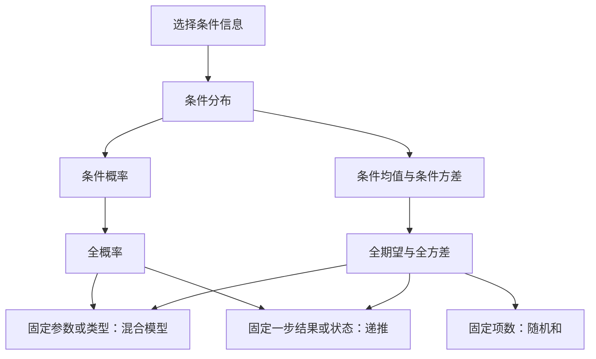
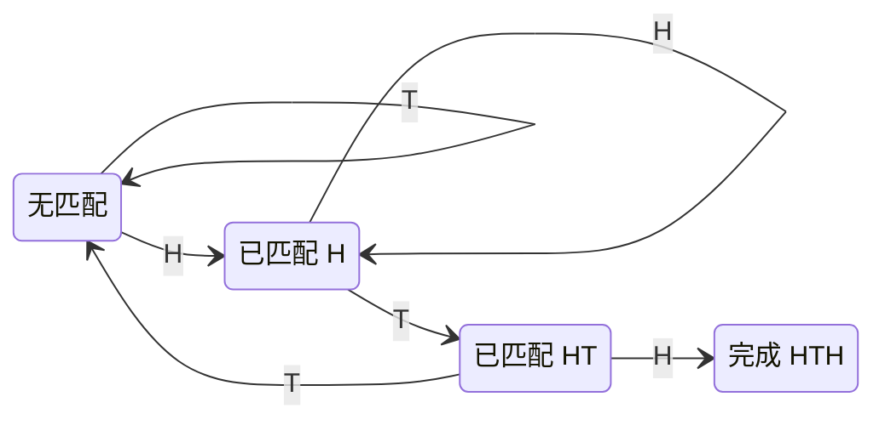

# 第 3 章 · 条件概率与条件期望

> **教材依据：** Ross, *Introduction to Probability Models*（《概率模型导论》），第 13 版，第 3 章；对应所附 PDF 的教材页码 103—182，习题另列于章末。
> **学习主线：** 先建立逻辑地图，再理解核心工具，接着学习建模方法，最后把专题应用接回主线。英文仅用于术语标注。

## 1. 先看整章的逻辑地图

条件化（**conditioning**）就是先固定一部分信息，再分析随机系统。它有两个用途：获得观察结果后更新判断；或者暂时固定一个有用变量，让计算变简单。如果最终求的是无条件结果，就按这个变量的分布，把条件下的答案加权平均。

各类应用的联系在于“选择什么信息”：固定隐藏参数，得到混合模型（**mixture model**）；固定第一次结果，得到递推（**recursion**）；固定随机项数，得到固定项数的和。核心能力是判断：**条件化以后，究竟哪一部分变简单了？**

| 层次 | 核心问题 | 教材范围 | 本文位置 |
|---|---|---|---|
| 定义 | 给定信息后，分布与均值是什么？ | 3.1—3.3 | 第 2—3 节 |
| 平均工具 | 如何恢复总体概率、均值和方差？ | 3.4—3.5、3.4.1 | 第 3—4 节 |
| 建模方法 | 如何选择条件、写递推、分析混合与随机和？ | 3.4—3.5 | 第 5—7 节 |
| 专题应用 | 列表、图、Pólya 模型、模式、记录值与随机游走 | 3.6.1—3.6.6 | 第 6、8—10 节 |
| 分布递推 | 如何计算随机和的完整 PMF？ | 3.7—3.7.3 | 第 11 节 |

**贯穿全章的提问：** 如果我知道了___，剩余问题就会更容易，因为___。

## 2. 条件分布：限制范围，再归一化

### 2.1 离散与连续情形

条件分布（**conditional distribution**）是在纳入已知信息之后得到的概率分布。对事件来说，先只保留符合条件的结果，再归一化（**normalization**），使它们的总概率恢复为 1。条件符号 $\mid$ 表示“给定”（**given**）。

$$
P(A\mid B)=\frac{P(A\cap B)}{P(B)},\qquad P(B)>0.
$$

离散分布用概率质量函数（**probability mass function，PMF**）描述；连续分布用概率密度函数（**probability density function，PDF**）描述。

| 术语 | 离散 | 连续 |
|---|---|---|
| 联合分布（joint distribution） | 联合概率质量函数 **joint PMF**：$p_{X,Y}(x,y)$ | 联合概率密度函数 **joint PDF**：$f_{X,Y}(x,y)$ |
| 边缘分布（marginal distribution） | $p_Y(y)=\sum_xp_{X,Y}(x,y)$ | $f_Y(y)=\int f_{X,Y}(x,y)\,dx$ |
| 条件分布（conditional distribution） | 用联合 PMF 除以边缘 PMF | 用联合 PDF 除以边缘 PDF |

$$
\boxed{p_{X\mid Y}(x\mid y)=\frac{p_{X,Y}(x,y)}{p_Y(y)}}
\qquad
\boxed{f_{X\mid Y}(x\mid y)=\frac{f_{X,Y}(x,y)}{f_Y(y)}}.
$$

两个公式都要求分母为正。连续变量通常满足 $P(Y=y)=0$，因此条件密度公式不是“两个点概率相除”。密度（**density**）对区域积分后才得到概率，密度值本身可以超过 1。

**离散小例，教材例 3.1：**

| $X\backslash Y$ | $Y=1$ | $Y=2$ |
|---|---:|---:|
| $X=1$ | 0.5 | 0.1 |
| $X=2$ | 0.1 | 0.3 |

给定 $Y=1$，只保留第一列。该列总概率为 $0.6$，所以各项除以 $0.6$ 后，得到 $P(X=1\mid Y=1)=5/6$、$P(X=2\mid Y=1)=1/6$。

### 2.2 用一个连续模型贯穿后续计算

自设联合密度如下，其他位置为 0：

$$
f_{X,Y}(x,y)=\frac1y,\qquad 0<x<y<1.
$$

先看支持集（**support**），也就是变量允许取值的范围。固定 $Y=y$ 后，$x$ 只能在 $0$ 到 $y$ 之间变化。把 $y$ 当常数，对 $x$ 积分求边缘密度，再归一化：

$$
f_Y(y)=\int_0^y\frac1y\,dx=1,\quad 0<y<1;
\qquad
f_{X\mid Y}(x\mid y)=\frac1y,\quad 0<x<y.
$$

因此 $Y\sim\operatorname{Uniform}(0,1)$，且 $X\mid Y=y\sim\operatorname{Uniform}(0,y)$，其中 $\operatorname{Uniform}$ 表示均匀分布（**uniform distribution**）。

**计算步骤：** 写支持集 → 求边缘分布 → 相除 → 检查条件分布的总概率为 1。注意，条件后的范围可以依赖 $y$。

### 2.3 识别条件化后出现的新分布

条件化可能把一种熟悉的分布变成另一种。要问的是：总量固定后，还剩下什么随机性？原模型中的独立性（**independence**），一般不会在给定共同总量后继续成立。

**① 二项分布（binomial distribution）→ 超几何分布。** 独立的 $X_1\sim\operatorname{Binomial}(n_1,p)$、$X_2\sim\operatorname{Binomial}(n_2,p)$ 具有相同成功率 $0<p<1$。给定总成功数 $m$：

$$
P(X_1=k\mid X_1+X_2=m)
=\frac{\binom{n_1}{k}\binom{n_2}{m-k}}{\binom{n_1+n_2}{m}},
\quad
\max(0,m-n_2)\le k\le\min(n_1,m).
$$

总成功数固定，问题变成这些成功如何分配到两组。共同的成功率 $p$ 在相除时约掉，因此得到超几何分布（**hypergeometric distribution**）；两组成功率不同时，不能直接使用这个公式。这里 $k,m$ 都是可行的整数。

**② Poisson 分布 → 二项分布。** 若 $X_1,X_2$ 独立，分别服从均值为 $\lambda_1,\lambda_2$ 的 Poisson 分布，且 $\lambda_1+\lambda_2>0$，则：

$$
X_1\mid(X_1+X_2=n)
\sim\operatorname{Binomial}\!\left(n,\frac{\lambda_1}{\lambda_1+\lambda_2}\right).
$$

给定总计数后，每个事件按各来源占总发生率的比例分配。推导时，把分子写成联合事件 $X_1=k,X_2=n-k$，利用独立性，再除以总计数为 $n$ 的概率即可。

**③ 指数分布（exponential distribution）→ 均匀分布（uniform distribution）。** 若 $X_1,X_2$ 是独立的同率指数变量，则：

$$
X_1\mid(X_1+X_2=t)\sim\operatorname{Uniform}(0,t),\qquad t>0.
$$

两个率相同时，联合密度沿着 $x_1+x_2=t$ 保持不变，所以条件分布均匀。如果率为不同的 $\mu_1,\mu_2$，条件密度在 $(0,t)$ 上正比于 $e^{-(\mu_1-\mu_2)x}$，不再均匀。两种情形都必须保留支持集限制。

**独立性判别：** $X$ 与 $Y$ 独立，当且仅当对几乎所有条件值 $y$，$X$ 的整个条件分布都等于其边缘分布。因此，“条件答案是否随 $y$ 改变”也可以帮助判断独立性；仅检查均值还不够。

### 2.4 用条件分布重建或变换模型

链式法则（**chain rule**）把逐步的条件分布相乘，重建联合分布。它本身不要求独立；只有另加独立性条件时，才能把相应的条件分布换成边缘分布。例如：

$$
f_{X,Y,Z}(x,y,z)
=f_X(x)f_{Y\mid X}(y\mid x)f_{Z\mid X,Y}(z\mid x,y).
$$

对两个变量的和，固定其中一个，就确定了另一个需要贡献多少。存在联合密度时，沿 $x+y=t$ 积分得到和的密度；若两者独立，才进一步化为边缘密度的卷积（**convolution**）：

$$
f_{X+Y}(t)=\int_{-\infty}^{\infty} f_{X,Y}(t-y,y)\,dy
\quad\xrightarrow{\ X\perp Y\ }\quad
\int_{-\infty}^{\infty} f_X(t-y)f_Y(y)\,dy.
$$

离散情形把积分换成对可行 $y$ 的求和。至此，条件分布既能“接收信息”，也能“构造新分布”。

## 3. 条件期望：先分组，再平均

### 3.1 一个数、一个函数与一个随机变量

条件期望（**conditional expectation**）就是用条件分布作加权平均。对于适当的函数 $h$，可以直接计算 $h(X)$ 的条件期望，通常不用先求 $h(X)$ 自己的分布：

$$
E[h(X)\mid Y=y]=
\begin{cases}
\displaystyle\sum_x h(x)p_{X\mid Y}(x\mid y),&X\text{ 为离散变量},\\[5pt]
\displaystyle\int h(x)f_{X\mid Y}(x\mid y)\,dx,&X\text{ 为连续变量}.
\end{cases}
$$

取 $h(x)=x$ 得到条件均值（**conditional mean**）；取 $h(x)=x^2$ 得到条件二阶矩（**conditional second moment**）；取 $h(x)=\mathbf1_{\{x\le t\}}$ 得到条件累积分布函数（**conditional cumulative distribution function，CDF**）。

固定 $Y=y$ 后，条件期望是一个数。让 $y$ 变化，$g(y)=E[X\mid Y=y]$ 就是“观察值对应哪个均值”的函数。把随机变量 $Y$ 代入，得到 $E[X\mid Y]=g(Y)$；它通常仍然是随机变量。

沿用 $X\mid Y=y\sim U(0,y)$：

| 表达式 | 结果 | 含义 |
|---|---|---|
| $E[X\mid Y=0.8]$ | $0.4$ | 已知上限为 0.8 后的均值，是一个数 |
| $g(y)=E[X\mid Y=y]$ | $y/2$ | 每个上限对应其区间中点，是一个函数 |
| $E[X\mid Y]$ | $Y/2$ | 随机上限对应的随机均值，是一个随机变量 |

### 3.2 全期望与全概率是一套逻辑

先求每组内部的平均值，再按各组出现的概率加权，就得到总体平均值。外层平均使用的是条件变量的分布；目标变量本身是离散还是连续，并不决定外层采用求和还是积分。

$$
\boxed{E[X]=E\!\left[E[X\mid Y]\right]}
=\begin{cases}
\displaystyle\sum_y E[X\mid Y=y]p_Y(y),&Y\text{ 为离散变量},\\[5pt]
\displaystyle\int E[X\mid Y=y]f_Y(y)\,dy,&Y\text{ 为连续变量}.
\end{cases}
$$

这是全期望公式（**law of total expectation**），也叫迭代期望法则（**law of iterated expectations**）。不要求 $X,Y$ 独立；有限均值的讨论通常假设 $E[|X|]<\infty$。

**为什么成立：** 离散时，两种求和顺序都在加总同一批联合概率质量：

$$
\sum_y E[X\mid Y=y]p_Y(y)
=\sum_y\sum_x x\,p_{X,Y}(x,y)
=\sum_x x\,p_X(x)=E[X].
$$

贯穿例子立即给出 $E[X]=E[Y/2]=1/4$，不用先求 $X$ 的边缘密度。

事件的概率，就是其指示变量（**indicator variable**）的期望。因此，把全期望应用于指示变量，就得到全概率公式（**law of total probability**）。这解释了为什么求概率和求期望可以使用同一套条件化策略。

$$
\mathbf1_A=\begin{cases}1,&A\text{ 发生},\\0,&A\text{ 不发生},\end{cases}
\qquad
\boxed{P(A)=E[P(A\mid Y)]}.
$$

若 $B_1,B_2,\ldots$ 构成互不相交且覆盖全部可能性的划分（**partition**），则 $P(A)=\sum_iP(A\mid B_i)P(B_i)$；只需对概率为正的组求和。

### 3.3 能真正简化计算的性质

| 性质 | 公式 | 解释 |
|---|---|---|
| 线性性（linearity） | $E[aX+bZ\mid Y]=aE[X\mid Y]+bE[Z\mid Y]$ | 加权平均具有线性性，无须独立 |
| 提出已知量（taking out what is known） | $E[h(Y)X\mid Y]=h(Y)E[X\mid Y]$ | 给定 $Y$ 后，$h(Y)$ 已确定 |
| 对已知量取条件期望 | $E[h(Y)\mid Y]=h(Y)$ | 已知量不需要再平均 |
| 塔式法则（tower property） | $E[E[X\mid Y,Z]\mid Y]=E[X\mid Y]$ | 从更多信息平均回较少信息 |
| 独立性（independence） | $X\perp Y\Rightarrow E[X\mid Y]=E[X]$ | 独立时，知道 $Y$ 不改变 $X$ 的均值 |

这些性质要求相关期望存在。塔式法则依赖信息的嵌套关系，不能随意删掉条件；一般没有 $E[E[X\mid Y]\mid Z]=E[X\mid Z]$。此外，条件均值不变不足以证明独立，因为独立要求整个分布保持不变。

**常用推论：** $E[XY]=E[Y\,E[X\mid Y]]$，常用于算协方差（**covariance**）。但非线性函数不能随意移出期望，例如 $E[X^2\mid Y]$ 通常不等于 $(E[X\mid Y])^2$。

## 4. 全方差：波动来自哪两个层次？

### 4.1 组内波动与组间波动

条件方差（**conditional variance**）衡量信息固定以后仍然存在的波动。总体波动还有另一个来源：不同条件下的均值可能不同。全方差公式（**law of total variance**）把第一种波动的平均与第二种波动的方差相加。

$$
\operatorname{Var}(X\mid Y)=E[X^2\mid Y]-(E[X\mid Y])^2,
$$

$$
\boxed{
\operatorname{Var}(X)
=\underbrace{E[\operatorname{Var}(X\mid Y)]}_{\text{组内方差的平均}}
+\underbrace{\operatorname{Var}(E[X\mid Y])}_{\text{组均值的方差}}
}.
$$

推导只需要把二阶矩展开并抵消。这也说明，单独对条件方差取平均会漏掉一部分总体方差。讨论有限方差时，要求 $E[X^2]<\infty$：

$$
\begin{aligned}
E[\operatorname{Var}(X\mid Y)]
&=E[X^2]-E[(E[X\mid Y])^2],\\
\operatorname{Var}(E[X\mid Y])
&=E[(E[X\mid Y])^2]-(E[X])^2.
\end{aligned}
$$

### 4.2 把贯穿例子算完整

$$
E[X\mid Y]=\frac Y2,\qquad
\operatorname{Var}(X\mid Y)=\frac{Y^2}{12};
\qquad
E[Y^2]=\frac13,\quad\operatorname{Var}(Y)=\frac1{12}.
$$

$$
E[X]=\frac14,
\qquad
\operatorname{Var}(X)
=E\!\left[\frac{Y^2}{12}\right]
+\operatorname{Var}\!\left(\frac Y2\right)
=\frac1{36}+\frac1{48}=\boxed{\frac7{144}}.
$$

第一项来自固定区间以后，还要在区间内随机取点；第二项来自上限变化，使区间中点也跟着变化。这一计算完整连接了：**联合密度 → 条件矩 → 无条件矩**。

**计算模板：** 先写 $m(y)=E[X\mid Y=y]$、$v(y)=\operatorname{Var}(X\mid Y=y)$，再算 $E[m(Y)]$ 和 $E[v(Y)]+\operatorname{Var}(m(Y))$。

### 4.3 与预测的联系

在平方误差损失（**squared-error loss**）下，基于 $Y$ 的最优预测是条件均值。其他预测函数都会增加一个非负误差项。信息减少的是平均剩余方差；某个具体条件下的方差，仍可能大于无条件方差。

对平方可积的预测函数 $g(Y)$：

$$
E[(X-g(Y))^2]
=E[\operatorname{Var}(X\mid Y)]
+E[(E[X\mid Y]-g(Y))^2].
$$

取 $g(Y)=E[X\mid Y]$，最后一项为 0。这一联系帮助理解条件期望在回归（**regression**）中的意义。

## 5. 首步分析：让过程变成方程

### 5.1 先定义状态，再写递推

对随时间演化的过程，可以先固定第一次转移的结果。这种方法称为首步分析（**first-step analysis**）。状态（**state**）必须保留决定未来分布所需的信息。走完一步后，把已经付出的成本与新状态下的剩余成本分开。

设 $P_{sj}$ 是从状态 $s$ 转移到 $j$ 的概率，$c_s$ 是本步的期望成本，$m_s$ 是剩余总成本的期望，则在非终止状态：

$$
\boxed{m_s=c_s+\sum_jP_{sj}m_j}.
$$

到达某目标的概率也满足类似的加权平均方程，但不需要加上“一单位时间”。边界条件（**boundary conditions**）规定到达目标或其他终止状态后，结果取什么值。必须先明确模型，才能正确列方程。

例如目标命中概率为 $h_s$ 时，非终止状态满足 $h_s=\sum_jP_{sj}h_j$；目标状态取 1，代表失败的终止状态取 0。终止状态的剩余时间则取 0。

### 5.2 几何等待与重新开始

设 $N$ 是直到首次成功为止的总试验次数，包含成功那一次，各次独立且成功率为 $p>0$。失败后，未来试验与原实验具有相同分布，因此递推方程两边会出现同一个未知均值。

令 $m=E[N]$、$q=1-p$，则：

$$
m=p\cdot1+q(1+m)
\quad\Longrightarrow\quad m=\frac1p.
$$

求二阶矩时，先把总时间平方，再取期望。失败后总次数是 $1+N'$，其中 $N'$ 与原来的 $N$ 同分布；不要漏掉平方展开中的交叉项 $2N'$。

$$
a=E[N^2]=p+q(1+2m+a)
\quad\Longrightarrow\quad
E[N^2]=\frac{2-p}{p^2},\qquad
\operatorname{Var}(N)=\frac{1-p}{p^2}.
$$

**约定：** 此处几何分布（**geometric distribution**）取值为 $1,2,\ldots$；若统计成功前的失败次数，应使用 $N-1$。

同一个“重启”结构给出教材矿工例：三个门等概率选择，分别 2 小时获救、3 小时返回、5 小时返回；返回后重复相同选择规则。于是 $m=\frac13[2+(3+m)+(5+m)]$，解得 $m=10$ 小时。

### 5.3 需要多个状态时怎么办？

在赌徒破产模型（**gambler’s ruin**）中，剩余游戏时间取决于当前资金。应当给每个资金状态分别定义均值，不能把所有未终止状态都当成同一种“重启”。公平游戏对应的二阶差分方程具有二次函数形式的解。

每局等概率赢或输 1，资金到 0 或 $b$ 时停止，从 $i$ 开始：

$$
m_i=1+\tfrac12m_{i-1}+\tfrac12m_{i+1},\qquad m_0=m_b=0,
\qquad\boxed{m_i=i(b-i)}.
$$

到达 $b$ 的概率没有常数项 1：$h_i=\frac12h_{i-1}+\frac12h_{i+1}$，边界 $h_0=0,h_b=1$，故 $h_i=i/b$。

### 5.4 同一思想如何变成算法？

把递推中的中间答案保存并复用，就得到动态规划（**dynamic programming, DP**）。条件变量应当揭示更小的子问题：最后一次 Bernoulli 试验让计数增加 0 或 1；快速排序（**quicksort**）的第一个枢轴（**pivot**）决定两个子问题的大小。

独立 Bernoulli 变量可有不同成功率 $p_k$。令 $a_k(j)$ 为前 $k$ 次恰好成功 $j$ 次的概率：

$$
a_k(j)=(1-p_k)a_{k-1}(j)+p_ka_{k-1}(j-1),
\qquad a_0(0)=1.
$$

其他不可能下标取 0。这是 Poisson 二项分布（**Poisson binomial distribution**）的计算方法；各 $p_k$ 不同时，不能套普通二项 PMF。

随机选择枢轴时，$n$ 个互异元素的期望比较次数满足：

$$
C_n=n-1+\frac1n\sum_{j=1}^{n}(C_{j-1}+C_{n-j}),\quad C_0=C_1=0;
\qquad C_n=2(n+1)H_n-4n,
$$

其中 $H_n=\sum_{j=1}^n1/j$ 是调和数（**harmonic number**），所以期望复杂度为 $\Theta(n\log n)$。

**递推四步：** 定义状态 → 按转移条件化 → 写边界 → 求解。若未来还取决于记忆、发球者或已匹配的模式，就必须把它们纳入状态。几乎必然结束（**almost surely finite**）也不自动保证期望有限。

## 6. 混合、贝叶斯更新与强化过程

### 6.1 先固定隐藏参数

混合模型先选择隐藏类型或参数，再依据它生成观察值。把参数取平均，通常不能代替对条件分布加权平均；全概率公式要求的是后者。

若 $X\mid\Lambda=\lambda\sim\operatorname{Poisson}(\lambda)$，则：

$$
P(X=k)=E\!\left[e^{-\Lambda}\frac{\Lambda^k}{k!}\right],\qquad
E[X]=E[\Lambda],\qquad
\operatorname{Var}(X)=E[\Lambda]+\operatorname{Var}(\Lambda).
$$

例如 $\Lambda$ 等概率取 2、5，均值为 3.5，但方差为 $3.5+2.25=5.75$，所以总体不是 $\operatorname{Poisson}(3.5)$。

发生率自身的随机性，会在普通 Poisson 波动之外增加额外方差。这解释了异质群体中的过度离散（**overdispersion**）。如果率服从 Gamma 分布，把它积分消去后，计数服从负二项分布（**negative binomial distribution**）。

具体地，若 $\Lambda\sim\operatorname{Gamma}(a,b)$，其中 $a>0$ 为形状、$b>0$ 为率（**rate**），则：

$$
P(X=k)=\frac{\Gamma(k+a)}{\Gamma(a)k!}
\left(\frac b{b+1}\right)^a\left(\frac1{b+1}\right)^k,
\qquad k=0,1,\ldots.
$$

教材例 3.23 取 $a=2,b=1$，得到 $(k+1)/2^{k+2}$。这里 $\Gamma$ 表示 Gamma 函数（**gamma function**）。

**另一种分布构造：$t$ 分布（Student’s $t$ distribution）。**

条件化也能处理随机缩放。用一个标准正态变量（**standard normal variable**），除以“独立的卡方变量（**chi-squared variable**）与其自由度之比”的平方根；固定分母后，剩下的是正态分布。再对这些正态密度加权，就得到 $t$ 密度。

$$
Z\sim N(0,1),\quad V\sim\chi^2_{\nu},\quad Z\perp V,
\qquad T=\frac Z{\sqrt{V/\nu}};
\qquad T\mid V=v\sim N(0,\nu/v).
$$

$$
f_T(t)=\frac{\Gamma((\nu+1)/2)}{\sqrt{\nu\pi}\,\Gamma(\nu/2)}
\left(1+\frac{t^2}{\nu}\right)^{-(\nu+1)/2},\qquad t\in\mathbb R.
$$

其中 $\nu>0$ 是自由度（**degrees of freedom**）。这一例子的可迁移方法是“固定随机分母 → 识别条件分布 → 积分混合”。

### 6.2 条件独立是另一种命题

观察值在给定共同参数时可以独立，但对参数平均后可能相关。一次观察提供了关于隐藏参数的信息，因此会改变对另一次观察的预测。这个推理要求整段序列共用一次抽出的参数。

先抽 $P\sim U(0,1)$，给定 $P$ 后独立生成 $X_1,X_2\sim\operatorname{Bernoulli}(P)$：

$$
P(X_1=1,X_2=1)=E[P^2]=\frac13
\ne\frac14=P(X_1=1)P(X_2=1).
$$

若每次都独立重抽一个参数，模型就不同了。对应术语是条件独立（**conditional independence**）与无条件独立（**unconditional independence**）。

### 6.3 先更新，再预测

先验（**prior**）描述观察数据前的参数分布；似然（**likelihood**）把已观察数据的概率看成参数的函数。贝叶斯公式（**Bayes’ theorem**）将两者结合得到后验（**posterior**），预测则用后验权重对未来的条件分布加权。

$$
\underbrace{f(\theta\mid D)}_{\text{后验}}
\,\propto\,
\underbrace{P(D\mid\theta)}_{\text{似然}}
\underbrace{f(\theta)}_{\text{先验}}.
$$

符号 $\propto$ 表示“成比例”，最后需要归一化。连续数据时，似然改用相应密度。

均匀先验下，前 $n$ 次成功 $k$ 次后，后验密度正比于 $p^k(1-p)^{n-k}$。识别出 Beta 密度的形式，就能直接读出参数；再取后验均值，得到下一次成功的概率。

$$
P\mid D\sim\operatorname{Beta}(k+1,n-k+1),
\qquad
P(X_{n+1}=1\mid D)=E[P\mid D]=\boxed{\frac{k+1}{n+2}}.
$$

同样的“更新—加权”流程适用于隐藏群体类型。若给定类型后，各年的计数是独立 Poisson 变量，第一年的结果会更新我们对类型的判断，这些新权重再决定下一年的预测。

设 $P(T=j)=\pi_j$，给定 $T=j$ 时各年计数独立且均值为 $\lambda_j>0$。观察第一年 $N_1=n$ 后：

$$
w_j(n)=P(T=j\mid N_1=n)
=\frac{\pi_j e^{-\lambda_j}\lambda_j^n}{\sum_\ell\pi_\ell e^{-\lambda_\ell}\lambda_\ell^n},
\qquad
E[N_2\mid N_1=n]=\sum_j\lambda_jw_j(n).
$$

### 6.4 Pólya 球罐与均匀计数向量

Pólya 球罐模型（**Pólya’s urn model**）的规则是：最初放 1 个白球、1 个黑球，每次抽球后放回，再加 1 个同色球。每次抽中某种颜色，都会提高下一次再抽到它的概率，这称为强化（**reinforcement**）。

前 $n$ 次有 $k$ 次白球时，下次白球概率是 $(k+1)/(n+2)$，恰好等于均匀先验模型的预测概率。因此，这两种构造产生相同的颜色序列分布。

总白球次数 $K_n$ 的分布为：

$$
P(K_n=k)=\binom nk\int_0^1p^k(1-p)^{n-k}\,dp=\frac1{n+1},\qquad 0\le k\le n.
$$

这些试验具有可交换性（**exchangeability**）：只改变有限序列的排列，不改变各颜色次数，序列概率就不变。但可交换不意味着独立。多颜色情形中，若在概率单纯形（**probability simplex**）上采用均匀先验，所有可行计数向量等可能；教材称其为 Bose–Einstein 分配（**Bose–Einstein statistics**）。单纯形的约束使概率向量各分量之间存在依赖。

有 $m$ 类时，概率向量采用 $\operatorname{Dirichlet}(1,\ldots,1)$ 分布，等价于每种颜色初始各 1 球的 Pólya 模型：

$$
P(K_1=k_1,\ldots,K_m=k_m)=\binom{n+m-1}{m-1}^{-1},
\quad\sum_{j=1}^m k_j=n;
\qquad
P(\text{下一次为 }j\mid\boldsymbol K)=\frac{k_j+1}{n+m}.
$$

概率向量满足各分量非负、总和为 1，只剩 $m-1$ 个自由坐标；上述均匀先验在这些坐标上的密度为 $(m-1)!$。这里计数向量等可能，但不同计数对应的具体序列数量不同，不能误认为所有长度为 $n$ 的颜色序列都等可能。

## 7. 随机和：固定项数，消去一层随机性

### 7.1 均值与方差

设 $S_N=\sum_{i=1}^N X_i$，$S_0=0$；$X_i$ 独立同分布（**independent and identically distributed, i.i.d.**），整个增量序列与非负整数计数 $N$ 独立。记 $E[X_i]=\mu$、$\operatorname{Var}(X_i)=\sigma^2$。

随机和（**random sum**）有两层随机性：出现多少项，以及每项有多大。条件于项数，就把它变成固定项数的和。计数与增量独立，保证固定项数后，各项的分布不变。

$$
E[S_N\mid N]=N\mu,\qquad
\operatorname{Var}(S_N\mid N)=N\sigma^2.
$$

由全期望、全方差，在所需矩有限时：

$$
\boxed{E[S_N]=E[N]\mu},
\qquad
\boxed{\operatorname{Var}(S_N)=E[N]\sigma^2+\operatorname{Var}(N)\mu^2}.
$$

方差的两项分别表示单项贡献的波动和项数的波动。如果项数依赖已经观察到的增量，就必须重新检查条件下的计算。由历史决定的停止规则，并不自动满足这里的独立计数论证。

短反例：$X_i\overset{\text{i.i.d.}}\sim\operatorname{Bernoulli}(1/2)$，令 $N=X_1$，则 $S_N=X_1$，所以 $E[S_N]=1/2$，而 $E[N]E[X_1]=1/4$。停止时刻能否使用 Wald 等式（**Wald’s equation**），需要另外验证其适用条件。

若 $N\sim\operatorname{Poisson}(\lambda)$，则 $S_N$ 是复合 Poisson 变量（**compound Poisson variable**），满足 $\operatorname{Var}(S_N)=\lambda E[X_1^2]$。

| 模型 | 随机化的对象 |
|---|---|
| 混合 Poisson（mixed Poisson） | Poisson 计数的率参数 $\Lambda$ 随机 |
| 复合 Poisson（compound Poisson） | Poisson 个随机增量相加，项数和增量都随机 |

### 7.2 Poisson 分流

假设总项数服从 Poisson 分布，每项独立地分入两类。给定总数，一类的计数服从二项分布。再按 Poisson 总数加权，两类计数会成为相互独立的 Poisson 变量；而给定总数时，它们仍受固定总和的约束。

若 $N\sim\operatorname{Poisson}(\lambda)$，每项以概率 $p$ 分入第一类，以 $1-p$ 分入第二类，则：

$$
\begin{aligned}
P(N_1=a,N_2=b)
&=P(N=a+b)\binom{a+b}{a}p^a(1-p)^b\\
&=\left[e^{-\lambda p}\frac{(\lambda p)^a}{a!}\right]
  \left[e^{-\lambda(1-p)}\frac{(\lambda(1-p))^b}{b!}\right].
\end{aligned}
$$

联合 PMF 分解为边缘 PMF 的乘积，因此 $N_1\perp N_2$。这一结果叫分流（**splitting**）或稀疏化（**thinning**）；多类别时相应得到独立的 $\operatorname{Poisson}(\lambda p_j)$ 计数。

## 8. 模式等待：难点在重叠与状态

*对应教材 3.6.4。*

### 8.1 为什么不能总用“概率的倒数”？

模式等待时间（**pattern waiting time**）统计直到目标模式首次完整出现所需的观察次数。模式在一个固定窗口中出现的概率，与逐次观察窗口所需的等待时间不同；相邻窗口会共享符号。自重叠（**self-overlap**）决定延伸失败后能否保留部分匹配进度，因此“模式概率的倒数”不是通用等待时间公式。

将“已观察序列的后缀中，同时也是目标前缀的最长部分”作为状态。它恰好保留了对下一次观察有用的部分匹配信息。再对每个未完成状态列首步方程。

例如公平硬币等待 **HTH**，$H$ 为正面（**heads**），$T$ 为反面（**tails**）。状态为 $\varnothing,H,HT$，完成状态为 HTH：

$$
\begin{aligned}
m_0&=1+\tfrac12m_0+\tfrac12m_H,\\
m_H&=1+\tfrac12m_H+\tfrac12m_{HT},\\
m_{HT}&=1+\tfrac12m_0.
\end{aligned}
\qquad\Longrightarrow\qquad \boxed{m_0=10}.
$$

### 8.2 用前后缀重叠概括均值

对独立同分布的符号序列，每个同时作为前缀与后缀的部分，都会对等待均值作出贡献。这里的边界长度集合（**border lengths**）包含完整模式长度。若不存在短于完整模式的这种重叠，均值就化为模式概率的倒数。

目标 $w=w_1\cdots w_L$，各目标符号概率为正；令 $B(w)$ 为所有满足“长度为 $r$ 的前缀等于后缀”的 $r\in\{1,\ldots,L\}$，则：

$$
\boxed{E[T_w]=\sum_{r\in B(w)}\frac1{P(w_1)\cdots P(w_r)}}.
$$

| 公平硬币模式 | 边界长度 | 平均等待次数 |
|---|---|---:|
| HHT | $3$ | $8$ |
| HTH | $1,3$ | $2+8=10$ |
| HHH | $1,2,3$ | $2+4+8=14$ |

### 8.3 还要会求分布与方差

对长度为 $L$、单窗口概率为 $\pi$ 的无自重叠模式，时刻 $j+L$ 首次完成，可以与“时刻 $j$ 尚未完成”联系起来。这同时给出概率递推和方差公式，但等待时间仍不必服从几何分布。

$$
P(T_w=j+L)=\pi P(T_w>j),\quad j\ge0;
\qquad E[T_w]=\frac1\pi,
\quad\operatorname{Var}(T_w)=\frac1{\pi^2}-\frac{2L-1}{\pi}.
$$

若 $a_t=P(T_w=t)$，则 $a_t=0$ 对 $t<L$，$a_L=\pi$，且对 $t\ge L+1$，$a_t=a_{t-1}-\pi a_{t-L}$。有重叠时可回到状态方程求分布或二阶矩。

连续 $k$ 次正面是常用特例：成功率 $p>0$ 时，$E[T]=\sum_{r=1}^k p^{-r}$；公平硬币下为 $2^{k+1}-2$。

### 8.4 把混合模型与重启结合

假设硬币的成功率随机，出现正面就继续使用，出现反面就独立换一枚新硬币。一次尝试在前 $k$ 次全是正面时成功结束。先条件于硬币品质，求单次尝试的成功概率和平均长度，再用重启方程。

记每枚新硬币的成功率为 $P$，$\mu_j=E[P^j]$，$\mu_0=1$、$\mu_k>0$。一次尝试成功的概率为 $\mu_k$，平均长度为 $c=\sum_{j=0}^{k-1}\mu_j$，故：

$$
m=c+(1-\mu_k)m
\quad\Longrightarrow\quad
\boxed{m=\frac{\sum_{j=0}^{k-1}\mu_j}{\mu_k}}.
$$

若每枚新硬币的 $P\sim U(0,1)$，则 $\mu_j=1/(j+1)$，从而 $m=(k+1)H_k$。这里换币规则是模型的一部分，不能把它当成固定一枚随机硬币一直投掷。

## 9. 列表、随机图与记录值：换一种观察单位

### 9.1 列表模型，教材 3.6.1

在移至表首（**move-to-front**）列表中，每次访问一个元素后，就把它移到最前面。某元素的位置等于“1 加上排在它前面的元素数”，因此用指示变量，就能把整体排序问题化成两两比较。长期来看，$j$ 排在 $i$ 前面，恰好对应这两个元素中最近被访问的是 $j$。

各次访问独立，访问 $i$ 的概率为 $p_i>0$，$\sum_i p_i=1$。长期有：

$$
P(j\text{ 排在 }i\text{ 前面})=\frac{p_j}{p_i+p_j},
\qquad
\boxed{E[\text{查找位置}]
=1+\sum_i p_i\sum_{j\ne i}\frac{p_j}{p_i+p_j}}.
$$

均匀访问 $n$ 个元素时，结果是 $(n+1)/2$。可迁移的方法是：**总成本 → 局部指示变量之和 → 单个局部概率**。

### 9.2 随机映射图，教材 3.6.2

随机映射图（**random mapping graph**）中，$n$ 个节点各自独立地从全部 $n$ 个节点中均匀选择一个作为出边目标，允许自环（**self-loop**）。判断连通性（**connectivity**）时忽略方向。从一个节点沿出边走，直到第一次重复；条件于此时已发现的不同节点数，就能把这些节点合并为一个连通的超级节点（**supernode**）。

令 $N$ 为第一次重复前发现的不同节点数。教材的超级节点引理给出 $P(\text{连通}\mid N=k)=k/n$，所以：

$$
\boxed{P(\text{连通})=\frac{E[N]}n
=\frac{(n-1)!}{n^n}\sum_{j=0}^{n-1}\frac{n^j}{j!}}.
$$

其中 $E[N]$ 可由尾概率求和得到：$P(N>j)=\prod_{\ell=1}^{j}(1-\ell/n)$，$0\le j<n$，空乘积为 1。大 $n$ 时，连通概率渐近等价于 $\sqrt{\pi/(2n)}$。

每个连通分量（**connected component**）恰好包含一个有向环（**directed cycle**）。因此，数分量等价于数环，用指示变量便能求期望。若要求分量数的完整分布，就条件于某固定节点所在分量的顶点集合，其余顶点构成更小的子问题。

设 $C$ 为连通分量数，则：

$$
E[C]=\sum_{k=1}^{n}\binom nk\frac{(k-1)!}{n^k}.
$$

设 $g_n(r)=P(C=r)$；$g_n(1)$ 就是上面的连通概率，对 $2\le r\le n$：

$$
g_n(r)=\sum_{k=1}^{n-r+1}
\binom{n-1}{k-1}
\left(\frac kn\right)^k
\left(\frac{n-k}{n}\right)^{n-k}
g_k(1)g_{n-k}(r-1).
$$

各因子依次表示：选同组节点、两组出边各留在组内、第一组连通、剩余组有 $r-1$ 个分量。基础值为 $g_1(1)=1$，不可能的分量数概率为 0。

### 9.3 连续上记录，教材 3.3

上记录（**upper record**）是超过此前所有观察值的新值。给定当前记录 $r$，不断跳过未超过 $r$ 的观察，直到遇到更大的值；所以下一个记录服从原分布在 $r$ 以上的截断分布（**truncated distribution**）。

设原 i.i.d. 连续样本的密度为 $f$、CDF 为 $F$，生存函数（**survival function**）为 $\bar F=1-F$。当 $\bar F(r)>0$ 时：

$$
f_{R_{n+1}\mid R_n}(u\mid r)=\frac{f(u)}{\bar F(r)},\qquad u>r.
$$

由链式法则可得前 $n$ 个记录的联合密度，以及第 $n$ 个记录的边缘密度：

$$
f_{R_1,\ldots,R_n}(r_1,\ldots,r_n)
=f(r_n)\prod_{j=1}^{n-1}\frac{f(r_j)}{\bar F(r_j)},\quad r_1<\cdots<r_n.
$$

$$
f_{R_n}(t)=f(t)\frac{\Lambda(t)^{n-1}}{(n-1)!},
$$

其中 $\Lambda(t)=-\log\bar F(t)$ 是累积风险函数（**cumulative hazard function**），$f(t)/\bar F(t)$ 是风险率（**hazard rate**）。这一组公式的来源是反复条件化与截断。

### 9.4 离散 $k$ 记录，教材 3.6.5

本小节改为考察独立同分布的正整数值样本。本章定义：若前 $n$ 个观察值中，包括 $X_n$ 自己在内，恰有 $k$ 个大于或等于 $X_n$，就称 $X_n$ 为一个 $k$ 记录（**$k$-record**）。离散样本会出现并列（**ties**），所以不能把“大于或等于”改成“大于”。对候选值 $i$，只保留至少为 $i$ 的观察；$i$ 是 $k$ 记录，当且仅当第 $k$ 个保留下来的观察等于 $i$。

令 $p_i=P(X=i)$，则：

$$
\lambda_i=P(X=i\mid X\ge i)
=\frac{p_i}{\sum_{j\ge i}p_j}.
$$

这种筛选构造是 Ignatov 定理（**Ignatov’s theorem**）的基础：不同 $k$ 对应的完整有序记录值向量相互独立且同分布。该结论针对记录值，不能换成“记录出现的时刻相互独立”。有限支持集下，按剩余最小取值条件化，还能为首次 $k$ 记录时间建立简短递推。

设支持集包含于 $\{1,\ldots,m\}$，且 $p_m>0$。$T_i$ 是在分布 $X\mid X\ge i$ 下首次出现 $k$ 记录所需的观察次数，则：

$$
E[T_i]=E[T_{i+1}]+(k-1)\lambda_i,\quad i<m;
\qquad E[T_m]=k.
$$

$$
\boxed{E[T_1]=k+(k-1)\sum_{i=1}^{m-1}\lambda_i}.
$$

均匀分布于 $1,\ldots,m$ 时，结果为 $1+(k-1)H_m$。本专题的思路是“筛选样本 → 条件分布 → 对层级递推”。

## 10. 向左不能跳级的随机游走

*对应教材 3.6.6。*

### 10.1 把下降过程拆成逐级通过

令 $S_n=\sum_{i=1}^nX_i$、$S_0=0$；增量 $X_i$ i.i.d.，取值为 $-1,0,1,\ldots$。首次到达 $-k$ 的时间称为首次通过时间（**first-passage time**）：

$$
T_{-k}=\min\{n\ge1:S_n=-k\},\qquad k\ge1.
$$

向左不能跳级（**left skip free**），指每一步最多下降 1。为了到达 $-k$，过程必须依次经过中间各层。相继下降一级所需的时间相互独立且同分布，所以下降 $k$ 级的时间，是 $k$ 个单级通过时间之和。

设 $E[X_i]=-v<0$，$E[|X_i|]<\infty$。负漂移（**negative drift**）保证最终会到达每个负层级，且：

$$
E[T_{-k}]=kE[T_{-1}],\qquad
\operatorname{Var}(T_{-k})=k\operatorname{Var}(T_{-1})
$$

其中方差的有限性还需要相应二阶矩条件。

### 10.2 首步分析加上全方差

如果第一次增量为 $X_1=j$，已经用掉 1 步，之后还需下降 $j+1$ 级。这就把条件均值和条件方差都写成了单级通过时间的函数；再用全期望、全方差，解出这两个未知矩。

令 $m=E[T_{-1}]$、$a=\operatorname{Var}(T_{-1})$，则：

$$
E[T_{-1}\mid X_1]=1+(X_1+1)m,
\qquad
\operatorname{Var}(T_{-1}\mid X_1)=(X_1+1)a.
$$

若 $\sigma^2=\operatorname{Var}(X_1)<\infty$，解除条件后：

$$
m=1+(1-v)m,\qquad a=(1-v)a+m^2\sigma^2;
\qquad
\boxed{E[T_{-k}]=\frac kv},\quad
\boxed{\operatorname{Var}(T_{-k})=\frac{k\sigma^2}{v^3}}.
$$

**解释：** 平均向下速度为 $v$，走完距离 $k$ 平均需 $k/v$ 步；当负漂移接近零时，等待时间波动会显著增大。负均值本身不保证增量二阶矩有限，因此不能省略方差条件。

### 10.3 首次到达、停留次数与最后到达

“时刻 $n$ 位于某层”与“时刻 $n$ 首次到达该层”不同。命中时间定理（**hitting time theorem**）通过因子 $k/n$ 把两者联系起来。这个恒等式本身不要求负漂移，与前面关于有限均值的公式应区分使用。

$$
\boxed{P(T_{-k}=n)=\frac knP(S_n=-k)},\qquad k,n\ge1.
$$

在负漂移条件下，同一恒等式还能给出访问某负层级的期望次数。每次访问后，再不返回的概率为 $v$。把“此时位于该层”的概率乘以这个逃离概率（**escape probability**），就得到最后访问时间的分布。

令 $L_{-k}$ 为最后访问 $-k$ 的时间，教材的其余结论可整理为：

| 对象 | 结论 |
|---|---|
| 期望访问次数 | $\sum_{n\ge1}P(S_n=-k)=1/v$ |
| 离开 0 后始终严格为负的概率 | $P(S_n<0\text{ 对所有 }n\ge1)=v$ |
| 最后访问时间分布 | $P(L_{-k}=n)=vP(S_n=-k)$ |
| 最后访问时间均值 | $E[L_{-k}]=k/v+\sigma^2/v^2$，要求 $\sigma^2<\infty$ |

## 11. 复合分布：从矩推进到完整 PMF

*对应教材 3.7—3.7.3。沿用第 7 节中与增量序列独立的计数 $N$。*

### 11.1 为什么引入规模偏倚计数？

直接求随机和的概率，需要对许多个固定项数和的分布加权。复合随机变量恒等式（**compound random variable identity**）能避免反复计算这些卷积。关键手段是规模偏倚（**size biasing**）：按一个计数中包含多少个对称的贡献项，为它重新加权。

当 $0<E[N]<\infty$ 时，定义与增量序列独立的 $M$：

$$
P(M=n)=\frac{nP(N=n)}{E[N]},\qquad n=1,2,\ldots.
$$

从总体中抽一个人，比均匀抽一个组更容易碰到大组。权重中的 $n$ 表示这种抽样视角的变化。代数上，把 $n$ 个对称项的贡献之和写成“$n$ 倍某个代表项”，也会产生同一个因子 $n$。

在相关期望存在时，条件于 $N$ 并利用对称性：

$$
\begin{aligned}
E[S_Nh(S_N)]
&=\sum_{n\ge1}P(N=n)\sum_{i=1}^n E[X_i h(S_n)]\\
&=\sum_{n\ge1}nP(N=n)E[X_1h(S_n)]\\
&=\boxed{E[N]E[X_1h(S_M)]}.
\end{aligned}
$$

### 11.2 选择指示函数，得到概率递推

现在进一步假设增量取正整数。让测试函数指示“总量等于 $k$”。左边在该事件上恰好贡献 $k$；右边则条件于第一个增量，再让剩余增量补足所需总量。

记 $\alpha_j=P(X_i=j)$，取 $h(s)=\mathbf1_{\{s=k\}}$，得到：

$$
\boxed{
\begin{aligned}
P(S_N=0)&=P(N=0),\\
P(S_N=k)&=\frac{E[N]}k\sum_{j=1}^k j\alpha_jP(S_{M-1}=k-j),\quad k\ge1.
\end{aligned}
}.
$$

这里剩余 $M-1$ 个增量的和，与 $S_{M-1}$ 同分布；“去掉第一项”不表示两个不同和在同一样本上相等。下一步只需识别 $M-1$ 的计数分布：

| 原计数 $N$ | $M-1$ |
|---|---|
| $\operatorname{Poisson}(\lambda)$ | $\operatorname{Poisson}(\lambda)$ |
| $\operatorname{Binomial}(r,p)$ | $\operatorname{Binomial}(r-1,p)$ |
| $\operatorname{NB}_{\mathrm{fail}}(r,p)$ | $\operatorname{NB}_{\mathrm{fail}}(r+1,p)$ |

最后一行的下标 **fail** 表示“第 $r$ 次成功前的失败次数”，避免不同教材对负二项变量的计数约定产生歧义。

### 11.3 三种可以直接执行的递推

**Poisson 计数，教材 3.7.1。** 令 $q_k=P(S_N=k)$：

$$
\boxed{q_0=e^{-\lambda},\qquad
q_k=\frac\lambda k\sum_{j=1}^k j\alpha_jq_{k-j},\quad k\ge1}.
$$

Poisson 情形特别简单，因为规模偏倚后再减 1，计数分布保持不变。每个概率只用到更小总量的概率，因此从 0 开始向上计算。若所有增量恒为 1，就恢复普通 Poisson 分布的递推。

例如教材例 3.38：$\lambda=4$，增量均匀取 $1,2,3,4$。各 $q_k/e^{-4}$ 依次为 $1,1,3/2,13/6,73/24,381/120$，所以 $P(S_N=5)=(381/120)e^{-4}\approx0.05815$。

**二项计数，教材 3.7.2。** 固定 $p$，令 $q_r(k)$ 对应 $N\sim\operatorname{Binomial}(r,p)$：

$$
q_r(0)=(1-p)^r,\qquad
q_r(k)=\frac{rp}{k}\sum_{j=1}^k j\alpha_jq_{r-1}(k-j),\quad r,k\ge1.
$$

基础值 $q_0(0)=1$、$q_0(k)=0$ 对 $k>0$。

**与负二项有关的计数，教材 3.7.3。** 此处明确采用：

$$
P(N=n)=\binom{n+r-1}{r-1}p^r(1-p)^n,\quad n\ge0,
\qquad E[N]=\frac{r(1-p)}p,
$$

其中 $r\ge1$ 为整数，$0<p<1$；教材中统计总试验次数的负二项变量对应 $N+r$。固定 $p$ 后：

$$
q_r(0)=p^r,\qquad
q_r(k)=\frac{r(1-p)}{kp}\sum_{j=1}^k j\alpha_jq_{r+1}(k-j),\quad k\ge1.
$$

负二项递推虽然让参数 $r$ 增加，却让总量下标 $k$ 减小。由于增量为正，对任一固定目标总量，计算仍会在有限步后到达初值。若允许零增量，初始概率会改变，必须重新检查递推。

例如增量允许为 0 且 $\alpha_0=P(X_i=0)$ 时，复合 Poisson 的初值为 $q_0=e^{\lambda(\alpha_0-1)}$，不再是 $e^{-\lambda}$。

## 12. 把理解变成通用解题方法

### 12.1 根据困难选择条件

开始时先识别计算困难，再选择能消除这项困难的信息，写出条件下的答案，最后才加权。如果条件答案里又出现了原来的未知量，就建立起了递推方程。

| 困难 | 优先考虑的条件 | 简化后的问题 |
|---|---|---|
| 类型、发生率未知 | 隐藏类型或参数 | 已知参数下的熟悉分布 |
| 项数随机 | 总项数 $N$ | 固定项数的和 |
| 过程反复继续 | 首次或末次结果、当前状态 | 本步成本加剩余子问题 |
| 窗口重叠 | 已匹配的最长前缀状态 | 有限个状态之间的转移 |
| 排序或连通复杂 | 一对元素、首次重复、局部连通分量 | 局部概率或更小模型 |
| 观察后预测改变 | 先更新参数或类型的后验 | 按新权重加权预测 |

### 12.2 指示变量、对称性与尾概率

对计数问题，指示变量经常能省去求分布的步骤。期望的线性性不要求这些指示变量独立。对乘积矩，条件于其中一个因子，就能把已知因子移出内层期望。

$$
E\!\left[\sum_i\mathbf1_{A_i}\right]=\sum_iP(A_i),
\qquad E[XY]=E[X\,E[Y\mid X]].
$$

例如多项计数（**multinomial counts**）$N_i,N_j$ 来自 $n$ 次独立分类，类别概率为 $p_i,p_j$，$i\ne j$、$p_i<1$。给定 $N_i=k$ 后，剩余 $n-k$ 次落入 $j$ 类的概率为 $p_j/(1-p_i)$，所以：

$$
E[N_j\mid N_i]=\frac{(n-N_i)p_j}{1-p_i}
\quad\Longrightarrow\quad
E[N_iN_j]=n(n-1)p_ip_j,
\quad\operatorname{Cov}(N_i,N_j)=-np_ip_j.
$$

对非负整数等待时间，把尚未结束的概率相加，就得到均值；即使均值为无穷大，这个公式仍成立。它通常比先求每个时刻恰好结束的概率更方便，也能帮助区分“几乎必然结束”和“平均时间有限”。

$$
\boxed{E[T]=\sum_{n=0}^{\infty}P(T>n)}.
$$

教材的独立 $U(0,1)$ 变量之和首次超过 1：前 $n$ 项和不超过 1 的概率为 $1/n!$，所以平均需要 $\sum_{n\ge0}1/n!=e$ 项。这里把等待问题变成了单纯形体积（**simplex volume**）问题。

### 12.3 识别教材中其他代表性构造

教材其余例题主要展示选择条件的不同方式。阅读时，抓住哪个事件或局部结构被固定了。熟悉基础公式后，可以用这些例子专门练习“选条件”。

| 构造 | 关键条件化思路 |
|---|---|
| 最优奖品选择（best-prize selection） | 总数已知、顺序随机，只观察相对排名且不可回选。先跳过 $r$ 个，再选首个超过此前所有观察的对象；条件于全局最优的位置 $j$，成功要求前 $j-1$ 个中的最优落在前 $r$ 个。 |
| 错排（derangements） | 随机排列中无人配对成功。固定第一个人的错配对象，再区分是否形成二元互换，把问题缩成 $n-1$ 或 $n-2$ 人。 |
| 投票领先问题（ballot problem） | 随机排列 $a$ 张 A 票、$b$ 张 B 票，$a>b$；条件于最后一票，递推“每个非空前缀都严格领先”的概率。 |
| 规模偏倚抽样（size-biased sampling） | 抽一个家庭与抽一个人会产生不同权重；按人数抽到家庭时，家庭规模 $i$ 的权重需乘以 $i$。 |
| 类别覆盖与比赛计分 | 类别覆盖可条件于某类出现次数；胜率依赖发球者时，比赛状态必须包括比分和发球者，只有比分不足以确定未来。 |

前三种构造的核心结果，供回读教材时核对：

$$
\begin{aligned}
\text{选择成功概率}\quad
P_r&=\frac rn\sum_{j=r+1}^{n}\frac1{j-1},\qquad 1\le r<n;\\[3pt]
\text{错排概率}\quad
d_n&=\frac{n-1}{n}d_{n-1}+\frac1n d_{n-2},\quad n\ge2;\\
&=\sum_{j=0}^{n}\frac{(-1)^j}{j!},\quad d_0=1,\ d_1=0;\\[3pt]
\text{始终严格领先概率}\quad
P&=\frac{a-b}{a+b}.
\end{aligned}
$$

奖品选择在 $n$ 大时，最优跳过比例趋近 $1/e$，成功率也趋近 $1/e$；错排概率趋近 $e^{-1}$。抽样偏倚中，若总体中规模为 $i$ 的家庭实际占比为 $p_i$、平均规模为 $\mu=\sum_i ip_i$，按人抽样对应家庭规模分布为 $ip_i/\mu$；教材独立生成有限个家庭时，这是家庭数趋于无穷后的极限结论。

### 12.4 用五个问题检验是否真正学会

先尝试自己解释，再看右栏。

| 问题 | 关键答案 |
|---|---|
| 为什么条件期望可能随机？ | 因为它是 $g(Y)$；只有把 $Y=y$ 固定后，才得到该条件下的一个数。 |
| 外层按谁的分布加权？ | 按条件变量的分布，而不是目标变量的分布。 |
| 只平均条件方差漏了什么？ | 条件均值之间的波动，即 $\operatorname{Var}(E[X\mid Y])$。 |
| 为什么 HTH 等待不是普通几何等待？ | 相邻窗口共享符号；失败后保留的匹配进度会影响后续，因此需要状态。 |
| 为什么负二项递推的 $r$ 增大仍可算完？ | 正整数增量保证总量下标 $k$ 每次严格减小，最终到达已知初值。 |

能同时解释“为什么选这项信息”和“它让哪一步计算变简单”，才算理解了条件化。做新题时，明确模型假设，找出简化后的条件问题，并检查最终结果的取值范围、边界和极限行为。
