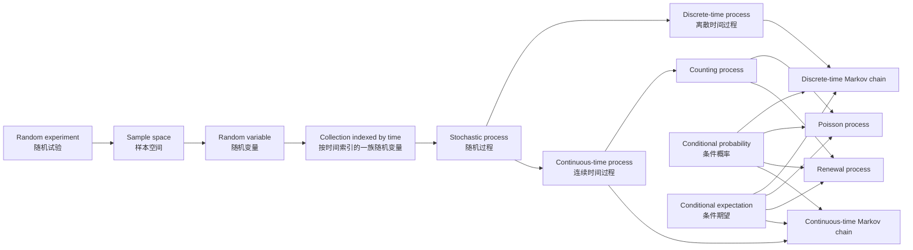
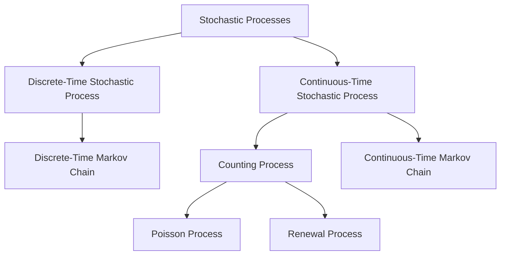

# Stochastic Processes Lecture 1
## Introduction and Probability Theory：中英混合精讲

> **资料范围（source scope）**：本文严格按照课件 `chap3intro and probability theory.pdf` 的顺序组织，覆盖课件第 7–58 页：随机过程导论（**Introduction to Stochastic Processes**）与概率论回顾（**Review of Probability Theory**）。  
> **标记规则**：
> - **【课件】**：课件明确给出的定义、问题或例子；
> - **【标准补全】**：课件留空但可由标准概率论知识补全的公式；
> - **【拓展理解】**：为帮助理解而补充的解释、推导或术语，不代表课件已经正式讲授到这一深度。

---

# 目录

1. [本节课的整体逻辑](#1-本节课的整体逻辑)
2. [从随机试验到随机过程](#2-从随机试验到随机过程)
3. [随机过程的基本对象](#3-随机过程的基本对象)
4. [随机过程的分类](#4-随机过程的分类)
5. [为什么不能默认各时刻独立](#5-为什么不能默认各时刻独立)
6. [重要随机过程的知识地图](#6-重要随机过程的知识地图)
7. [离散时间马尔可夫链](#7-离散时间马尔可夫链)
8. [计数过程](#8-计数过程)
9. [泊松过程](#9-泊松过程)
10. [更新过程](#10-更新过程)
11. [连续时间马尔可夫链](#11-连续时间马尔可夫链)
12. [概率论回顾：样本空间与事件](#12-概率论回顾样本空间与事件)
13. [条件概率](#13-条件概率)
14. [随机变量、CDF、PMF 与 PDF](#14-随机变量cdfpmf-与-pdf)
15. [期望与方差](#15-期望与方差)
16. [联合分布与边缘分布](#16-联合分布与边缘分布)
17. [独立随机变量](#17-独立随机变量)
18. [离散条件分布与条件期望](#18-离散条件分布与条件期望)
19. [连续条件分布与条件期望](#19-连续条件分布与条件期望)
20. [利用条件化计算期望](#20-利用条件化计算期望)
21. [利用条件化计算概率](#21-利用条件化计算概率)
22. [课件附加练习](#22-课件附加练习)
23. [英文文献阅读句型](#23-英文文献阅读句型)
24. [高频易错点](#24-高频易错点)
25. [一页式公式与概念总结](#25-一页式公式与概念总结)

---

# 1. 本节课的整体逻辑

这节课看起来由两部分组成：

1. 随机过程导论（**Introduction to Stochastic Processes**）；
2. 概率论回顾（**Review of Probability Theory**）。

但它们不是互不相关的两块内容，而是前后依赖的：

- 随机过程研究“一个随机系统如何随时间演化”；
- 要描述这种演化，必须使用随机变量、联合分布、条件概率与条件期望；
- 后半部分复习的概率论工具，会成为后续马尔可夫链（**Markov chain**）、泊松过程（**Poisson process**）、更新过程（**renewal process**）和排队模型（**queueing model**）的计算基础。

## 1.1 本节课最重要的两个问题

### 问题 A：研究对象是什么？

> **How does a random system evolve over time?**  
> 一个随机系统如何随时间变化？

这是随机过程的建模问题（**modeling problem**）。

### 问题 B：怎样计算？

> **Can we simplify a difficult problem by conditioning on suitable information?**  
> 能否通过对合适的信息进行条件化，把复杂问题拆开？

这是条件概率与条件期望的计算思想（**conditioning technique**）。

---

# 2. 从随机试验到随机过程

## 2.1 第一步：随机试验（Random Experiment）

随机试验（**random experiment**）是指：

- 试验可以重复；
- 试验可能出现多个结果；
- 在试验发生之前，具体结果未知。

课件中的例子包括：

- 抛一枚硬币（**flipping a coin**）；
- 抛两枚硬币（**flipping two coins**）；
- 投一个骰子（**rolling a die**）；
- 投两个骰子（**rolling two dice**）。

常见英文句型：

> **The outcome of the experiment will not be known in advance.**  
> 试验的结果事先无法知道。

其中：

- **outcome**：试验结果；
- **in advance**：事先、提前；
- **will not be known**：将无法被预先知道。

---

## 2.2 第二步：随机变量（Random Variable）

随机变量（**random variable, r.v.**）把一个原始随机结果映射成一个实数：

$$
X:\Omega\to\mathbb R.
$$

例如，投两个骰子时：

- 原始结果可能是 $\omega=(3,5)$；
- 定义 $X(\omega)$ 为两个骰子的点数之和；
- 则 $X(3,5)=8$。

课件原句：

> **A random variable is a real-valued function defined on the sample space.**

中文理解：

> 随机变量本质上不是“随机变化的字母”，而是定义在样本空间上的实值函数（**real-valued function**）。

---

## 2.3 第三步：多个时刻对应多个随机变量

如果只研究明天下午两点的气温，可以定义一个随机变量：

$$
X=\text{明天下午两点的气温}.
$$

如果研究未来七天每天下午两点的气温，就需要：

$$
X_1,X_2,\ldots,X_7.
$$

如果研究未来任意一天，甚至任意连续时刻，就会得到一整族随机变量：

$$
\{X(t):t\in T\}.
$$

这就是随机过程（**stochastic process**）。

---

## 2.4 随机过程的直观定义

【课件】第 7 页的核心句子是：

> **A stochastic process describes the evolution through time of some process.**

可译为：

> 随机过程描述某个系统随时间的演化。

逐词理解：

- **describe**：描述；
- **evolution**：演化、发展过程；
- **through time**：随时间推移；
- **some process**：某个现实系统或动态过程。

这里的第一个 **process** 是数学对象“随机过程”，第二个 **process** 是现实中的“变化过程”。

更自然的英文表达还包括：

> **A stochastic process models the time evolution of a random system.**  
> 随机过程对随机系统的时间演化进行建模。

> **It is used to describe uncertainty that unfolds over time.**  
> 它用于描述随时间逐步展开的不确定性。

---

## 2.5 随机过程的正式定义

【课件】第 11 页：

> **A stochastic process $\{X(t),t\in T\}$ is a collection of random variables.**

即：

$$
\boxed{\{X(t),t\in T\}\text{ 是由索引 }t\text{ 标记的一族随机变量。}}
$$

关键点不是“有很多数”，而是：

1. 对每一个固定的 $t$，$X(t)$ 是一个随机变量；
2. 不同 $t$ 对应系统在不同时刻的状态；
3. 整个集合共同描述系统的动态变化。

常见英文句型：

> **For each index $t\in T$, $X(t)$ is a random variable.**  
> 对于每个索引 $t\in T$，$X(t)$ 都是一个随机变量。

> **The parameter $t$ usually represents time.**  
> 参数 $t$ 通常表示时间。

> **The process is indexed by time.**  
> 这个过程以时间为索引。

---

# 3. 随机过程的基本对象

## 3.1 索引（Index）与索引集（Index Set）

- $t$：索引（**index**）；
- $T$：索引集（**index set**）。

课件中时间通常作为索引，因此：

$$
t\in T.
$$

典型索引集：

- $T=\{0,1,2,\ldots\}$：离散时间；
- $T=[0,\infty)$：连续时间；
- $T=\{1,2,\ldots,7\}$：未来七天；
- $T=[0,24]$：未来 24 小时。

英文句型：

> **The index set specifies the times at which the process is observed.**  
> 索引集规定了我们在哪些时刻观察该过程。

> **If $T$ is countable, the process is said to be discrete-time.**  
> 如果 $T$ 可数，则称该过程为离散时间过程。

> **If $T$ is an interval of the real line, the process is continuous-time.**  
> 如果 $T$ 是实数轴上的一个区间，则该过程为连续时间过程。

---

## 3.2 状态（State）与状态空间（State Space）

$X(t)$ 表示系统在时刻 $t$ 的状态（**state**）。

所有可能状态组成状态空间（**state space**），常写成：

$$
\mathcal S,\quad S,\quad E.
$$

例如：

- 骰子点数：$\mathcal S=\{1,2,3,4,5,6\}$；
- 商店每日销量：$\mathcal S=\{0,1,2,\ldots\}$；
- 气温：$\mathcal S\subseteq\mathbb R$；
- 银行中的顾客数：$\mathcal S=\{0,1,2,\ldots\}$。

课件原句：

> **$X(t)$ is the state of the process at time $t$.**

> **The state space is the set of all possible values that $X(t)$ can assume.**

其中：

- **assume a value**：取某个值；
- **all possible values**：所有可能取值。

---

## 3.3 随机变量与样本路径的双重视角

严格写法可以表示为：

$$
X(t,\omega).
$$

### 固定时间 $t$

$$
\omega\mapsto X(t,\omega)
$$

是一个随机变量（**random variable**）。

### 固定随机结果 $\omega$

$$
t\mapsto X(t,\omega)
$$

是一条随时间变化的确定曲线或序列，称为：

- 样本路径（**sample path**）；
- 轨迹（**trajectory**）；
- 实现（**realization**）；
- 样本函数（**sample function**）。

英文句型：

> **A sample path is one possible realization of the stochastic process.**  
> 一条样本路径是该随机过程的一种可能实现。

> **For a fixed outcome $\omega$, the function $t\mapsto X(t,\omega)$ is deterministic.**  
> 当随机结果 $\omega$ 固定后，函数 $t\mapsto X(t,\omega)$ 是确定的。

> **Before the experiment is observed, the entire path is random.**  
> 在观测发生之前，整条路径都是随机的。

> [!important]
> “随机过程是一族随机变量”与“随机过程产生一条随机轨迹”是同一对象的两种观察方式。

---

# 4. 随机过程的分类

## 4.1 第一条分类轴：时间是离散还是连续

【课件】第 12 页：

### 离散时间随机过程（Discrete-Time Stochastic Process）

如果 $T$ 是可数集（**countable set**），通常写成：

$$
\{X_n,n=0,1,2,\ldots\}.
$$

英文句型：

> **A discrete-time process is observed at separate time points.**  
> 离散时间过程是在一个个分离的时点上被观察的。

### 连续时间随机过程（Continuous-Time Stochastic Process）

如果 $T$ 是实数轴上的区间（**an interval of the real line**），通常写成：

$$
\{X(t),t\ge 0\}.
$$

英文句型：

> **A continuous-time process may be observed at any real-valued time point.**  
> 连续时间过程可以在任意实数时刻被观察。

---

## 4.2 第二条分类轴：状态是离散还是连续

时间类型（**time type**）与状态类型（**state type**）必须分开判断。

| 时间 | 状态 | 英文名称 | 例子 |
|---|---|---|---|
| 离散 | 离散 | discrete-time, discrete-state | 每日销量 |
| 离散 | 连续 | discrete-time, continuous-state | 每日下午两点气温 |
| 连续 | 离散 | continuous-time, discrete-state | 截至时刻 $t$ 的事故数 |
| 连续 | 连续 | continuous-time, continuous-state | 连续变化的温度、资产价格 |

> [!warning]
> **Continuous-time** 不等于 **continuous-state**。  
> “时间可以取任意实数”与“状态可以取任意实数”是两件事。

---

## 4.3 课件六个例子的建模

### E1：未来三次投六面骰子的结果

> **The outcomes of the next three tosses of a six-sided die.**

可定义：

$$
X_n=\text{第 }n\text{ 次投骰子的点数},\qquad n=1,2,3.
$$

- 索引集：$T=\{1,2,3\}$；
- 状态空间：$\{1,2,3,4,5,6\}$；
- 类型：离散时间、离散状态。

### E2：未来七天每天下午两点的上海气温

> **The temperature at 2:00 p.m. in Shanghai in the next seven days.**

$$
X_n=\text{第 }n\text{ 天下午两点的气温}.
$$

- 索引集：$T=\{1,\ldots,7\}$；
- 状态空间：通常建模为 $\mathbb R$ 的某个区间；
- 类型：离散时间、连续状态。

### E3：从明天开始的每日销量

> **The daily sales of a grocery store starting tomorrow.**

$$
X_n=\text{第 }n\text{ 天的销量}.
$$

- 离散时间；
- 离散状态。

### E4：未来 24 小时内累计售出的电脑数量

> **The number of PCs sold at an outlet store in the next 24 hours.**

可定义：

$$
X(t)=\text{从现在起到时刻 }t\text{ 为止累计售出的电脑数}.
$$

- $t\in[0,24]$；
- 连续时间、离散状态；
- 如果强调“累计”，它可以被建模为计数过程。

### E5：从明天 00:01 开始累计报告的交通事故数

> **The number of reported car accidents in Shanghai since tomorrow at 12:01 a.m.**

$$
X(t)=\text{截至时刻 }t\text{ 已报告的事故总数}.
$$

- 连续时间；
- 离散状态；
- 非递减；
- 典型计数过程。

### E6：明天 9:30–11:30 急诊室内患者人数

> **The number of patients in the emergency room from 9:30 a.m. to 11:30 a.m. tomorrow.**

$$
X(t)=\text{时刻 }t\text{ 急诊室中的患者数}.
$$

- 连续时间；
- 离散状态；
- 可以上升，也可以下降。

### E5 与 E6 的关键区别

- E5 记录累计事件数（**cumulative number of events**），只会上升；
- E6 记录系统当前人数（**current population in the system**），既可增加，也可减少。

英文区分：

> **A counting process records cumulative arrivals.**  
> 计数过程记录累计到达数。

> **A queue-length process records the number currently present in the system.**  
> 队长过程记录当前仍在系统中的人数。

---

# 5. 为什么不能默认各时刻独立

【课件】第 13 页提出：

> **Can we make a probability model for a stochastic process?**  
> 我们能否为一个随机过程建立概率模型？

> **Independent random variables?**  
> 各时刻的随机变量是否独立？

> **What if the state of a process depends on its past?**  
> 如果过程的当前状态依赖过去怎么办？

现实中的时间序列通常存在时间依赖（**temporal dependence**）：

- 今天的销量与昨天的销量相关；
- 当前排队人数受此前到达和服务完成影响；
- 今天的天气与昨天的天气有关；
- 用户下一次行为与此前行为序列有关。

常见术语：

| 英文 | 中文 |
|---|---|
| temporal dependence | 时间依赖 |
| serial dependence | 序列依赖 |
| dependence structure | 依赖结构 |
| autocorrelation | 自相关 |
| history of the process | 过程的历史 |
| current state | 当前状态 |
| future evolution | 未来演化 |

英文句型：

> **The random variables at different times need not be independent.**  
> 不同时刻的随机变量不一定独立。

> **The current state may contain information about the future.**  
> 当前状态可能包含关于未来的信息。

> **A stochastic process is characterized not only by marginal distributions, but also by its dependence structure.**  
> 随机过程不仅由各时刻的边缘分布刻画，还由其依赖结构刻画。

---

# 6. 重要随机过程的知识地图

【课件】第 14 页给出以下分类：

| 过程 | 核心对象 | 核心假设或性质 |
|---|---|---|
| 离散时间马尔可夫链（DTMC） | $X_0,X_1,\ldots$ | 下一状态在给定当前状态后与更早历史无关 |
| 计数过程（counting process） | $N(t)$ | 记录截至时刻 $t$ 的累计事件数 |
| 泊松过程（Poisson process） | $N(t)$ | 相邻事件间隔为 i.i.d. 指数随机变量 |
| 更新过程（renewal process） | $N(t)$ | 相邻更新间隔为 i.i.d. 非负随机变量 |
| 连续时间马尔可夫链（CTMC） | $X(t)$ | 连续时间跳转，停留时间具有无记忆结构 |

---

# 7. 离散时间马尔可夫链

## 7.1 马尔可夫性质（Markov Property）

离散时间马尔可夫链（**discrete-time Markov chain, DTMC**）写成：

$$
\{X_n,n=0,1,2,\ldots\}.
$$

【课件】第 15 页：

> **$X_{n+1}$ depends on the past only through $X_n$.**

中文：

> 下一时刻 $X_{n+1}$ 对过去的依赖，只通过当前状态 $X_n$ 体现。

正式写成：

$$
\begin{aligned}
&P(X_{n+1}=j\mid X_n=i,X_{n-1}=i_{n-1},\ldots,X_0=i_0)\\
&\qquad=P(X_{n+1}=j\mid X_n=i).
\end{aligned}
$$

英文读法：

> **Given the present state, the future is conditionally independent of the past.**  
> 给定当前状态后，未来与过去条件独立。

> **The current state summarizes all relevant information from the history.**  
> 当前状态总结了历史中所有与未来相关的信息。

### “无记忆”不等于“前后独立”

错误理解：

$$
X_{n+1}\perp X_n.
$$

正确理解：

$$
X_{n+1}\perp (X_0,\ldots,X_{n-1})\mid X_n.
$$

也就是说，$X_{n+1}$ 通常仍然依赖 $X_n$；只是给定 $X_n$ 后，更早历史不再提供额外信息。

---

## 7.2 转移概率（Transition Probability）

定义：

$$
p_{ij}=P(X_{n+1}=j\mid X_n=i).
$$

称为从状态 $i$ 到状态 $j$ 的转移概率（**transition probability**）。

所有 $p_{ij}$ 组成转移概率矩阵（**transition probability matrix**）：

$$
P=(p_{ij}).
$$

满足：

$$
p_{ij}\ge 0,
\qquad
\sum_j p_{ij}=1.
$$

英文句型：

> **The entry $p_{ij}$ represents the one-step transition probability from state $i$ to state $j$.**  
> 元素 $p_{ij}$ 表示从状态 $i$ 一步转移到状态 $j$ 的概率。

> **Each row of the transition matrix sums to one.**  
> 转移矩阵的每一行之和为 1。

---

## 7.3 赌博模型（Gambling Model / Gambler’s Ruin）

【课件】第 16–17 页：

- 赌徒初始有 $i$ 美元；
- 每局赢 1 美元或输 1 美元；
- 各局相互独立（**successive plays are independent**）；
- 财富达到 0 或 $K$ 时停止。

定义：

$$
X_n=\text{the player's fortune at time }n.
$$

即：

$$
X_n=\text{第 }n\text{ 局结束后的财富}.
$$

若每局以概率 $p$ 获胜，令 $q=1-p$，则：

$$
P(X_{n+1}=i+1\mid X_n=i)=p,
$$

$$
P(X_{n+1}=i-1\mid X_n=i)=q.
$$

状态空间：

$$
\mathcal S=\{0,1,\ldots,K\}.
$$

状态 0 与 $K$ 是吸收状态（**absorbing states**）：一旦到达，就不再离开。

英文句型：

> **The gambler quits when his fortune reaches either $0$ or $K$.**  
> 当财富达到 0 或 $K$ 时，赌徒停止赌博。

> **The process is absorbed when it reaches a boundary state.**  
> 当过程到达边界状态时，它被吸收。

---

## 7.4 课件提出的三个问题

### 问题 1：停止前的期望局数

> **What is the expected number of plays until the gambler quits?**

令：

$$
m_i=E[\text{停止前的局数}\mid X_0=i].
$$

【标准补全：第一步分析】

$$
m_i=1+pm_{i+1}+qm_{i-1},
$$

边界条件：

$$
m_0=m_K=0.
$$

公平赌博 $p=q=1/2$ 时：

$$
\boxed{m_i=i(K-i)}.
$$

### 问题 2：最终以 $K$ 美元离开的概率

> **What is the probability that the gambler leaves with $K$ dollars instead of zero?**

令：

$$
u_i=P_i(\text{先到达 }K\text{ 而不是 }0).
$$

递推：

$$
u_i=pu_{i+1}+qu_{i-1},
$$

边界：

$$
u_0=0,\qquad u_K=1.
$$

当 $p\ne q$：

$$
\boxed{
u_i=\frac{1-(q/p)^i}{1-(q/p)^K}}.
$$

当 $p=q=1/2$：

$$
\boxed{
u_i=\frac{i}{K}}.
$$

### 问题 3：在状态 $j$ 上停留的期望时间

> **What is the expected amount of time the gambler has $j$ dollars?**

这是状态访问次数（**expected number of visits to a state**）或占用时间（**occupation time**）问题。

【拓展理解】后续通常可以用：

- 第一部分析（**first-step analysis**）；
- 基本矩阵（**fundamental matrix**）；
- 访问概率与返回概率（**hitting and return probabilities**）

进行求解。课件此处只提出问题，没有给出完整计算条件与解答。

---

# 8. 计数过程

## 8.1 定义

计数过程（**counting process**）通常记为：

$$
\{N(t),t\ge 0\}.
$$

【课件】第 19 页：

> **$X(t)$ is the total number of events that have occurred up to time $t$.**

中文：

> $X(t)$ 表示截至时刻 $t$ 已经发生的事件总数。

关键词：

- **total number of events**：事件总数；
- **have occurred**：已经发生；
- **up to time $t$**：截至时刻 $t$。

典型性质：

$$
N(0)=0,
$$

$$
N(t)\in\{0,1,2,\ldots\},
$$

$$
s<t\implies N(s)\le N(t).
$$

因此样本路径一般是非递减阶梯函数（**nondecreasing step function**）。

英文句型：

> **The process increases by one whenever an event occurs.**  
> 每当一个事件发生时，过程就增加 1。

> **Between two consecutive events, the process remains constant.**  
> 在两个相邻事件之间，过程保持不变。

> **A counting process has integer-valued, nondecreasing sample paths.**  
> 计数过程的样本路径取整数值且非递减。

---

# 9. 泊松过程

## 9.1 课件给出的定义视角

【课件】第 20 页：泊松过程（**Poisson process**）是一种计数过程，并且事件之间经过的时间：

> **The elapsed times between events are independent and identically distributed exponential random variables.**

设相邻事件间隔为：

$$
T_1,T_2,\ldots
$$

则：

$$
T_n\overset{\text{i.i.d.}}{\sim}\operatorname{Exp}(\lambda).
$$

其中：

- **elapsed time**：经过的时间；
- **interarrival time**：到达间隔；
- **independent and identically distributed, i.i.d.**：独立同分布；
- **exponential random variable**：指数随机变量；
- $\lambda$：到达率（**arrival rate**）或强度（**intensity**）。

---

## 9.2 到达间隔与到达时刻

到达间隔（**interarrival time**）：

$$
T_n=\text{第 }n-1\text{ 次与第 }n\text{ 次事件之间的时间}.
$$

第 $n$ 次到达时刻（**the $n$th arrival time**）：

$$
S_n=T_1+\cdots+T_n.
$$

计数过程与到达时刻之间的关系：

$$
N(t)=\max\{n:S_n\le t\}.
$$

英文句型：

> **$S_n$ denotes the time of the $n$th arrival.**  
> $S_n$ 表示第 $n$ 次到达发生的时刻。

> **$N(t)$ counts the number of arrivals by time $t$.**  
> $N(t)$ 统计截至时刻 $t$ 的到达次数。

> **The event $\{N(t)\ge n\}$ is equivalent to $\{S_n\le t\}$.**  
> 事件“时刻 $t$ 前至少到达 $n$ 次”等价于“第 $n$ 次到达时刻不晚于 $t$”。

---

## 9.3 泊松过程的标准结论

【标准补全】若 $\{N(t),t\ge0\}$ 是速率为 $\lambda$ 的泊松过程，则：

$$
N(t)\sim\operatorname{Poisson}(\lambda t).
$$

即：

$$
P(N(t)=n)=e^{-\lambda t}\frac{(\lambda t)^n}{n!}.
$$

并且：

$$
E[N(t)]=\lambda t,
\qquad
\operatorname{Var}(N(t))=\lambda t.
$$

若 $0\le s<t$：

$$
N(t)-N(s)\sim\operatorname{Poisson}(\lambda(t-s)).
$$

两个重要性质：

- 独立增量（**independent increments**）；
- 平稳增量（**stationary increments**）。

英文句型：

> **The number of arrivals in an interval of length $t$ has a Poisson distribution with mean $\lambda t$.**  
> 长度为 $t$ 的区间内的到达数服从均值为 $\lambda t$ 的泊松分布。

> **Counts over disjoint time intervals are independent.**  
> 不相交时间区间内的计数相互独立。

> **The distribution of an increment depends only on the length of the interval.**  
> 增量的分布只取决于区间长度。

---

## 9.4 指数分布的无记忆性

若 $T\sim\operatorname{Exp}(\lambda)$，则：

$$
P(T>s+t\mid T>s)=P(T>t).
$$

称为无记忆性（**memoryless property**）。

英文表达：

> **Given that no event has occurred by time $s$, the additional waiting time still follows the same exponential distribution.**  
> 已知到时刻 $s$ 仍未发生事件，之后还需要等待的时间仍服从相同指数分布。

注意：

- 这里的“无记忆”是等待时间分布的性质；
- 马尔可夫性质是条件独立结构；
- 两者相关，但概念层次不同。

---

## 9.5 实习 Offer 例子：最优停止

【课件】第 21 页设定：

- 三个月实习 Offer 逐个到来；
- 每个 Offer 的价值是具有密度 $f(x)$ 的连续随机变量；
- 一旦出现，必须立即接受或拒绝；
- 拒绝后继续等待下一个；
- 等待成本率为每单位时间 $c$；
- Offer 按泊松过程到达；
- 目标是最大化期望总收益。

关键英文：

> **Offers arrive one by one.**  
> Offer 一个接一个到来。

> **Once an offer is presented, you have to accept it or reject it.**  
> 一旦 Offer 出现，就必须接受或拒绝。

> **You incur a waiting cost at a rate $c$ per unit time.**  
> 你以每单位时间 $c$ 的速率承担等待成本。

> **The objective is to maximize the expected total return.**  
> 目标是最大化期望总收益。

这个问题属于：

- 最优停止（**optimal stopping**）；
- 序贯决策（**sequential decision-making**）；
- 动态规划（**dynamic programming**）。

【拓展理解】常见最优策略是阈值策略（**threshold policy**）：

> 接受价值高于某个保留值（**reservation value**）的 Offer，否则继续等待。

但课件没有给出完整的时间期限、Offer 分布细节和终止规则，因此此处只能说明一般结构，不能唯一确定数值阈值。

---

# 10. 更新过程

## 10.1 定义

【课件】第 22 页：更新过程（**renewal process**）是一种计数过程，并且：

$$
T_1,T_2,\ldots\quad\text{are i.i.d.}
$$

这里 $T_n$ 表示相邻更新之间的时间，称为：

- 更新间隔（**interrenewal time**）；
- 周期长度（**cycle length**）。

设：

$$
S_n=T_1+\cdots+T_n,
$$

$$
N(t)=\max\{n:S_n\le t\}.
$$

英文句型：

> **A renewal occurs whenever a new cycle begins.**  
> 每当一个新周期开始，就发生一次更新。

> **The interrenewal times are independent and identically distributed.**  
> 更新间隔相互独立且同分布。

> **A Poisson process is a special renewal process with exponential interrenewal times.**  
> 泊松过程是更新间隔服从指数分布的特殊更新过程。

---

## 10.2 泊松过程与更新过程的关系

$$
\boxed{\text{Poisson process}\subset\text{Renewal process}}
$$

- 更新过程：只要求 $T_n$ 为 i.i.d. 非负随机变量；
- 泊松过程：进一步要求 $T_n\sim\operatorname{Exp}(\lambda)$。

因此：

> 每个泊松过程都是更新过程，但不是每个更新过程都是泊松过程。

英文：

> **Every Poisson process is a renewal process, but the converse is not true.**

其中：

- **the converse**：逆命题；
- **is not true**：不成立。

---

## 10.3 长期更新率

课件提出：

> **What is the average rate at which renewals occur?**

如果：

$$
\mu=E[T_1]<\infty,
$$

【标准补全】长期更新率满足：

$$
\frac{N(t)}{t}\to\frac{1}{\mu}
$$

在适当意义下成立。

直观解释：

- 平均每个周期长度为 $\mu$；
- 因而单位时间平均完成约 $1/\mu$ 个周期。

英文句型：

> **The long-run renewal rate is the reciprocal of the mean cycle length.**  
> 长期更新率等于平均周期长度的倒数。

---

## 10.4 单服务台银行例子

【课件】第 23 页：

- 银行只有一个服务台（**one server**）；
- 顾客按照泊松过程到达；
- 只有当服务台空闲时，顾客才进入接受服务；
- 如果服务台忙，顾客直接离开；
- 服务时间分布为 $G$。

英文原句中的关键结构：

> **A customer will enter the branch for service only if the server is free when he arrives.**

中文：

> 只有当顾客到达时服务台空闲，他才进入网点接受服务。

### 一次更新周期如何定义？

可以把“一个服务完成时刻”视为一个更新点。下一周期由两部分组成：

1. 服务完成后，等待下一位顾客到达的空闲时间 $I$；
2. 这位顾客的服务时间 $S$。

因此：

$$
T=I+S.
$$

由于到达过程是速率 $\lambda$ 的泊松过程：

$$
E[I]=\frac{1}{\lambda}.
$$

所以：

$$
E[T]=\frac{1}{\lambda}+E[S].
$$

### 顾客实际进入银行的长期速率

每个周期恰好接纳一位顾客，因此：

$$
\boxed{\lambda_{\text{admitted}}
=\frac{1}{E[T]}
=\frac{\lambda}{1+\lambda E[S]}}.
$$

### 被接纳的顾客比例

总到达率为 $\lambda$，因此：

$$
\boxed{\text{admitted proportion}
=\frac{1}{1+\lambda E[S]}}.
$$

### 未接受服务而离开的比例

$$
\boxed{\text{loss proportion}
=\frac{\lambda E[S]}{1+\lambda E[S]}}.
$$

术语：

- **admitted customer**：被接纳的顾客；
- **blocked customer**：因系统忙碌而被拒绝的顾客；
- **loss system**：损失系统；
- **server utilization**：服务台利用率。

---

# 11. 连续时间马尔可夫链

## 11.1 基本结构

连续时间马尔可夫链（**continuous-time Markov chain, CTMC**）写作：

$$
\{X(t),t\ge0\}.
$$

【课件】第 24 页给出两部分结构：

1. 当过程离开状态 $i$ 时，以概率 $p_{ij}$ 进入状态 $j$；
2. 状态之间的停留时间为指数随机变量。

英文：

> **When the process leaves state $i$, it enters state $j$ with probability $p_{ij}$.**

> **The holding times are exponentially distributed.**

这里的 **w.p.** 是：

> **with probability**，意为“以……的概率”。

---

## 11.2 连续时间马尔可夫性质

课件公式表达：给定当前状态 $X(s)=i$ 后，未来 $X(s+t)$ 的分布不再依赖 $s$ 之前的完整路径。

可写为：

$$
P(X(s+t)=j\mid X(s)=i,\{X(u):0\le u<s\})
=P(X(s+t)=j\mid X(s)=i).
$$

英文句型：

> **Conditional on the present state, the future evolution is independent of the past trajectory.**  
> 给定当前状态后，未来演化与过去轨迹条件独立。

---

## 11.3 停留时间与嵌入链

系统进入状态 $i$ 后，会停留一段随机时间：

$$
H_i\sim\operatorname{Exp}(\nu_i),
$$

其中：

- $H_i$：停留时间（**holding time**）或逗留时间（**sojourn time**）；
- $\nu_i$：离开状态 $i$ 的速率（**exit rate**）。

离开状态 $i$ 后，以概率 $p_{ij}$ 跳到 $j$。这些跳转形成嵌入离散链（**embedded discrete-time chain**）。

英文：

> **The chain remains in state $i$ for an exponential holding time and then jumps to a new state.**  
> 链在状态 $i$ 停留一个指数分布的时间，然后跳到新状态。

---

## 11.4 生成矩阵（Generator Matrix）

【拓展理解】连续时间马尔可夫链常用生成矩阵：

$$
Q=(q_{ij}).
$$

对 $j\ne i$：

$$
q_{ij}=\nu_i p_{ij},
$$

而：

$$
q_{ii}=-\nu_i.
$$

因此每一行之和为：

$$
\sum_j q_{ij}=0.
$$

对比：

| 对象 | 矩阵 | 行和 |
|---|---|---:|
| DTMC | 转移矩阵 $P$ | 1 |
| CTMC | 生成矩阵 $Q$ | 0 |

英文句型：

> **The off-diagonal entry $q_{ij}$ is the transition rate from state $i$ to state $j$.**  
> 非对角元素 $q_{ij}$ 是从状态 $i$ 跳到状态 $j$ 的转移速率。

> **The diagonal entry is the negative of the total rate out of the state.**  
> 对角元素等于离开该状态总速率的相反数。

---

## 11.5 多服务台银行例子

【课件】第 25 页定义：

$$
X(t)=\text{the number of customers in the branch at time }t.
$$

课件关心：

1. 银行恰有 $i$ 位顾客的长期时间比例；
2. 银行内平均顾客数；
3. 顾客在银行内的平均停留时间。

英文句型：

> **What proportion of time does the branch have exactly $i$ customers?**

> **What is the average number of customers in the branch?**

> **What is the average amount of time a customer spends in the branch?**

这些分别对应：

- 稳态概率（**steady-state probability**）$\pi_i$；
- 长期平均系统人数（**long-run average number in the system**）；
- 平均逗留时间（**mean sojourn time**）。

> [!note]
> 课件此处没有完整说明到达率、服务时间分布、是否允许排队等条件，因此不能直接唯一认定具体模型。若假设泊松到达、指数服务并允许无限等待，常形成 $M/M/n$；若不允许等待，则可能是 $M/M/n/n$ 损失系统。

---

# 12. 概率论回顾：样本空间与事件

## 12.1 样本空间（Sample Space）

样本空间记为：

$$
\Omega\quad\text{或}\quad S.
$$

它包含随机试验的所有可能结果（**all possible outcomes**）。

例如，投一枚骰子：

$$
\Omega=\{1,2,3,4,5,6\}.
$$

投两枚硬币：

$$
\Omega=\{HH,HT,TH,TT\}.
$$

英文：

> **The sample space is the set of all possible outcomes of the experiment.**

---

## 12.2 事件（Event）

事件是样本空间的子集：

$$
E\subseteq\Omega.
$$

例如：

$$
E=\{\text{骰子点数为偶数}\}=\{2,4,6\}.
$$

常见集合运算：

| 符号 | 英文 | 中文 |
|---|---|---|
| $E\cup F$ | union | 并集，$E$ 或 $F$ 发生 |
| $E\cap F$ | intersection | 交集，$E$ 与 $F$ 都发生 |
| $E^c$ | complement | 补集，$E$ 不发生 |
| $E\setminus F$ | difference | 差集 |
| $\varnothing$ | empty set | 空集 |

课件中有时把 $E\cap F$ 简写为 $EF$。

---

## 12.3 概率公理

【课件】第 29 页留空；按标准概率公理补全：

### 非负性（Non-negativity）

$$
P(E)\ge0.
$$

### 规范性（Normalization）

$$
P(\Omega)=1.
$$

### 可列可加性（Countable Additivity）

若 $E_1,E_2,\ldots$ 两两互斥（**mutually exclusive**），则：

$$
P\left(\bigcup_{i=1}^{\infty}E_i\right)
=\sum_{i=1}^{\infty}P(E_i).
$$

英文句型：

> **Probabilities are nonnegative and sum to one over the entire sample space.**  
> 概率非负，整个样本空间的概率总和为 1。

> **For mutually exclusive events, the probability of their union is the sum of their probabilities.**  
> 对互斥事件，并集的概率等于各事件概率之和。

---

# 13. 条件概率

## 13.1 定义

【课件】第 30 页：

> **$P(E\mid F)$ is the probability that event $E$ occurs given that event $F$ has occurred.**

定义：

$$
P(E\mid F)=\frac{P(E\cap F)}{P(F)},
\qquad P(F)>0.
$$

等价地：

$$
P(E\cap F)=P(E\mid F)P(F).
$$

英文高频结构：

- **given that $F$ has occurred**：已知 $F$ 已发生；
- **conditional on $F$**：以 $F$ 为条件；
- **under the condition that $F$ occurs**：在 $F$ 发生的条件下。

英文句型：

> **Conditioning restricts the sample space to the event $F$.**  
> 条件化相当于把样本空间限制到事件 $F$ 内。

> **The denominator renormalizes probabilities within the restricted sample space.**  
> 分母在缩小后的样本空间内重新归一化概率。

---

## 13.2 帽子问题（Hats Game）

【课件】第 31 页：三个人把帽子混在一起，每个人随机拿一顶。

总排列数：

$$
3!=6.
$$

### 三个人都拿到自己帽子的概率

只有恒等排列一种：

$$
P(\text{all three match})=\frac{1}{6}.
$$

### 三个人都没拿到自己帽子的概率

三个人的完全错排共有 2 种：

$$
P(\text{no one matches})=\frac{2}{6}=\frac13.
$$

术语：

- **match**：匹配；
- **fixed point**：排列中的不动点；
- **derangement**：错排，没有任何不动点的排列。

英文句型：

> **A derangement is a permutation with no fixed points.**  
> 错排是没有任何不动点的排列。

---

# 14. 随机变量、CDF、PMF 与 PDF

## 14.1 累积分布函数（CDF）

【课件】第 33 页：

$$
F_X(b)=P(X\le b).
$$

全称：

> **cumulative distribution function, cdf**

【标准补全】基本性质：

1. $F_X(b)$ 关于 $b$ 单调不减（**nondecreasing**）；
2. $\lim_{b\to-\infty}F_X(b)=0$；
3. $\lim_{b\to\infty}F_X(b)=1$；
4. $F_X$ 右连续（**right-continuous**）。

英文句型：

> **The cdf gives the probability that the random variable does not exceed a threshold.**  
> CDF 给出随机变量不超过某个阈值的概率。

> **The function is nondecreasing because larger thresholds include more possible outcomes.**  
> 该函数单调不减，因为阈值越大，包含的可能结果越多。

---

## 14.2 离散随机变量与 PMF

离散随机变量（**discrete random variable**）只取有限个或可数多个值。

概率质量函数（**probability mass function, pmf**）：

$$
\boxed{p_X(a)=P(X=a)}.
$$

满足：

$$
p_X(a)\ge0,
\qquad
\sum_a p_X(a)=1.
$$

课件列出的典型离散分布：

- 伯努利分布（**Bernoulli distribution**）；
- 二项分布（**Binomial distribution**）；
- 几何分布（**Geometric distribution**）；
- 泊松分布（**Poisson distribution**）。

英文句型：

> **The pmf assigns a probability mass to each possible value.**  
> PMF 为每一个可能取值分配一个概率质量。

> **For a discrete random variable, point probabilities may be positive.**  
> 对离散随机变量，单点概率可以大于 0。

---

## 14.3 连续随机变量与 PDF

若存在非负函数 $f_X(x)$，使得对任意集合 $B$：

$$
P(X\in B)=\int_B f_X(x)\,dx,
$$

则 $X$ 为连续随机变量（**continuous random variable**），$f_X$ 为概率密度函数（**probability density function, pdf**）。

满足：

$$
f_X(x)\ge0,
$$

$$
\int_{-\infty}^{\infty}f_X(x)\,dx=1.
$$

CDF：

$$
F_X(a)=\int_{-\infty}^{a}f_X(x)\,dx.
$$

【课件留空，标准补全】：

$$
P(X=a)=0.
$$

> [!warning]
> 对连续随机变量，$f_X(a)$ 不是 $P(X=a)$。密度是“单位长度上的概率集中程度”，概率必须通过积分得到。

英文句型：

> **Probability is represented by area under the density curve.**  
> 概率由密度曲线下的面积表示。

> **A density value is not itself a probability.**  
> 某一点的密度值本身不是概率。

课件列出的典型连续分布：

- 均匀分布（**Uniform distribution**）；
- 指数分布（**Exponential distribution**）；
- 伽马分布（**Gamma distribution**）；
- 正态分布（**Normal distribution**）。

---

## 14.4 PMF、PDF、CDF 对比

| 对象 | 适用范围 | 作用 | 典型公式 |
|---|---|---|---|
| PMF | 离散型 | 单点概率 | $p_X(x)=P(X=x)$ |
| PDF | 连续型 | 概率密度 | $P(a<X<b)=\int_a^b f_X(x)dx$ |
| CDF | 离散、连续都适用 | 累积概率 | $F_X(x)=P(X\le x)$ |

---

# 15. 期望与方差

## 15.1 期望（Expectation）

离散型：

$$
E[X]=\sum_x x p_X(x).
$$

连续型：

$$
E[X]=\int_{-\infty}^{\infty}x f_X(x)\,dx.
$$

统一写法：

$$
E[X]=\int_{-\infty}^{\infty}x\,dF_X(x).
$$

英文术语：

- **expectation**；
- **expected value**；
- **mean**。

英文句型：

> **The expectation is a probability-weighted average of possible values.**  
> 期望是各可能取值按概率加权后的平均。

> **The expected value need not be a value that the random variable can actually attain.**  
> 期望不一定是随机变量实际能够取到的值。

---

## 15.2 随机变量函数的期望

【课件】第 35 页留有 $E[h(X)]$：

离散型：

$$
E[h(X)]=\sum_x h(x)p_X(x).
$$

连续型：

$$
E[h(X)]=\int_{-\infty}^{\infty}h(x)f_X(x)\,dx.
$$

这一公式常称：

> **Law of the Unconscious Statistician, LOTUS**

意思是：不必先求 $Y=h(X)$ 的分布，也可以直接对 $h(X)$ 求期望。

---

## 15.3 方差（Variance）

定义：

$$
\operatorname{Var}(X)=E[(X-E[X])^2].
$$

计算公式：

$$
\operatorname{Var}(X)=E[X^2]-(E[X])^2.
$$

标准差（**standard deviation, SD**）：

$$
\operatorname{SD}(X)=\sqrt{\operatorname{Var}(X)}.
$$

英文句型：

> **Variance measures the dispersion of a random variable around its mean.**  
> 方差衡量随机变量围绕均值的离散程度。

> **Standard deviation has the same physical unit as the original variable.**  
> 标准差与原随机变量具有相同量纲。

---

# 16. 联合分布与边缘分布

## 16.1 联合 CDF

两个随机变量 $X,Y$ 的联合累积分布函数（**joint cdf**）：

$$
F_{X,Y}(a,b)=P(X\le a,Y\le b).
$$

英文：

> **The joint distribution describes how two random variables vary together.**  
> 联合分布描述两个随机变量如何共同变化。

---

## 16.2 离散联合 PMF

$$
p_{X,Y}(x,y)=P(X=x,Y=y).
$$

从联合分布得到 $X$ 的边缘 PMF（**marginal pmf**）：

$$
p_X(x)=\sum_y p_{X,Y}(x,y).
$$

同理：

$$
p_Y(y)=\sum_x p_{X,Y}(x,y).
$$

这个操作称为边缘化（**marginalization**）。

英文句型：

> **To obtain a marginal distribution, sum out the other variable.**  
> 要得到边缘分布，需要把另一个变量求和消掉。

---

## 16.3 连续联合 PDF

若存在联合密度 $f_{X,Y}(x,y)$，则：

$$
P(X\in A,Y\in B)
=\int_A\int_B f_{X,Y}(x,y)\,dy\,dx.
$$

边缘密度：

$$
f_X(x)=\int_{-\infty}^{\infty}f_{X,Y}(x,y)\,dy,
$$

$$
f_Y(y)=\int_{-\infty}^{\infty}f_{X,Y}(x,y)\,dx.
$$

英文：

> **Integrating out $Y$ yields the marginal density of $X$.**  
> 对 $Y$ 积分可以得到 $X$ 的边缘密度。

---

## 16.4 二元函数的期望

离散型：

$$
E[g(X,Y)]
=\sum_x\sum_y g(x,y)p_{X,Y}(x,y).
$$

连续型：

$$
E[g(X,Y)]
=\int\int g(x,y)f_{X,Y}(x,y)\,dx\,dy.
$$

---

## 16.5 期望的线性性

$$
E[aX+bY]=aE[X]+bE[Y].
$$

更一般地：

$$
E\left[\sum_{i=1}^n a_iX_i\right]
=\sum_{i=1}^n a_iE[X_i].
$$

> [!important]
> 期望的线性性（**linearity of expectation**）不要求 $X_i$ 相互独立。

英文句型：

> **Linearity of expectation holds regardless of dependence.**  
> 无论随机变量之间是否存在依赖，期望的线性性都成立。

---

# 17. 独立随机变量

## 17.1 定义

$X,Y$ 独立（**independent**）当且仅当：

$$
F_{X,Y}(a,b)=F_X(a)F_Y(b)
$$

对所有 $a,b$ 成立。

离散情形：

$$
p_{X,Y}(x,y)=p_X(x)p_Y(y).
$$

连续情形：

$$
f_{X,Y}(x,y)=f_X(x)f_Y(y).
$$

英文句型：

> **Knowing the value of one variable provides no information about the other.**  
> 知道一个变量的取值不会提供关于另一个变量的信息。

> **The joint distribution factors into the product of the marginals.**  
> 联合分布可以分解为边缘分布的乘积。

---

## 17.2 独立与不相关的区别

若 $X,Y$ 独立且期望存在，则：

$$
E[XY]=E[X]E[Y].
$$

但反过来通常不成立。

- **independent**：独立，整个联合分布可分解；
- **uncorrelated**：不相关，只表示协方差为 0。

$$
\operatorname{Cov}(X,Y)=0
$$

一般不能推出独立。

---

# 18. 离散条件分布与条件期望

## 18.1 条件 PMF

【课件】第 39–41 页：

$$
p_{X\mid Y}(x\mid y)
=P(X=x\mid Y=y)
=\frac{p_{X,Y}(x,y)}{p_Y(y)},
$$

前提：

$$
P(Y=y)>0.
$$

英文：

> **The conditional pmf describes the distribution of $X$ after observing $Y=y$.**  
> 条件 PMF 描述观测到 $Y=y$ 后 $X$ 的分布。

---

## 18.2 条件 CDF

$$
F_{X\mid Y}(x\mid y)
=P(X\le x\mid Y=y).
$$

离散情形：

$$
F_{X\mid Y}(x\mid y)
=\sum_{a\le x}p_{X\mid Y}(a\mid y).
$$

---

## 18.3 条件期望

$$
E[X\mid Y=y]
=\sum_x x p_{X\mid Y}(x\mid y).
$$

英文句型：

> **Conditional expectation is the mean of the conditional distribution.**  
> 条件期望是条件分布的均值。

> **After conditioning on $Y=y$, treat the conditional distribution as an ordinary distribution.**  
> 在给定 $Y=y$ 后，可以把条件分布当作普通分布来计算。

---

## 18.4 Example 3.3：独立泊松变量之和

【课件】设：

$$
X\sim\operatorname{Poisson}(\lambda_1),
\qquad
Y\sim\operatorname{Poisson}(\lambda_2),
$$

且 $X,Y$ 独立。求：

$$
E[X\mid X+Y=n].
$$

### 第一步：求条件分布

$$
P(X=x\mid X+Y=n)
=\frac{P(X=x,Y=n-x)}{P(X+Y=n)}.
$$

由独立性：

$$
P(X=x,Y=n-x)
=P(X=x)P(Y=n-x).
$$

又因为：

$$
X+Y\sim\operatorname{Poisson}(\lambda_1+\lambda_2),
$$

整理得到：

$$
P(X=x\mid X+Y=n)
=\binom{n}{x}
\left(\frac{\lambda_1}{\lambda_1+\lambda_2}\right)^x
\left(\frac{\lambda_2}{\lambda_1+\lambda_2}\right)^{n-x}.
$$

因此：

$$
X\mid(X+Y=n)
\sim\operatorname{Binomial}\left(
 n,\frac{\lambda_1}{\lambda_1+\lambda_2}
\right).
$$

于是：

$$
\boxed{
E[X\mid X+Y=n]
=n\frac{\lambda_1}{\lambda_1+\lambda_2}
}.
$$

英文表述：

> **Conditional on the total count being $n$, the number of type-1 events has a binomial distribution.**  
> 在已知总事件数为 $n$ 的条件下，第一类事件数服从二项分布。

---

## 18.5 Example 3.4：下雨条件下正常工作的组件数

设指示变量：

$$
I_i=
\begin{cases}
1,&\text{组件 }i\text{ 正常工作},\\
0,&\text{否则}.
\end{cases}
$$

总正常组件数：

$$
N=\sum_{i=1}^n I_i.
$$

已知下雨事件 $R$ 发生时：

$$
P(I_i=1\mid R)=p_i.
$$

则：

$$
E[N\mid R]
=E\left[\sum_{i=1}^n I_i\mid R\right]
=\sum_{i=1}^n E[I_i\mid R].
$$

因为指示变量期望等于事件概率：

$$
E[I_i\mid R]=P(I_i=1\mid R)=p_i.
$$

所以：

$$
\boxed{E[N\mid R]=\sum_{i=1}^n p_i}.
$$

注意：课件给出的降雨概率 $\alpha$ 和非雨天工作概率 $q_i$，在“已知下雨”的条件期望中不需要使用。

英文：

> **The expectation of an indicator variable equals the probability of the indicated event.**  
> 指示变量的期望等于其所指事件的概率。

---

# 19. 连续条件分布与条件期望

## 19.1 条件 PDF

若 $X,Y$ 有联合密度 $f_{X,Y}(x,y)$，且 $f_Y(y)>0$，则：

$$
f_{X\mid Y}(x\mid y)
=\frac{f_{X,Y}(x,y)}{f_Y(y)}.
$$

条件期望：

$$
E[X\mid Y=y]
=\int_{-\infty}^{\infty}x f_{X\mid Y}(x\mid y)\,dx.
$$

英文句型：

> **The conditional density is obtained by dividing the joint density by the marginal density of the conditioning variable.**  
> 条件密度等于联合密度除以条件变量的边缘密度。

> **The formula is valid for values of $y$ such that $f_Y(y)>0$.**  
> 该公式适用于满足 $f_Y(y)>0$ 的 $y$。

---

## 19.2 为什么连续情形不能直接除以 $P(Y=y)$

连续随机变量满足：

$$
P(Y=y)=0.
$$

因此不能把离散条件概率公式机械地写为：

$$
\frac{P(X=x,Y=y)}{P(Y=y)}.
$$

连续情形使用密度比例来定义条件密度。

---

## 19.3 Example 3.7

【课件】联合密度：

$$
f_{X,Y}(x,y)=
\begin{cases}
0.5ye^{-xy},&x>0,\ 0<y<2,\\
0,&\text{otherwise}.
\end{cases}
$$

求：

$$
E[e^{X/2}\mid Y=1].
$$

### 第一步：求 $Y$ 的边缘密度

$$
\begin{aligned}
f_Y(y)
&=\int_0^{\infty}0.5ye^{-xy}\,dx\\
&=0.5y\cdot\frac{1}{y}\\
&=0.5,
\qquad 0<y<2.
\end{aligned}
$$

### 第二步：求条件密度

$$
f_{X\mid Y}(x\mid y)
=\frac{0.5ye^{-xy}}{0.5}
=ye^{-xy},
\qquad x>0.
$$

因此：

$$
X\mid Y=y\sim\operatorname{Exp}(y).
$$

当 $y=1$：

$$
f_{X\mid Y}(x\mid1)=e^{-x},\qquad x>0.
$$

### 第三步：计算条件期望

$$
\begin{aligned}
E[e^{X/2}\mid Y=1]
&=\int_0^{\infty}e^{x/2}e^{-x}\,dx\\
&=\int_0^{\infty}e^{-x/2}\,dx\\
&=2.
\end{aligned}
$$

所以：

$$
\boxed{E[e^{X/2}\mid Y=1]=2}.
$$

英文：

> **Given $Y=y$, the conditional distribution of $X$ is exponential with rate $y$.**

---

# 20. 利用条件化计算期望

## 20.1 $E[X\mid Y=y]$ 与 $E[X\mid Y]$

这两个对象不同。

### $E[X\mid Y=y]$

当 $y$ 是一个确定值时，$E[X\mid Y=y]$ 是一个数。

### $E[X\mid Y]$

先定义函数：

$$
g(y)=E[X\mid Y=y].
$$

再把 $y$ 换成随机变量 $Y$：

$$
E[X\mid Y]=g(Y).
$$

所以 $E[X\mid Y]$ 本身是随机变量（**a random variable**）。

【课件】第 45 页强调：

> **$E[X\mid Y]$ is a function of the random variable $Y$.**

> **$E[X\mid Y]$ is itself a random variable.**

例子：若

$$
E[X\mid Y=y]=2y+1,
$$

则

$$
E[X\mid Y]=2Y+1.
$$

---

## 20.2 全期望公式

$$
\boxed{E[X]=E[E[X\mid Y]]}.
$$

常见名称：

- 全期望公式（**law of total expectation**）；
- 塔式性质（**tower property**）；
- 迭代期望（**iterated expectation**）。

离散形式：

$$
E[X]=\sum_y E[X\mid Y=y]P(Y=y).
$$

连续形式：

$$
E[X]=\int E[X\mid Y=y]f_Y(y)\,dy.
$$

直觉：先在每个组内求平均，再对各组平均，得到总体平均。

英文：

> **Condition first, average second.**  
> 先条件化，再取平均。

> **The unconditional expectation is the average of the conditional expectations.**  
> 无条件期望是条件期望的平均。

---

## 20.3 Example 3.10：随机个数随机变量之和

设：

- 每周事故数为 $N$，且 $E[N]=4$；
- 第 $i$ 起事故的受伤人数为 $X_i$；
- $E[X_i]=2$；
- $X_i$ 独立同分布；
- $X_i$ 与 $N$ 独立。

总受伤人数：

$$
S=\sum_{i=1}^{N}X_i.
$$

对 $N$ 条件化：

$$
E[S\mid N=n]
=E\left[\sum_{i=1}^{n}X_i\right]
=nE[X_1]
=2n.
$$

因此：

$$
E[S]
=E[E[S\mid N]]
=E[2N]
=2E[N]
=8.
$$

所以：

$$
\boxed{E[S]=8}.
$$

课件给出的通式：

$$
\boxed{
E\left[\sum_{i=1}^{N}X_i\right]
=E[N]E[X_1]
}
$$

在相应独立与可积条件下，这与瓦尔德等式（**Wald's equation**）有关。

英文：

> **The expected sum equals the expected number of terms times the common mean of each term.**

---

## 20.4 Example 3.12：矿工逃生

矿工面对三扇门：

- 门 1：2 小时后安全离开；
- 门 2：3 小时后回到原地；
- 门 3：5 小时后回到原地；
- 每次等概率选择。

令：

$$
T=\text{最终逃生所需时间的期望}.
$$

按第一次选择条件化（**condition on the first choice**）：

$$
T
=\frac13(2)
+\frac13(3+T)
+\frac13(5+T).
$$

整理：

$$
3T=2+3+T+5+T,
$$

$$
T=10.
$$

因此：

$$
\boxed{E[\text{逃生时间}]=10\text{ 小时}}.
$$

为什么后两项有 $+T$？

因为走完门 2 或门 3 后回到原点，未来问题与最初完全相同。这种结构称为递归性（**recursive structure**）或再生性（**regeneration**）。

英文：

> **After returning to the mine, the problem starts over from the same state.**  
> 回到矿井后，问题从同一状态重新开始。

---

## 20.5 Example 3.15：连续 $k$ 次成功

每次试验独立，成功概率为 $p$，直到出现连续 $k$ 次成功。

定义：

$$
E_j=\text{当前已经连续成功 }j\text{ 次时，还需的期望试验数}.
$$

边界：

$$
E_k=0.
$$

对 $j<k$，下一次：

- 以概率 $p$ 成功，进入状态 $j+1$；
- 以概率 $1-p$ 失败，连续成功次数清零，回到状态 0。

因此：

$$
E_j=1+pE_{j+1}+(1-p)E_0.
$$

解得：

$$
\boxed{
E_0=\frac{1-p^k}{(1-p)p^k}
}
$$

也可写成：

$$
\boxed{
E_0=\frac1p+\frac1{p^2}+\cdots+\frac1{p^k}
}.
$$

若 $p=1/2$：

- 连续 1 次成功：$2$ 次；
- 连续 2 次成功：$6$ 次；
- 连续 3 次成功：$14$ 次。

英文：

> **A failure resets the current run of successes to zero.**  
> 一次失败会把当前连续成功长度重置为 0。

> **The state records the current number of consecutive successes.**  
> 状态记录当前连续成功的次数。

---

# 21. 利用条件化计算概率

## 21.1 用指示变量表示概率

对任意事件 $E$，定义指示变量（**indicator random variable**）：

$$
I_E=
\begin{cases}
1,&E\text{ 发生},\\
0,&E\text{ 不发生}.
\end{cases}
$$

则：

$$
E[I_E]=P(E).
$$

因此：

$$
P(E)
=E[I_E]
=E[E[I_E\mid Y]]
=E[P(E\mid Y)].
$$

得到：

$$
\boxed{P(E)=E[P(E\mid Y)]}.
$$

这就是全概率思想的随机变量版本。

英文：

> **A probability can be viewed as the expectation of an indicator.**  
> 概率可以看成指示变量的期望。

> **Conditioning partitions a difficult probability into simpler conditional probabilities.**  
> 条件化把一个困难概率拆成若干更简单的条件概率。

---

## 21.2 Example 3.22：计算 $P(X<Y)$

设 $X,Y$ 独立连续，密度分别为 $f_X,f_Y$。

对 $Y$ 条件化：

$$
P(X<Y)
=\int_{-\infty}^{\infty}P(X<Y\mid Y=y)f_Y(y)\,dy.
$$

给定 $Y=y$：

$$
P(X<Y\mid Y=y)=P(X<y)=F_X(y).
$$

所以：

$$
\boxed{
P(X<Y)=\int_{-\infty}^{\infty}F_X(y)f_Y(y)\,dy
}.
$$

也可对 $X$ 条件化：

$$
P(X<Y)
=\int_{-\infty}^{\infty}[1-F_Y(x)]f_X(x)\,dx.
$$

若 $X,Y$ 独立同分布且连续，则：

$$
P(X<Y)=P(Y<X)=\frac12.
$$

英文：

> **Condition on one variable and integrate over its possible values.**  
> 对其中一个变量条件化，再对它的可能取值积分。

---

## 21.3 Example 3.24：泊松分流

每天进入瑜伽馆的总人数：

$$
N\sim\operatorname{Poisson}(\lambda).
$$

每人独立地：

- 以概率 $p$ 为女性；
- 以概率 $1-p$ 为男性。

令：

$$
W=\text{女性人数},
\qquad
M=\text{男性人数}.
$$

求：

$$
P(W=n,M=m).
$$

若 $W=n,M=m$，则总人数必须为 $n+m$：

$$
P(W=n,M=m)
=P(N=n+m)P(W=n\mid N=n+m).
$$

给定总人数 $n+m$：

$$
W\mid N=n+m\sim\operatorname{Binomial}(n+m,p).
$$

因此：

$$
\begin{aligned}
P(W=n,M=m)
&=e^{-\lambda}\frac{\lambda^{n+m}}{(n+m)!}
\binom{n+m}{n}p^n(1-p)^m\\
&=e^{-\lambda}
\frac{(\lambda p)^n}{n!}
\frac{(\lambda(1-p))^m}{m!}\\
&=\left[e^{-\lambda p}\frac{(\lambda p)^n}{n!}\right]
\left[e^{-\lambda(1-p)}\frac{(\lambda(1-p))^m}{m!}\right].
\end{aligned}
$$

所以：

$$
W\sim\operatorname{Poisson}(\lambda p),
$$

$$
M\sim\operatorname{Poisson}(\lambda(1-p)),
$$

并且 $W,M$ 独立。

这称为：

- 泊松分流（**Poisson splitting**）；
- 泊松稀疏化（**Poisson thinning**）。

英文：

> **Independent classification of Poisson arrivals produces independent Poisson subprocesses.**  
> 对泊松到达进行独立分类，会产生相互独立的泊松子过程。

---

# 22. 课件附加练习

## 22.1 Example 2.30：匹配人数的期望

$n$ 个人随机拿帽子。令：

$$
X_i=
\begin{cases}
1,&\text{第 }i\text{ 人拿到自己的帽子},\\
0,&\text{否则}.
\end{cases}
$$

总匹配人数：

$$
X=\sum_{i=1}^nX_i.
$$

由于：

$$
P(X_i=1)=\frac1n,
$$

所以：

$$
E[X_i]=\frac1n.
$$

利用期望线性性：

$$
E[X]=\sum_{i=1}^nE[X_i]
=n\cdot\frac1n=1.
$$

因此：

$$
\boxed{E[X]=1}.
$$

即无论有多少人，随机分配后平均恰好有 1 人拿到自己的帽子。

英文：

> **The indicators are dependent, but linearity of expectation still applies.**  
> 这些指示变量并不独立，但期望线性性仍然适用。

---

## 22.2 Example 3.14：重复抽取直到所有人匹配

规则：

- 每轮拿到自己帽子的人离开；
- 未匹配者把帽子放回，重新混合并再抽；
- 重复直到所有人匹配。

令 $R_n$ 为初始有 $n$ 人时所需轮数的期望。

课件提示：

> **Condition on the number of matches in the first round.**  
> 对第一轮的匹配人数进行条件化。

【标准结果】

$$
\boxed{R_n=n}.
$$

对 $n\ge2$，所有人做出的总选择次数期望为：

$$
\boxed{C_n=\frac{n(n+2)}{2}}.
$$

例如：

| $n$ | 期望轮数 $R_n$ | 期望总选择次数 $C_n$ |
|---:|---:|---:|
| 2 | 2 | 4 |
| 3 | 3 | 7.5 |
| 4 | 4 | 12 |

这里的关键思想不是直接枚举整个随机过程，而是根据第一轮结束后剩余人数建立递推。

---

## 22.3 Example 3.18：已知第一个人未匹配

求：

$$
E[\text{总匹配人数}\mid\text{第 1 人未匹配}].
$$

令 $X_i$ 为第 $i$ 人是否匹配的指示变量。

已知 $X_1=0$。对 $i\ne1$：

$$
P(X_i=1\mid X_1=0)
=\frac{n-2}{(n-1)^2}.
$$

因此：

$$
\begin{aligned}
E[X\mid X_1=0]
&=\sum_{i=2}^nP(X_i=1\mid X_1=0)\\
&=(n-1)\frac{n-2}{(n-1)^2}\\
&=\frac{n-2}{n-1}.
\end{aligned}
$$

所以：

$$
\boxed{E[X\mid X_1=0]=\frac{n-2}{n-1}}.
$$

---

## 22.4 Example 3.27：无人匹配与恰好 $k$ 人匹配

令 $D_n$ 为 $n$ 个元素的错排数（**number of derangements**）：

$$
D_n=n!\sum_{j=0}^{n}\frac{(-1)^j}{j!}.
$$

### 无人匹配的概率

$$
P(\text{no matches})
=\frac{D_n}{n!}
=\sum_{j=0}^{n}\frac{(-1)^j}{j!}.
$$

当 $n\to\infty$：

$$
P(\text{no matches})\to e^{-1}\approx0.3679.
$$

### 恰好 $k$ 人匹配的概率

先选择哪 $k$ 人匹配，再让剩余 $n-k$ 人完全错排：

$$
\boxed{
P(\text{exactly }k\text{ matches})
=\frac{\binom nkD_{n-k}}{n!}
}.
$$

---

## 22.5 Example 3.26：秘书问题

课件设定：

- $n$ 个不同奖品依次出现；
- 每看见一个奖品，必须立即接受或拒绝；
- 拒绝后无法返回；
- 只能知道当前奖品相对于此前奖品的相对排名；
- 目标是最大化选到最好奖品的概率；
- 所有 $n!$ 种出现顺序等可能。

这就是秘书问题（**secretary problem**）或经典最优停止问题（**classical optimal stopping problem**）。

经典策略：

1. 先观察并拒绝前 $r$ 个；
2. 记录其中最好水平；
3. 接受此后第一个优于此前所有候选者的奖品。

当 $n$ 很大时：

$$
\frac{r}{n}\approx\frac1e\approx0.368.
$$

最大成功概率也趋近：

$$
\frac1e\approx0.368.
$$

英文句型：

> **Reject an initial sample and then accept the first record thereafter.**  
> 先拒绝一段初始样本，然后接受此后第一个刷新历史最好记录的候选者。

> **A rejected prize cannot be recalled.**  
> 被拒绝的奖品无法召回。

---

# 23. 英文文献阅读句型

## 23.1 定义类句型

| 英文句型 | 中文 |
|---|---|
| **A stochastic process is a collection of random variables indexed by time.** | 随机过程是一族按时间索引的随机变量。 |
| **Let $X(t)$ denote the state of the system at time $t$.** | 令 $X(t)$ 表示系统在时刻 $t$ 的状态。 |
| **The state space consists of all values that the process can assume.** | 状态空间由过程所有可能取值组成。 |
| **A counting process records the cumulative number of events.** | 计数过程记录累计事件数。 |
| **The interarrival times are assumed to be i.i.d.** | 假设到达间隔独立同分布。 |
| **The process satisfies the Markov property.** | 该过程满足马尔可夫性质。 |

---

## 23.2 假设类句型

| 英文句型 | 中文 |
|---|---|
| **Suppose that customers arrive according to a Poisson process.** | 假设顾客按照泊松过程到达。 |
| **Assume that successive trials are independent.** | 假设各次试验相互独立。 |
| **Let $X$ and $Y$ be independent random variables.** | 设 $X,Y$ 为独立随机变量。 |
| **Conditional on $N=n$, ...** | 在给定 $N=n$ 的条件下，…… |
| **For all values of $y$ such that $f_Y(y)>0$, ...** | 对所有满足 $f_Y(y)>0$ 的 $y$，…… |
| **All orderings are assumed to be equally likely.** | 假设所有排列等可能。 |

---

## 23.3 计算目标类句型

| 英文句型 | 中文 |
|---|---|
| **Compute the probability that ...** | 计算……发生的概率。 |
| **Find the expected number of ...** | 求……数量的期望。 |
| **Determine the long-run proportion of time that ...** | 求长期来看……所占的时间比例。 |
| **Calculate the conditional expected value of $X$ given ...** | 计算在给定……条件下 $X$ 的条件期望。 |
| **What is the average rate at which renewals occur?** | 更新发生的平均速率是多少？ |
| **When should an offer be accepted to maximize expected return?** | 为最大化期望收益，应在何时接受 Offer？ |

---

## 23.4 推导类连接词

| 英文 | 中文与用法 |
|---|---|
| **therefore / hence / thus** | 因此，用于给出结论 |
| **since / because** | 因为，用于说明原因 |
| **by independence** | 由独立性 |
| **by conditioning on ...** | 通过对……条件化 |
| **by linearity of expectation** | 由期望线性性 |
| **it follows that ...** | 由此可得…… |
| **equivalently** | 等价地 |
| **respectively** | 分别地 |
| **otherwise** | 其他情况下 |
| **provided that** | 只要、在……条件成立时 |

---

## 23.5 公式的英文读法

### 条件概率

$$
P(E\mid F)=\frac{P(E\cap F)}{P(F)}.
$$

读作：

> **The probability of $E$ given $F$ equals the probability of $E$ intersect $F$ divided by the probability of $F$.**

### 全期望公式

$$
E[X]=E[E[X\mid Y]].
$$

读作：

> **The expectation of $X$ equals the expectation of the conditional expectation of $X$ given $Y$.**

### 泊松条件二项

$$
X\mid(X+Y=n)\sim\operatorname{Binomial}(n,p).
$$

读作：

> **$X$, conditional on $X+Y=n$, follows a binomial distribution with parameters $n$ and $p$.**

### 收敛表达

$$
\frac{N(t)}{t}\to\frac1\mu.
$$

读作：

> **$N(t)$ divided by $t$ converges to one over $\mu$ as $t$ tends to infinity.**

---

## 23.6 高频术语总表

| English term | 中文 |
|---|---|
| stochastic process | 随机过程 |
| random process | 随机过程，常与 stochastic process 同义 |
| random variable | 随机变量 |
| index | 索引 |
| index set | 索引集 |
| state | 状态 |
| state space | 状态空间 |
| sample path | 样本路径 |
| trajectory | 轨迹 |
| realization | 实现 |
| discrete-time | 离散时间 |
| continuous-time | 连续时间 |
| discrete-state | 离散状态 |
| continuous-state | 连续状态 |
| Markov property | 马尔可夫性质 |
| transition probability | 转移概率 |
| transition matrix | 转移矩阵 |
| absorbing state | 吸收状态 |
| hitting probability | 到达概率 |
| occupation time | 占用时间 |
| counting process | 计数过程 |
| Poisson process | 泊松过程 |
| arrival | 到达 |
| arrival time | 到达时刻 |
| interarrival time | 到达间隔 |
| arrival rate | 到达率 |
| intensity | 强度 |
| independent increments | 独立增量 |
| stationary increments | 平稳增量 |
| exponential distribution | 指数分布 |
| memoryless property | 无记忆性 |
| renewal process | 更新过程 |
| renewal epoch | 更新时刻 |
| interrenewal time | 更新间隔 |
| cycle length | 周期长度 |
| long-run rate | 长期速率 |
| continuous-time Markov chain | 连续时间马尔可夫链 |
| holding time | 停留时间 |
| sojourn time | 逗留时间 |
| generator matrix | 生成矩阵 |
| transition rate | 转移速率 |
| queueing system | 排队系统 |
| server | 服务台 |
| customer | 顾客 |
| service time | 服务时间 |
| steady state | 稳态 |
| long-run proportion | 长期比例 |
| sample space | 样本空间 |
| event | 事件 |
| outcome | 结果 |
| conditional probability | 条件概率 |
| cumulative distribution function | 累积分布函数 |
| probability mass function | 概率质量函数 |
| probability density function | 概率密度函数 |
| expectation | 期望 |
| variance | 方差 |
| joint distribution | 联合分布 |
| marginal distribution | 边缘分布 |
| conditional distribution | 条件分布 |
| conditional expectation | 条件期望 |
| indicator random variable | 指示随机变量 |
| law of total expectation | 全期望公式 |
| tower property | 塔式性质 |
| first-step analysis | 第一步分析 |
| optimal stopping | 最优停止 |
| threshold policy | 阈值策略 |
| expected total return | 期望总收益 |

---

# 24. 高频易错点

## 易错点 1：随机过程不是一个普通随机变量

- $X(t)$：固定时刻的随机变量；
- $\{X(t),t\in T\}$：完整随机过程；
- $t\mapsto X(t,\omega)$：一条样本路径。

---

## 易错点 2：离散时间不等于离散状态

例如每天两点的气温：

- 时间离散；
- 状态连续。

事故累计数：

- 时间连续；
- 状态离散。

---

## 易错点 3：马尔可夫性质不表示相邻状态独立

正确是：

$$
\text{future}\perp\text{past}\mid\text{present}.
$$

不是：

$$
X_{n+1}\perp X_n.
$$

---

## 易错点 4：泊松分布与泊松过程不同

- 泊松分布：一个随机变量的分布；
- 泊松过程：一整套随时间演化的计数随机变量；
- 对泊松过程，固定 $t$ 后的 $N(t)$ 才服从泊松分布。

---

## 易错点 5：更新过程不一定是泊松过程

更新过程只要求间隔 i.i.d.；泊松过程还要求间隔为指数分布。

---

## 易错点 6：PMF 与 PDF 不能混用

- 离散：$P(X=x)=p_X(x)$；
- 连续：$P(X=x)=0$，概率来自积分。

---

## 易错点 7：期望线性性不要求独立

$$
E[X+Y]=E[X]+E[Y]
$$

永远成立，只要期望存在。

---

## 易错点 8：$E[X\mid Y]$ 不是常数

它是 $Y$ 的函数，因此通常是随机变量。

---

## 易错点 9：连续条件概率不能直接除以 $P(Y=y)$

因为连续变量单点概率为 0，应使用条件密度。

---

## 易错点 10：第一步分析的“1”不能漏

例如期望停止时间递推：

$$
E_i=1+\sum_j p_{ij}E_j.
$$

其中的 1 表示已经执行了当前这一步。

---

# 25. 一页式公式与概念总结

## 25.1 随机过程

$$
\{X(t),t\in T\}
$$

- $T$：index set；
- $X(t)$：state at time $t$；
- state space：所有可能状态。

---

## 25.2 马尔可夫性质

$$
P(X_{n+1}=j\mid X_n=i,\ldots,X_0=i_0)
=P(X_{n+1}=j\mid X_n=i).
$$

---

## 25.3 计数过程

$$
N(t)=\text{截至 }t\text{ 的累计事件数}.
$$

---

## 25.4 泊松过程

$$
T_n\overset{\text{i.i.d.}}{\sim}\operatorname{Exp}(\lambda),
$$

$$
N(t)\sim\operatorname{Poisson}(\lambda t).
$$

---

## 25.5 更新过程

$$
S_n=\sum_{i=1}^nT_i,
\qquad
N(t)=\max\{n:S_n\le t\}.
$$

长期更新率：

$$
\frac{N(t)}{t}\to\frac{1}{E[T_1]}.
$$

---

## 25.6 条件概率

$$
P(E\mid F)=\frac{P(E\cap F)}{P(F)}.
$$

---

## 25.7 CDF、PMF、PDF

$$
F_X(x)=P(X\le x),
$$

$$
p_X(x)=P(X=x),
$$

$$
P(a<X<b)=\int_a^b f_X(x)\,dx.
$$

---

## 25.8 条件分布

离散：

$$
p_{X\mid Y}(x\mid y)
=\frac{p_{X,Y}(x,y)}{p_Y(y)}.
$$

连续：

$$
f_{X\mid Y}(x\mid y)
=\frac{f_{X,Y}(x,y)}{f_Y(y)}.
$$

---

## 25.9 全期望公式

$$
\boxed{E[X]=E[E[X\mid Y]]}.
$$

---

## 25.10 条件化方法的统一模板

### 求期望

1. 选择一个合适条件变量 $Y$；
2. 先求 $E[X\mid Y]$；
3. 再对 $Y$ 取期望。

$$
E[X]=E[E[X\mid Y]].
$$

### 求概率

1. 选择一个合适条件变量 $Y$；
2. 先求 $P(E\mid Y)$；
3. 再对 $Y$ 平均。

$$
P(E)=E[P(E\mid Y)].
$$

### 求递推

1. 对第一步或第一次事件分类；
2. 当前一步的成本写出来；
3. 加上转移后剩余问题的期望；
4. 解递推方程。

英文总结：

> **Condition on the first step, write a recursive equation, and solve for the unknown expectation.**  
> 对第一步条件化，建立递推方程，再求解未知期望。

---

# 最后的学习主线

这节课真正需要形成的是以下三层认识：

## 第一层：对象

$$
\boxed{
\text{A stochastic process is a collection of random variables indexed by time.}
}
$$

随机过程研究的不是某一个孤立随机变量，而是随机系统的动态演化。

## 第二层：结构

不同随机过程的区别在于它们对依赖关系、事件间隔和状态转移作出了不同假设：

- Markov chain：当前状态概括了与未来有关的历史；
- Counting process：累计记录事件发生次数；
- Poisson process：指数到达间隔；
- Renewal process：一般 i.i.d. 更新间隔；
- CTMC：连续时间中的马尔可夫跳转。

## 第三层：方法

$$
\boxed{
\text{Conditioning is the central computational tool.}
}
$$

后续课程会不断重复：

- **condition on the current state**：对当前状态条件化；
- **condition on the first transition**：对第一次转移条件化；
- **condition on the number of arrivals**：对到达数量条件化；
- **condition on the first renewal cycle**：对第一个更新周期条件化。

掌握“先条件化，再递推或平均”的思路，比单独记住某一道例题的答案更重要。
