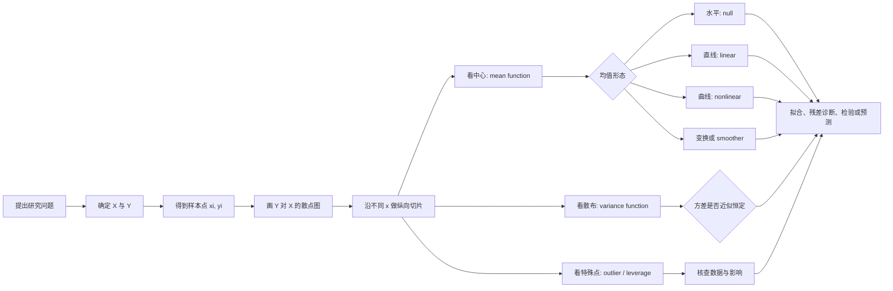

# Ch1 散点图与回归：中文主讲 + English Terms

> 适用材料  
>
> - 《高维数据分析》第一讲《散点图与回归》，袁洪松，lecture01，第 1-4 页  
> - Sanford Weisberg, *Applied Linear Regression*, 4th ed., Chapter 1, “Scatterplots and Regression”，第 1-20 页  
>
> 标记说明  
>
> - 【课件主线】：lecture01 明确讲授的内容  
> - 【教材例证】：Weisberg Chapter 1 的案例、图形和补充重点  
> - 【理解补充】：为了把逻辑讲清而加入的解释，不冒充课件原文

---

## 0. 先看全章逻辑地图

### 0.1 一句话抓住本章

**回归（regression）研究的不是“怎样硬画一条直线”，而是响应变量 \(Y\) 的条件分布（conditional distribution）如何随着预测变量 \(X\) 改变。**

我们先用散点图（scatterplot）看这种改变，再用两个函数把它说清楚：

1. 条件均值函数（mean function）：中心位置怎样变；
2. 条件方差函数（variance function）：波动大小怎样变。

线性回归（linear regression）只是其中一种可能：它假设条件均值可以用直线表示。

### 0.2 从问题到模型

### 0.3 本章真正要会的四件事

1. **会定角色**：谁是预测变量 \(X\)，谁是响应变量 \(Y\)。
2. **会读图**：不只看正负方向，还看形态、散布、重叠和特殊点。
3. **会说模型**：用 \(E(Y\mid X=x)\) 和 \(\operatorname{Var}(Y\mid X=x)\) 描述图。
4. **会怀疑模型**：直线看似贴合时，也要用平滑线（smoother）和残差图（residual plot）检查。

---

## 1. 回归到底在研究什么？

### 1.1 \(X\) 与 \(Y\) 的角色

【课件主线】

- 课件中的黑箱图可读作：\(X\rightarrow\text{black box / mechanism}\rightarrow Y\text{ (random)}\)。回归试图描述输入经过未知机制后，输出的分布怎样变化。
- \(X\)：预测变量（predictor），课件也列出自变量（independent variable）和输入变量（input variable）。
- \(Y\)：响应变量（response variable），课件也列出因变量（dependent variable）、输出变量（output variable）和被预测变量（predicted variable）。
- \(Y\) 通常带有随机性（randomness）：即使 \(X\) 相同，不同个体的 \(Y\) 也未必相同。

【理解补充】

教材更偏爱 predictor 和 response。原因是 independent variable 这个名字容易让人误以为 \(X\) 在概率意义上“独立”，或者误以为 \(X\) 一定是因果变量；这两点都不能仅由回归名称保证。

假设观察了 \(n\) 个观测单位（unit）或个案（case），数据写成

$$
(x_i,y_i),\qquad i=1,\ldots,n.
$$

大写 \(X,Y\) 表示变量，小写 \(x_i,y_i\) 表示第 \(i\) 个样本的具体观测值。

### 1.2 四类名称不要混

【课件主线，第 1 页】

| 输入 \(X\) | 输出 \(Y\) | 名称 | 中文理解 |
|---|---|---|---|
| 标量 | 标量或向量 | 简单回归（simple regression） | 只有一个输入变量 |
| 向量 | 标量或向量 | 多元回归（multiple regression） | 有多个输入变量 |
| 标量或向量 | 标量 | 单响应回归（univariate regression） | 只预测一个输出 |
| 标量或向量 | 向量 | 多响应回归（multivariate regression） | 同时研究多个输出 |

两个判断维度不同：

- simple / multiple 看 \(X\) 的维数；
- univariate / multivariate 看 \(Y\) 的维数。

所以“multiple regression”和“multivariate regression”不是同义词。

### 1.3 回归、相关与因果不是一回事

【理解补充】

- 回归（regression）描述 \(Y\) 怎样随 \(X\) 改变；
- 相关（correlation）通常概括两个变量的线性共同变化；
- 因果（causation）要求研究设计和额外假设，不能由一张散点图或一条回归线自动推出。

因此，“\(X\) 能预测 \(Y\)”不等于“改变 \(X\) 就一定会导致 \(Y\) 改变”。

---

## 2. 散点图：把样本关系放到二维平面上

### 2.1 定义与标准画法

【课件主线，第 2 页】

本节先假设 \(X,Y\) 都是标量。

散点图（scatterplot）把每个样本对 \((x_i,y_i)\) 画成平面上的一个点：

- 横轴（horizontal axis）：预测变量 \(X\)；
- 纵轴（vertical axis）：响应变量 \(Y\)；
- 每个观测单位被画成一个点；若坐标相同，多个观测会重叠在同一可见位置。

教材把单预测变量回归中的 \(Y\) 对 \(X\) 散点图称为总结图（summary graph）。它是回归分析的起点。

“\(Y\) versus \(X\)”或“plot \(Y\) against \(X\)”通常都表示：\(Y\) 在纵轴，\(X\) 在横轴。

### 2.2 读散点图的六问

看图时按下面顺序扫一遍，基本不会漏重点。

| 顺序 | 要问什么 | 英文术语 | 你在判断什么 |
|---|---|---|---|
| 1 | 整体往哪走？ | direction | 正向、负向，还是没有明显方向 |
| 2 | 中心轨迹是什么形状？ | form / shape | 水平、近似直线、弯曲、饱和、分组等 |
| 3 | 趋势有多清楚，点围绕中心有多散？ | strength / conditional spread | 强度看趋势相对散布是否明显；散布反映预测的不确定性 |
| 4 | 不同 \(x\) 处散布一样吗？ | variance pattern | 常方差还是异方差 |
| 5 | 有特殊点吗？ | separated point | 离群点、杠杆点以及可能的高影响点 |
| 6 | 图本身可靠吗？ | scale / overplotting / aggregation | 坐标比例、点重叠、离散取值、汇总数据是否误导 |

这六问可以压缩成一句：

> **先看中心怎样走，再看周围怎样散，最后看有没有点或画法在“骗眼睛”。**

强度（strength）和散布（spread）不是同义词：前者是趋势相对噪声有多明显，后者是条件 \(Y\) 本身有多分散。

### 2.3 为什么要沿 \(x\) 做“纵向切片”？

固定 \(X=x\)，想象在散点图上切下一条窄窄的竖带（vertical slice / strip）。竖带中的点近似来自条件分布

$$
Y\mid X=x.
$$

在这条竖带内：

- 点的中心高度对应条件均值 \(E(Y\mid X=x)\)；
- 点的纵向宽度对应条件方差 \(\operatorname{Var}(Y\mid X=x)\)；
- 明显偏离同一竖带其他点的观测可能是条件离群点。

把许多竖带从左向右连起来，就能理解“\(Y\) 的分布怎样随 \(X\) 改变”。这是散点图通向回归模型的关键桥梁。

### 2.4 坐标比例会改变视觉判断

【教材例证：Heights，教材第 3 页】

若 \(X\) 与 \(Y\) 单位相同、范围相近，例如母亲身高与女儿身高，横纵轴最好采用相同比例。此时 \(45^\circ\) 线表示 \(Y=X\)，即母女等高。

注意：

- \(45^\circ\) 线是“相等参考线”，不一定是回归拟合线（fitted regression line）；
- 拉宽或压扁图形会让趋势显得更陡或更平；
- 需要比较角度时，必须先确认两轴的单位和比例。

### 2.5 点重叠与抖动

【教材例证：Heights，教材第 3 页】

身高被四舍五入到整数后，很多样本会落在同一坐标上，形成点重叠（overplotting）。图上一个黑点可能代表许多个案，因此点的可见数量不等于样本量。

抖动（jittering）是在画图时给坐标加很小的随机扰动，让重叠点散开。例如教材给取整身高加入 \([-0.5,0.5]\) 范围内的均匀扰动。

必须记住：

- jitter 只帮助显示密度；
- 它没有产生新数据，也没有提高测量精度；
- 建模时通常仍使用原始值，而不是把随机抖动当成真实变化。

---

## 3. 条件均值函数：散点云的“中心路线”

### 3.1 定义

【课件主线，第 3 页；教材第 10 页】

条件均值函数（mean function）定义为

$$
m(x)=E(Y\mid X=x).
$$

它读作：

> “给定 \(X=x\) 时，响应 \(Y\) 的条件期望（conditional expectation）。”

它回答的是“在这个 \(x\) 附近，\(Y\) 平均处在什么水平”，而不是“每个 \(Y\) 必须等于多少”。

### 3.2 线性均值函数

一个最常见的候选形式是

$$
E(Y\mid X=x)=\beta_0^*+\beta_1^*x.
$$

- \(\beta_0^*\)：截距（intercept），表示 \(x=0\) 时的条件均值；
- \(\beta_1^*\)：斜率（slope），表示 \(x\) 每增加 1 个单位，条件均值平均改变多少；
- \(\beta_0^*,\beta_1^*\)：总体参数（parameters），真实但通常未知。

这里的“线性”是说**条件均值关于 \(x\) 是直线**，并不是说所有观测点都必须落在直线上。

截距只有在 \(x=0\) 有实际意义且接近观测范围时才值得实质解释。若样本中的 \(x\) 离 0 很远，截距可能只是维持直线表达式所需的数学常数。

### 3.3 真参数、估计量与拟合值

【理解补充】

课件用星号 \(^*\) 强调“真实但未知”的总体参数；教材常直接写 \(\beta_0,\beta_1\)。用样本估计后，通常写成

$$
\hat m(x)=\hat\beta_0+\hat\beta_1x.
$$

其中帽子（hat）表示估计：

- \(\beta_j^*\) 或 \(\beta_j\)：总体中的未知真值；
- \(\hat\beta_j\)：根据当前样本算出的估计值；
- \(\hat y_i=\hat m(x_i)\)：第 \(i\) 个样本的拟合值（fitted value）。

把真参数和估计量混写，是初学回归时最常见的符号错误之一。

### 3.4 水平均值函数与零图（null plot）

【教材例证，第 14 页】

若

$$
E(Y\mid X=x)=\beta_0^*,
$$

即 \(\beta_1^*=0\)，条件均值不随 \(x\) 改变。教材把同时满足下面三点的散点图称为零图（null plot）：

1. 均值函数是水平直线；
2. 方差函数恒定；
3. 没有明显分离点（separated points）。

天气降雪案例接近这种图形，但“看起来水平”仍只是初步证据，之后需要正式拟合和检验。

### 3.5 非线性均值函数

回归不等于线性回归。火鸡生长案例显示：剂量增加时体重增益先快后慢，逐渐接近平台。教材使用饱和型均值函数

$$
E(Y\mid \mathrm{Dose}=x)
=
\beta_0^*+\beta_1^*
\left(1-e^{-\beta_2^*x}\right).
$$

当 \(\beta_2^*>0\) 时：

- \(x=0\)：均值为 \(\beta_0^*\)，即基线生长（baseline growth）；
- \(x\) 很大：均值趋近 \(\beta_0^*+\beta_1^*\)，即平台或极限；
- \(\beta_2^*\)：控制靠近平台的速度。

这个例子说明：**先由图判断合理形态，再选函数；不能因为课程叫“回归”就默认直线。**

### 3.6 参数模型与非参数平滑

【课件主线 + 教材例证】

- 参数均值模型（parametric mean function）：先规定函数形式，例如直线或饱和曲线，再估计有限个参数。
- 非参数估计（nonparametric estimate）：不先规定某个具体全局公式，让数据本身显示均值走势。
- 平滑器（smoother）：常用来估计和显示非参数均值趋势。

Smallmouth Bass 案例中，年龄只取整数。把每个年龄下的鱼长均值连起来，就是一个简单的非参数均值估计；它与普通最小二乘直线在观测年龄 1-8 内非常接近，因此直线是这个范围内的可用近似。

但鱼不可能永远按同一速度长大，所以“区间内近似线性”不等于“全范围永远线性”。这也是不要盲目外推（extrapolation）的原因。

局部回归平滑（loess smooth）会在每个 \(x\) 附近选择一部分邻近点，局部拟合直线，再连接各处的估计值。它适合作为模型校准工具：

- 直线与 smoother 接近：线性均值形式较可信；
- 两者系统偏离：可能存在曲率；
- 图形边缘数据少，smoother 的边缘估计通常更不稳定。

---

## 4. 条件方差函数：散点云的“厚度路线”

### 4.1 定义

【课件主线，第 3-4 页；教材第 12 页】

方差函数（variance function）定义为

$$
v(x)=\operatorname{Var}(Y\mid X=x).
$$

它回答的是：

> “给定 \(X=x\) 后，\(Y\) 围绕条件均值还会波动多大？”

均值函数和方差函数描述的是两个不同问题：

- 均值函数决定点云中心怎样移动；
- 方差函数决定点云围绕中心有多厚。

均值近似线性，不代表方差一定恒定。

### 4.2 常方差与异方差

线性回归常从常方差（constant variance / homoscedasticity）假设开始：

$$
\operatorname{Var}(Y\mid X=x)=(\sigma^*)^2,
$$

其中 \((\sigma^*)^2>0\) 是未知参数。图上表现为不同 \(x\) 附近的竖向散布宽度大致相同。

若散布随 \(x\) 系统变宽、变窄或呈漏斗形，就可能存在异方差（heteroscedasticity）。这时条件均值仍可能是直线，但常方差假设不合适。

图形只能帮助判断“是否合理”（plausible），不能单凭肉眼证明方差严格相等。

### 4.3 汇总均值会隐藏方差

【教材例证：Turkey Growth，教材第 9、12 页】

火鸡图中的点主要是每种处理下多个围栏的平均体重增益（treatment means），不是每个围栏的原始观测。因此图中看不到同一剂量、同一来源下的组内变异。

所以：

> **能从汇总均值图看出均值走势，不代表也能从它判断原始数据的方差函数。**

这是聚合数据（aggregated data）非常容易造成的误读。

### 4.4 哪种分布由均值与方差决定？

【课件第 4 页思考题 + 理解补充】

这个思考题通常是在引向正态分布（Normal distribution / Gaussian distribution）。

更准确地说：一旦已知条件分布属于正态分布族，均值和方差就唯一确定这个分布。例如

$$
Y\mid X=x
\sim
N\!\left(m(x),v(x)\right).
$$

若再使用线性均值和常方差，就得到常见表达

$$
Y\mid X=x
\sim
N\!\left(\beta_0^*+\beta_1^*x,(\sigma^*)^2\right).
$$

但对任意分布而言，相同均值和方差可以对应完全不同的分布形状，因此“知道均值和方差”通常还不足以知道整个分布。

---

## 5. 特殊点：离群点（outlier）与杠杆点（leverage point）不能混

【教材例证：Heights 与 Anscombe，教材第 4-5、12-13 页】

### 5.1 离群点

离群点（outlier）是在相近 \(X\) 条件下，\(Y\) 与主趋势相差很远的点。它主要表现为**纵向异常**。

关键是“给定相近 \(X\)”：

- \(Y\) 在全体中很大，不一定是离群点；
- 只有当它相对同一条件趋势明显异常时，才可能是回归意义下的离群点。

### 5.2 杠杆点

杠杆点（leverage point）是 \(X\) 值在水平方向上远离大多数样本的点。它可能有很强的“拉线能力”，显著改变拟合直线。

### 5.3 高影响点

【理解补充】

高影响点（influential point）是删除后会明显改变拟合结果的点。它可能同时具有高杠杆和较大残差，但“离群”“高杠杆”“高影响”是三个不同概念。

发现特殊点后的正确动作不是立即删除，而是依次检查：

1. 是否录入或测量错误；
2. 是否来自不同的数据生成机制；
3. 是否是研究对象中真实但少见的个案；
4. 保留与删除时，结论是否明显变化。

大样本本来就更容易出现少量极端观测；“看起来特别”不是自动删除的理由。

---

## 6. 残差图：把小问题放大给你看

### 6.1 残差是什么？

【理解补充；教材 Ch1 使用残差直觉，正式推导在后续章节】

拟合直线给出

$$
\hat y_i=\hat\beta_0+\hat\beta_1x_i.
$$

第 \(i\) 个点的残差（residual）为

$$
e_i=y_i-\hat y_i.
$$

它就是点到拟合值的纵向差：

- \(e_i>0\)：观测点在线上方；
- \(e_i<0\)：观测点在线下方；
- \(|e_i|\) 大：该点与拟合均值相差较大。

### 6.2 为什么原散点图不够？

【教材例证：Forbes’s Data，教材第 5-7 页】

气压 \(pres\) 对沸点 \(bp\) 的原图看上去几乎是一条直线，因为总体纵轴范围很大。把线性趋势减掉后画 \(e_i\) 对 \(bp\)：

- 两端残差偏正；
- 中间残差偏负；
- 还存在一个明显特殊点。

这个系统弯曲在原图中很小，却在残差图中非常清楚。残差图相当于去掉主趋势后放大剩余结构。

### 6.3 四种常见残差形状

| 残差图表现 | 可能含义 | 下一步 |
|---|---|---|
| 围绕 0 随机散布，宽度近似稳定 | 线性均值与常方差暂时合理 | 继续做正式诊断 |
| U 形、倒 U 形或波浪形 | 均值函数有未建模曲率 | 考虑变换、曲线项或非线性模型 |
| 漏斗形，越往右越宽或越窄 | 方差不恒定 | 考虑变换或方差模型 |
| 少数点远离其余残差 | 潜在离群点 | 回到原始数据核查 |

没有明显模式只是“未发现明显违背”，不是对模型正确性的绝对证明。

### 6.4 普通最小二乘（OLS）在本章只需掌握什么？

【理解补充；教材在 Ch1 只使用直觉，计算细节留到后续章节】

普通最小二乘（ordinary least squares, OLS）选择一条直线，使残差平方和最小：

$$
(\hat\beta_0,\hat\beta_1)
=
\arg\min_{b_0,b_1}
\sum_{i=1}^{n}
\left(y_i-b_0-b_1x_i\right)^2.
$$

Ch1 的重点不是背估计公式，而是理解：

1. 在线性均值模型成立时，OLS 用直线估计条件均值；模型不成立时，它只能给出样本中的最佳线性近似；
2. 拟合后还必须看残差；
3. 少量高杠杆点可能强烈改变 OLS 线。

---

## 7. 变换：让结构更适合被模型概括

### 7.1 Forbes 案例中的对数变换

【教材例证，第 5-7 页】

物理理论提示 \(\log(pres)\) 与 \(bp\) 近似线性。将响应改为 \(\log_{10}(pres)\) 后，除一个特殊点外，残差不再出现原先的系统弯曲，直线成为更合理的摘要。

- 常用对数（common logarithm）：\(\log_{10}\)；
- 自然对数（natural logarithm）：\(\ln=\log_e\)。

更换对数底数通常不改变“是否近似线性”的图形判断，但会改变斜率的数值尺度和参数解释。

### 7.2 幂变换

【教材例证，第 14 页】

教材把幂变换（power transformation）概括为：对正值变量 \(Z\) 使用 \(Z^\lambda\) 或相应变换。被变换的既可以是预测变量，也可以是响应变量。教材约定 \(\lambda=0\) 对应对数变换；这是教材采用的记号约定，并不是普通幂运算中的 \(Z^0=1\)。

变换的目的可能包括：

- 拉直曲线关系；
- 稳定方差；
- 减少偏斜或极端尺度差；
- 让参数解释更贴合科学机制。

变换不是为了让图“更好看”，而是为了让模型与数据结构更一致。

---

## 8. 教材案例串联：六张图，六个判断

【教材例证：教材第 2-17 页；lecture01 第 2-3 页列出这些案例】

| 案例 | 页码 | 图形告诉你什么 | 最该记住的判断 |
|---|---:|---|---|
| 母女身高（Inheritance of Height） | 2-5、10-11、15 | 点云近似向右上倾斜的椭圆；不同身高切片的纵向变异近似相同；取整造成重叠 | jitter 只改善显示；正且小于 1 的斜率体现向均值回归（regression toward the mean），但不约束每个个体 |
| Forbes 气压与沸点（Forbes’s Data） | 5-7 | 原图几乎贴线，残差却呈系统弯曲 | 拟合紧不等于形式正确；对响应取对数后再检查残差 |
| 鲈鱼年龄与长度（Smallmouth Bass） | 7-8、10-11 | 整数年龄形成 8 个条件群体；不同年龄组的长度分布仍重叠，同一年龄内也有变异 | 组均值 smoother 与 OLS 线接近，但线性只是在 1-8 岁范围内的近似；横截面（cross-sectional）不等于纵向研究（longitudinal） |
| 早晚季降雪（Predicting the Weather） | 8-9、11、14 | 点云关系很弱，接近 null plot | 在线性模型下检验斜率是否为 0；零斜率或零相关不自动等于独立 |
| 火鸡生长（Turkey Growth） | 9-12 | 增益随剂量上升后趋于平台；符号还区分蛋氨酸来源 | 回归可非线性；处理均值图会隐藏组内方差 |
| 燃油消费（Fuel Consumption） | 15-17 | 散点图矩阵显示两两关系和预测变量间关系 | 边际关系（marginal relationship）不能代替联合关系（joint relationship） |

天气案例中的双侧斜率检验为

$$
H_0:\beta_1^*=0
\qquad\text{vs.}\qquad
H_1:\beta_1^*\ne 0.
$$

Fuel 案例还说明，建模前可能需要构造尺度可比的回归变量（regressor）：

$$
\mathrm{Fuel}=1000\times\frac{\mathrm{FuelC}}{\mathrm{Pop}},
\qquad
\mathrm{Dlic}=1000\times\frac{\mathrm{Drivers}}{\mathrm{Pop}},
$$

并使用 \(\log(\mathrm{Miles})\)。教材把原始观测变量称为 predictor，把由原始变量计算出的建模变量称为 regressor；其他文献的用词可能更宽松。散点图矩阵中，非对角格始终表示“纵轴变量对横轴变量”的一元关系。

图中 Fuel 与 Tax 平均呈负向关系但散布很大，Fuel 与其他变量的边际关系总体也较弱。本例中预测变量之间的两两关系同样较弱，所以边际图相对有信息；这只是该数据的特点，不能推广成“边际关系总能代表联合关系”。

---

## 9. Anscombe 四重奏：相同统计量，不同数据故事

【教材第 12-13 页】

Anscombe 四组人工数据具有相同的主要回归摘要，例如相同的估计斜率和截距，但图形完全不同：

1. 一组典型的近似线性点云；
2. 一组明显弯曲；
3. 大多数点近似线性，但有一个纵向离群点；
4. 大多数 \(X\) 几乎相同，整条线由一个水平极端点决定。

第四组若删掉那个点，甚至没有足够的 \(X\) 变化来估计斜率。

因此：

> **汇总统计量（summary statistics）不能替代可视化；图形也不能替代数据语境。**

发现异常结构后要回到采集过程和研究背景，而不是机械地删点或换模型。

---

## 10. 一套可直接复用的回归读图流程

【整理总结】

| 步骤 | 动作 | 必查问题 |
|---|---|---|
| 1 | 写清研究问题并确定 \(X,Y\) | 是解释、比较、检验还是预测？回归方向是什么？ |
| 2 | 画原始散点图 | 单位、范围、比例、缺失、取整、重叠、分组和样本量是否可靠？ |
| 3 | 沿 \(x\) 做纵向切片 | \(E(Y\mid X=x)\) 怎样移动？\(\operatorname{Var}(Y\mid X=x)\) 怎样变化？ |
| 4 | 判断均值形态 | 水平、直线、弯曲还是平台？是否需要 smoother 或变换？ |
| 5 | 检查特殊结构 | 是否有 outlier、leverage、离散 \(X\)、聚合均值或不同群组？ |
| 6 | 拟合并画残差图 | 是否残留曲率、漏斗、分组或异常点？ |
| 7 | 解释、检验或预测 | 结论是否限制在当前变量、样本、设计、假设和观测范围内？ |

超出观测 \(X\) 范围的外推（extrapolation）尤其需要科学机制支持。

---

## 11. 高频易错点

【整理总结】

| 误区 | 正确理解 |
|---|---|
| 回归就是画直线，线性就表示点都在线上 | 回归研究条件分布；线性只约束条件均值，个体 \(Y\) 仍可有散布 |
| 只看均值趋势 | 均值函数与方差函数必须分别检查 |
| 点很贴线，所以形式一定正确 | 小而系统的曲率常要靠 residual plot 发现 |
| 零斜率等于完全独立 | 它只排除指定线性均值中的斜率，仍可能存在非线性依赖 |
| outlier 和 leverage 都是“坏点”，应立即删除 | 二者方向和作用不同；先核查来源，再做保留/删除敏感性比较 |
| 一个可见点就是一个样本，处理均值也能显示原始方差 | overplotting 会叠点，aggregation 会隐藏组内变异 |
| 预测关系可以直接解释为因果并向区间外延伸 | 因果依赖研究设计；外推需要机制和额外证据 |
| 弱边际关系说明联合模型也无关系 | 多预测变量的联合结论还取决于变量间关系和控制条件 |

---

## 12. 中英术语速查表

| 中文 | English term | 本章中的含义 |
|---|---|---|
| 回归 | regression | 研究响应如何随预测变量变化 |
| 依赖关系 | dependence | 变量之间存在系统联系 |
| 预测变量 | predictor | 放在横轴、用于解释或预测 \(Y\) 的变量 |
| 响应变量 | response variable | 放在纵轴、研究其条件分布的变量 |
| 自变量 | independent variable | predictor 的常见旧称，不表示概率独立 |
| 因变量 | dependent variable | response 的常见旧称 |
| 简单回归 | simple regression | 一个预测变量 |
| 多元回归 | multiple regression | 多个预测变量 |
| 单响应回归 | univariate regression | 一个响应变量 |
| 多响应回归 | multivariate regression | 多个响应变量 |
| 观测单位 / 个案 | unit / case | 样本中的一个对象 |
| 散点图 | scatterplot | 绘制 \((x_i,y_i)\) 的二维图 |
| 总结图 | summary graph | 单预测变量回归中的 \(Y\) 对 \(X\) 散点图 |
| 条件分布 | conditional distribution | 固定 \(X=x\) 后 \(Y\) 的分布 |
| 条件期望 | conditional expectation | 给定 \(X=x\) 后 \(Y\) 的平均水平 |
| 均值函数 | mean function | \(E(Y\mid X=x)\) |
| 方差函数 | variance function | \(\operatorname{Var}(Y\mid X=x)\) |
| 参数 | parameter | 描述总体函数的未知常数 |
| 截距 | intercept | 线性均值中 \(x=0\) 时的均值 |
| 斜率 | slope | \(x\) 增加一单位时条件均值的变化 |
| 拟合值 | fitted value | 模型对某个样本的预测均值 |
| 普通最小二乘 | ordinary least squares, OLS | 最小化残差平方和的拟合方法 |
| 残差 | residual | \(e_i=y_i-\hat y_i\) |
| 残差图 | residual plot | 用残差检查遗漏结构的图 |
| 点重叠 | overplotting | 多个观测画在同一位置 |
| 抖动 | jittering | 为显示重叠而加入微小绘图扰动 |
| 分离点 | separated point | 与主要点云分开的观测 |
| 离群点 | outlier | 相对条件趋势的纵向异常点 |
| 杠杆点 | leverage point | \(X\) 在水平方向极端的点 |
| 高影响点 | influential point | 会明显改变拟合结果的点 |
| 常方差 | constant variance / homoscedasticity | 条件方差不随 \(x\) 系统改变 |
| 异方差 | heteroscedasticity | 条件方差随 \(x\) 改变 |
| 参数模型 | parametric model | 先指定有限参数的函数形式 |
| 非参数估计 | nonparametric estimate | 不预先指定固定的全局函数形式 |
| 平滑器 | smoother | 估计数据中平滑均值趋势的方法 |
| 局部回归平滑 | loess smooth | 用邻近点做局部拟合的平滑方法 |
| 邻域比例 | span | loess 每次局部拟合使用的数据比例 |
| 变换 | transformation | 改变变量尺度以改善模型结构 |
| 幂变换 | power transformation | 使用某个幂次或其连续扩展进行变换 |
| 常用对数 | common logarithm | 以 10 为底的对数 |
| 自然对数 | natural logarithm | 以 \(e\) 为底的对数 |
| 零图 | null plot | 水平均值、常方差且无分离点的图 |
| 向均值回归 | regression toward the mean | 极端 \(X\) 对应的条件平均 \(Y\) 更接近总体均值 |
| 横截面数据 | cross-sectional data | 同一时期观察不同个体 |
| 纵向数据 | longitudinal data | 随时间重复观察同一个体 |
| 散点图矩阵 | scatterplot matrix | 多变量两两散点图组成的矩阵 |
| 边际关系 | marginal relationship | \(Y\) 与单个 \(X_j\) 的关系 |
| 联合关系 | joint relationship | 同时考虑多个预测变量的关系 |
| 回归变量 / 回归项 | regressor | 教材中特指由原始变量构造的建模变量 |
| 不相关 | uncorrelated | 协方差为 0；方差有限且非零时等价于 Pearson 相关系数为 0，但不必然独立 |
| 独立 | independent | 一个变量的分布不随另一个变量改变 |
| 外推 | extrapolation | 在已观测 \(X\) 范围之外预测 |

---

## 13. 两份材料的页码索引

### lecture01《第一讲 散点图与回归》

| PDF 页码 | 内容 |
|---|---|
| 1 | 回归定义；\(X,Y\) 角色；simple/multiple 与 univariate/multivariate |
| 2 | 散点图定义；六个教材案例入口 |
| 3 | 均值函数；线性、非参数与非线性均值；斜率检验；方差函数 |
| 4 | 常方差假设；“什么分布由均值和方差决定”的思考题 |

### *Applied Linear Regression*, Chapter 1

| PDF 页码 | 内容 |
|---|---|
| 1-2 | 回归目标与 §1.1 Scatterplots |
| 3-5 | Heights；轴尺度；45° 线；overplotting；jitter；切片；outlier 与 leverage |
| 5-7 | Forbes；残差；曲率；对数变换 |
| 7-8 | Smallmouth Bass；离散年龄；横截面与纵向数据 |
| 8-9 | Weather；弱关系与 null plot 候选 |
| 9-10 | Turkey Growth；非线性与汇总均值 |
| 10-12 | §1.2 Mean Functions；线性、非参数与非线性均值 |
| 12 | §1.3 Variance Functions；常方差 |
| 12-13 | Anscombe quartet 与 §1.4 Summary Graph |
| 13-15 | §1.5 读图工具；比例、变换、loess |
| 15-17 | §1.6 Scatterplot Matrices；Fuel；边际与联合关系 |
| 17-20 | 习题与进一步图形练习 |

> 页码说明：两份 PDF 的 PDF 页码均与页面上显示的印刷页码一致。
